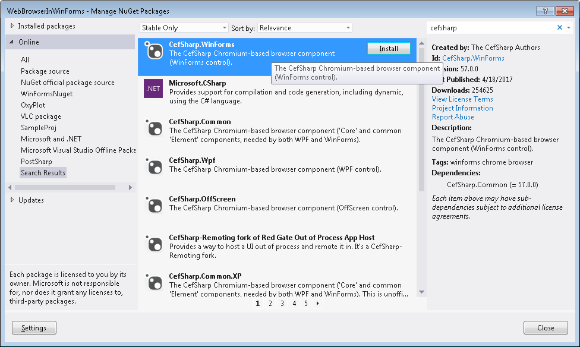
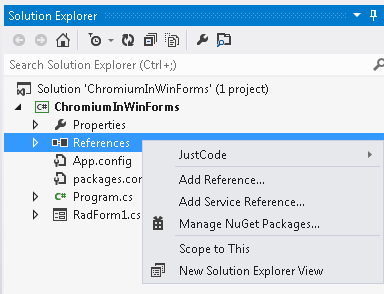
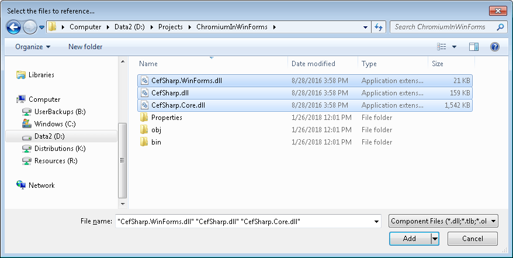
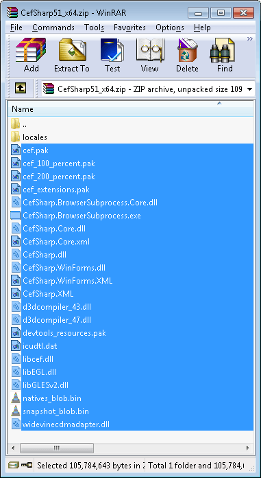
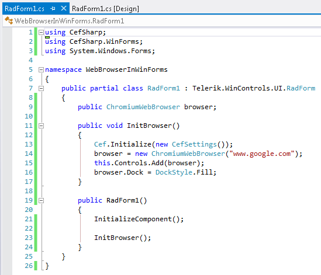

|Date Posted|Product|Author|
|----|----|----|
|January 31, 2018|Telerik UI for WinForms|[Desislava Yordanova](https://www.telerik.com/blogs/author/desislava-yordanova)| 

## Problem

This article demonstrates a sample approach how to embed Chrome in your application.

## Solution

Integrate the [CefSharp](http://cefsharp.github.io/) web browser component (based on [Chromium](https://en.wikipedia.org/wiki/Chromium_%28web_browser%29)) into your C# application. CefSharp is reliable, fast, fully open-source and does not need any extra dependencies to be installed by end users (except VC++ Runtime 2013).

**1A.** NuGet method – if you use [NuGet](https://www.nuget.org/), you can just grab **CefSharp.WinForms** from the NuGet repository.

 

Navigate to *Solution &gt; Configuration Manager* and set your project to *x86* or *x64* since *AnyCPU* is not currently supported.

**1B.** Manual method – download the CefSharp binaries and unzip them.

[CefSharp v51 x86 (for 32-bit apps)](https://raw.githubusercontent.com/hgupta9/CefsharpSite/gh-pages/files/CefSharp51_x32.zip)

[CefSharp v51 x64 (for 64-bit apps)](https://raw.githubusercontent.com/hgupta9/CefsharpSite/gh-pages/files/CefSharp51_x64.zip)

- Right click your project, select "Add Reference", then "Browse":

  

- Select the following DLLs:

	CefSharp.dll

	CefSharp.Core.dll

	CefSharp.WinForms.dll

  

- Select all the files in the ZIP and copy those files into your Project's Debug folder (inside Bin):

   

**2\.** Add the following code:

- Copy this to your *import* section:


````C#
using CefSharp;
using CefSharp.WinForms; 

```` 

- Copy this to your code section:

````C#
public ChromiumWebBrowser browser;
 
public void InitBrowser()
{
    Cef.Initialize(new CefSettings());
    browser = new ChromiumWebBrowser("www.google.com");
    this.Controls.Add(browser);
    browser.Dock = DockStyle.Fill;
}

````

- Call **InitBrowser**() just after the call of **InitializeComponent**():

  

When you run the application, you have Chromium embedded in your Windows Forms project:

  

It is possible to call a JavaScript function once the DOM is loaded. The **OnFrameLoadStart** event is called before the DOM is loaded, so you'll need to use one of the follow: **FrameLoadEnd**/**LoadingStateChanged**

````C#
private void browser_LoadingStateChanged(object sender, LoadingStateChangedEventArgs e)
{
    if (e.IsLoading == false)
    {
        browser.ExecuteScriptAsync("alert('All Resources Have Loaded');");
    }
}

````

  

Depending on the version of the CefSharp you are currently using your application may require .NET Framework 4.0 and higher. Please refer to [release branches](https://github.com/cefsharp/CefSharp#release-branches) section.  
  
>note A complete solution in C# and VB.NET can be found [here](https://github.com/telerik/winforms-sdk/tree/master/WinFormsChromium).


