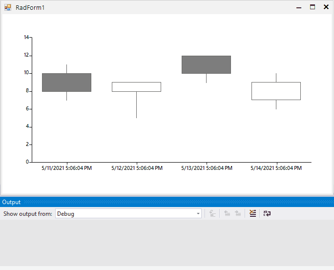

## Environment
 
|Product Version|Product|Author|
|----|----|----|
|2021.1.223|RadChartView for WinForms|[Nadya Karaivanova](https://www.telerik.com/blogs/author/nadya-karaivanova)|
 

## Description

Let's say that you have **RadChartView** with [CandleStickSeries]() that plots its data on the **DateTimeCategorical** axis for the horizontal axis and **Linear** axis for the vertical axis. This article will demonstrate how you can get the DateTime value from the horizontal axis when there is an interaction with the mouse, for example when the user clicks clicks with the mouse.




## Solution 

In order to achieve this, it would be helpful to use an "onePixelTime" variable that shows how many ticks a single pixel of the chart represents. It can also be helpful when the view is zoomed to a particular date range. Then, in the MouseDown event, the exact location is calculated. Please refer to the following example:
 

````C#
public partial class RadForm1 : Telerik.WinControls.UI.RadForm
{
    CandlestickSeries candlestickSeries;
    public RadForm1()
    {
        InitializeComponent();
        this.radChartView1.MouseDown += this.RadChartView1_MouseDown;
        candlestickSeries = new CandlestickSeries();
        candlestickSeries.DataPoints.Add(new OhlcDataPoint(10, 11, 7, 8, DateTime.Now));
        candlestickSeries.DataPoints.Add(new OhlcDataPoint(8, 9, 5, 9, DateTime.Now.AddDays(1)));
        candlestickSeries.DataPoints.Add(new OhlcDataPoint(12, 12, 9, 10, DateTime.Now.AddDays(2)));
        candlestickSeries.DataPoints.Add(new OhlcDataPoint(7, 10, 6, 9, DateTime.Now.AddDays(3)));
        this.radChartView1.Series.Add(candlestickSeries);
    }
    
    // Represents how many ticks a single pixel of the chart represents
    double onePixelTime = 0;
    protected override void OnShown(EventArgs e)
    {
        base.OnShown(e);
        
        var first = (OhlcDataPoint)candlestickSeries.DataPoints[0];
        var last = (OhlcDataPoint)candlestickSeries.DataPoints[candlestickSeries.DataPoints.Count - 1];
        TimeSpan span = (DateTime)last.Category - (DateTime)first.Category;
        
        double totalWidth = last.LayoutSlot.X + last.LayoutSlot.Width / 2 - first.LayoutSlot.X - first.LayoutSlot.Width / 2;
        this.onePixelTime = span.Ticks / totalWidth;
    }

    private void RadChartView1_MouseDown(object sender, MouseEventArgs e)
    {
        IChartView view = this.radChartView1.View;
        var firstDataPoint = (OhlcDataPoint)candlestickSeries.DataPoints[0];
        var offset = this.radChartView1.Area.View.Viewport.X + firstDataPoint.LayoutSlot.X + firstDataPoint.LayoutSlot.Width / 2;
        
        double location = e.Location.X - offset - view.PlotOriginX;
        long ticks = (long)(location * this.onePixelTime / view.ZoomWidth);
        TimeSpan span = TimeSpan.FromTicks(ticks);
        
        DateTime startDate = (DateTime)firstDataPoint.Category;
        DateTime clickedDate = startDate.Add(span);
        Console.WriteLine(clickedDate);
    }
}    
       
````
````VB.NET
Public Partial Class RadForm1
    Inherits Telerik.WinControls.UI.RadForm
    Private candlestickSeries As CandlestickSeries

    Public Sub New()
        InitializeComponent()
        AddHandler Me.radChartView1.MouseDown, AddressOf Me.RadChartView1_MouseDown
        candlestickSeries = New CandlestickSeries()
        candlestickSeries.DataPoints.Add(New OhlcDataPoint(10, 11, 7, 8, DateTime.Now))
        candlestickSeries.DataPoints.Add(New OhlcDataPoint(8, 9, 5, 9, DateTime.Now.AddDays(1)))
        candlestickSeries.DataPoints.Add(New OhlcDataPoint(12, 12, 9, 10, DateTime.Now.AddDays(2)))
        candlestickSeries.DataPoints.Add(New OhlcDataPoint(7, 10, 6, 9, DateTime.Now.AddDays(3)))
        Me.radChartView1.Series.Add(candlestickSeries)
    End Sub

    ' Represents how many ticks a single pixel of the chart represents
    Private onePixelTime As Double = 0
    Protected Overrides Sub OnShown(ByVal e As EventArgs)
        MyBase.OnShown(e)
        Dim first = CType(candlestickSeries.DataPoints(0), OhlcDataPoint)
        Dim last = CType(candlestickSeries.DataPoints(candlestickSeries.DataPoints.Count - 1), OhlcDataPoint)
        Dim span As TimeSpan = CType(last.Category, DateTime) - CType(first.Category, DateTime)
        Dim totalWidth As Double = last.LayoutSlot.X + last.LayoutSlot.Width / 2 - first.LayoutSlot.X - first.LayoutSlot.Width / 2
        Me.onePixelTime = span.Ticks / totalWidth
    End Sub

    Private Sub RadChartView1_MouseDown(ByVal sender As Object, ByVal e As MouseEventArgs)
        Dim view As IChartView = Me.radChartView1.View
        Dim firstDataPoint = CType(candlestickSeries.DataPoints(0), OhlcDataPoint)
        Dim offset = Me.radChartView1.Area.View.Viewport.X + firstDataPoint.LayoutSlot.X + firstDataPoint.LayoutSlot.Width / 2
        Dim location As Double = e.Location.X - offset - view.PlotOriginX
        Dim ticks As Long = CLng((location * Me.onePixelTime / view.ZoomWidth))
        Dim span As TimeSpan = TimeSpan.FromTicks(ticks)
        Dim startDate As DateTime = CType(firstDataPoint.Category, DateTime)
        Dim clickedDate As DateTime = startDate.Add(span)
        Console.WriteLine(clickedDate)
    End Sub
End Class

````

