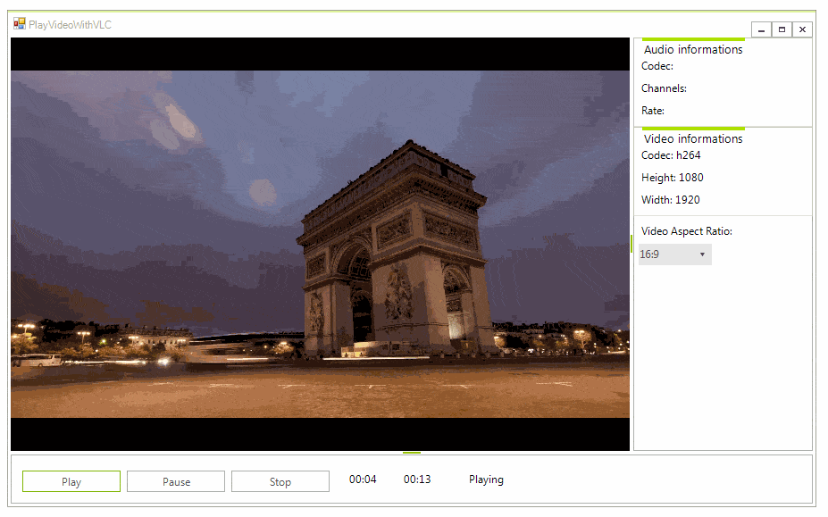

## Problem

A common question that we see from our Windows Forms customers is how to play video files in their WinForms applications. This article aims to answer this question by providing guidance on some of the possible means to achieve this.

## Solution

In order to play multimedia in your WinForms application there is a plenty of options. We will pay attention to the most widely spread and easy to achieve approaches.

 

### Embed the Windows Media Player

Let’s start with an approach which is already available with Windows and the Windows Forms development environment. This is how to embed the Windows Media Player in your application through the Toolbox in Visual Studio. Please follow the steps below:

1\. Right-click within the Toolbox, and then select *Choose Items*. This opens the *Customize Toolbox* dialog box.

2\. On the *COM Components* tab, select *Windows Media Player*. If *Windows Media Player* does not appear in the list, click *Browse*, and then open *Wmp.dll*, which should be in the Windows\System32 folder.

3\. Click *OK*. The Windows Media Player control will be placed on the current Toolbox tab.


Thus, the Windows Media Player will be added as an [AxWindowsMediaPlayer](https://msdn.microsoft.com/en-us/library/windows/desktop/dd562388%28v=vs.85%29.aspx) object to your form and you can add it as any other control from the Toolbox.  Set the **[URL](https://msdn.microsoft.com/en-us/library/windows/desktop/dd562470%28v=vs.85%29.aspx)** property to specify the name of the clip to play. Then, just run the application and click the *Play* button. The **[Ctlcontrols](https://msdn.microsoft.com/en-us/library/windows/desktop/dd562401%28v=vs.85%29.aspx)** property gets an **[IWMPControls](https://msdn.microsoft.com/en-us/library/windows/desktop/dd563179%28v=vs.85%29.aspx)** interface that provides a way to manipulate the playback of a media item. All supported file types are listed [here](https://support.microsoft.com/en-us/help/316992/file-types-supported-by-windows-media-player).

### Vlc.DotNet

[VLC](https://www.videolan.org/vlc/) is a very popular, multiplatform, open-source media player that can read a wide range of media. All of its features are available to application developers thanks to the LibVLC framework. **Vlc.DotNet** is a .NET wrapper around [LibVLC](https://wiki.videolan.org/LibVLC/) which hosts the audio/video capabilities of the VLC libraries. It runs on any .NET version starting from .NET 2.0 and can be easily integrated in WinForms. Here are the steps that you need to perform in order to integrate the VLC player in your WinForms application:

1\. Install the [Vlc.DotNet.Forms](https://www.nuget.org/packages/Vlc.DotNet.Forms/) NuGet Package which will automatically add the following references to your project: Vlc.DotNet.Core, Vlc.DotNet.Core.Interops, Vlc.DotNet.Forms

2\. Right-click within the Toolbox and select Add Tab option from the context menu. Drag the **Vlc.DotNet.Forms.dll** from the project’s folder to the newly created tab in the Toolbox. Now, the **[VlcControl](http://zebobo5.github.io/Vlc.DotNet/doc/html/edd96222-823c-110d-e520-52afbda2eb11.htm)** is added and you can drag it from the Toolbox to the form.

3\. You can find instructions how to get *libvlc* [here](https://github.com/ZeBobo5/Vlc.DotNet/wiki/Getting-started#getting-libvlc).

4\. Subscribe to the VlcControl.**VlcLibDirectoryNeeded** event at design time. In the event handler, it is necessary to specify the VlcLibDirectoryNeededEventArgs.**VlcLibDirectory**. Here is a sample code snippet: 
    
````C#
private void myVlcControl_VlcLibDirectoryNeeded(object sender, Vlc.DotNet.Forms.VlcLibDirectoryNeededEventArgs e)
{
    if (IntPtr.Size == 4)
        e.VlcLibDirectory = new DirectoryInfo(@"..\..\lib\x86\");
    else
        e.VlcLibDirectory = new DirectoryInfo(@"..\..\lib\x64\");
}

```` 
 
5\. You can specify the video file to be played by using the **[SetMedia](http://zebobo5.github.io/Vlc.DotNet/doc/html/4e65d0f3-e867-2067-df0d-d9545853efbc.htm)** method. The **[Play](http://zebobo5.github.io/Vlc.DotNet/doc/html/4e65d0f3-e867-2067-df0d-d9545853efbc.htm)** method plays the specified video: 
    
````C#
FileInfo fi = new FileInfo("file path");
this.vlcControl1.SetMedia(fi);
this.vlcControl1.Play();

```` 

You can refer to the public repository at the following link: [https://github.com/ZeBobo5/Vlc.DotNet/blob/develop/README.md](https://github.com/ZeBobo5/Vlc.DotNet/blob/develop/README.md). All supported formats by VLC are listed [here](https://wiki.videolan.org/VLC_Features_Formats).

>note A complete sample application can be found [here](https://github.com/telerik/winforms-sdk/tree/master/VideoPlayerSample). It contains two projects: one that demonstrates how to embed the Windows Media Player and another that shows how to use the open-source Vlc.DotNet.


