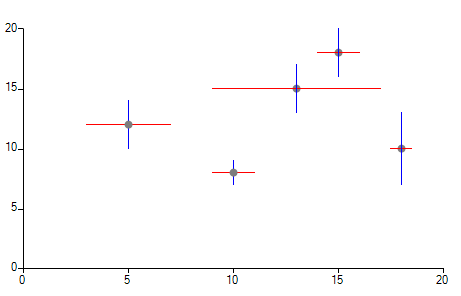

## Environment
|Product Version|Product|Author|
|----|----|----|
|2021.1.122|RadChartView for WinForms|[Desislava Yordanova](https://www.telerik.com/blogs/author/desislava-yordanova)|

## Description

This tutorial demonstrates a sample approach how to achieve scatter plots with error bars.

[Each point has 4 numbers , the x coordinate(x), the y coordinate(y), the uncertainty on the x coordinate (ux) and the uncertainty on the y coordinate(uy). The result is a dot on (x,y), then a horizontal line centered in the dot (x,y) with a width of 2*(ux), and a vertical line centered in (x,y) with a height of 2*(uy).](https://ncss-wpengine.netdna-ssl.com/wp-content/themes/ncss/pdf/Procedures/NCSS/Scatter_Plots_with_Error_Bars.pdf)



## Solution

It will be necessary to use a [custom renderer](). Besides a custom renderer, it is necessary to create special scatter data points holding information about the deviations along the X and Y axes. Last, but not least, we will create a custom **ScatterErrorBarsDrawPart** where the actual rendering is being executed:

#### RadChartView's setup
 
````C#
 public Form1()
{
    InitializeComponent();

    this.radChartView1.CreateRenderer += radChartView1_CreateRenderer;

    ScatterSeries scatterSeries = new ScatterSeries();
    scatterSeries.Name = "";
    scatterSeries.DataPoints.Add(new ScatterErrorBarsDataPoint(15, 18, 1, 2));
    scatterSeries.DataPoints.Add(new ScatterErrorBarsDataPoint(18, 10, 0.5, 3));
    scatterSeries.DataPoints.Add(new ScatterErrorBarsDataPoint(13, 15, 4, 2));
    scatterSeries.DataPoints.Add(new ScatterErrorBarsDataPoint(10, 8, 1, 1));
    scatterSeries.DataPoints.Add(new ScatterErrorBarsDataPoint(5, 12, 2, 2));

    scatterSeries.PointSize = new SizeF(8, 8);
    this.radChartView1.Series.Add(scatterSeries);
}

private void radChartView1_CreateRenderer(object sender, ChartViewCreateRendererEventArgs e)
{
    e.Renderer = new ScatterErrorBarsCartesianRenderer(e.Area as CartesianArea);
}

````
````VB.NET
Public Sub New()
    InitializeComponent()
    AddHandler Me.RadChartView1.CreateRenderer, AddressOf radChartView1_CreateRenderer
    Dim scatterSeries As ScatterSeries = New ScatterSeries()
    scatterSeries.Name = ""
    scatterSeries.DataPoints.Add(New ScatterErrorBarsDataPoint(15, 18, 1, 2))
    scatterSeries.DataPoints.Add(New ScatterErrorBarsDataPoint(18, 10, 0.5, 3))
    scatterSeries.DataPoints.Add(New ScatterErrorBarsDataPoint(13, 15, 4, 2))
    scatterSeries.DataPoints.Add(New ScatterErrorBarsDataPoint(10, 8, 1, 1))
    scatterSeries.DataPoints.Add(New ScatterErrorBarsDataPoint(5, 12, 2, 2))
    scatterSeries.PointSize = New SizeF(8, 8)
    Me.RadChartView1.Series.Add(scatterSeries)
End Sub

Private Sub radChartView1_CreateRenderer(ByVal sender As Object, ByVal e As ChartViewCreateRendererEventArgs)
    e.Renderer = New ScatterErrorBarsCartesianRenderer(TryCast(e.Area, CartesianArea))
End Sub

````

#### Custom renderer
 
````C#
public class ScatterErrorBarsCartesianRenderer : CartesianRenderer
{

    public ScatterErrorBarsCartesianRenderer(CartesianArea area)
        : base(area)
    { }

    protected override void Initialize()
    {
        base.Initialize();

        for (int i = 0; i < this.DrawParts.Count; i++)
        {
            ScatterSeriesDrawPart scatterPart = this.DrawParts[i] as ScatterSeriesDrawPart;
            if (scatterPart != null)
            {
                this.DrawParts[i] = new ScatterErrorBarsDrawPart((ScatterSeries)scatterPart.Element, this);
            }
        }
    }
}

````
````VB.NET
Public Class ScatterErrorBarsCartesianRenderer
    Inherits CartesianRenderer

    Public Sub New(ByVal area As CartesianArea)
        MyBase.New(area)
    End Sub

    Protected Overrides Sub Initialize()
        MyBase.Initialize()

        For i As Integer = 0 To Me.DrawParts.Count - 1
            Dim scatterPart As ScatterSeriesDrawPart = TryCast(Me.DrawParts(i), ScatterSeriesDrawPart)

            If scatterPart IsNot Nothing Then
                Me.DrawParts(i) = New ScatterErrorBarsDrawPart(CType(scatterPart.Element, ScatterSeries), Me)
            End If
        Next
    End Sub
End Class

````

#### Custom ScatterErrorBarsDataPoint
 
````C#
public class ScatterErrorBarsDataPoint : ScatterDataPoint
{
    private double? dx;
    private double? dy;

    public ScatterErrorBarsDataPoint(double x, double y, double dx, double dy)
        : base(x, y)
    {
        this.DeltaX = dx;
        this.DeltaY = dy;
    }

    public double? DeltaX
    {
        get
        {
            return this.dx;
        }
        set
        {
            this.dx = value;
        }
    }

    public double? DeltaY
    {
        get
        {
            return this.dy;
        }
        set
        {
            this.dy = value;
        }
    }
}

````
````VB.NET
Public Class ScatterErrorBarsDataPoint
    Inherits ScatterDataPoint

    Private dx As Double?
    Private dy As Double?

    Public Sub New(ByVal x As Double, ByVal y As Double, ByVal dx As Double, ByVal dy As Double)
        MyBase.New(x, y)
        Me.DeltaX = dx
        Me.DeltaY = dy
    End Sub

    Public Property DeltaX As Double?
        Get
            Return Me.dx
        End Get
        Set(ByVal value As Double?)
            Me.dx = value
        End Set
    End Property

    Public Property DeltaY As Double?
        Get
            Return Me.dy
        End Get
        Set(ByVal value As Double?)
            Me.dy = value
        End Set
    End Property
End Class

````

#### Custom ScatterErrorBarsDrawPart
 
````C#
public class ScatterErrorBarsDrawPart : ScatterSeriesDrawPart
{
    public ScatterErrorBarsDrawPart(ScatterSeries series, IChartRenderer renderer)
        : base(series, renderer)
    {
    }

    public override void DrawSeriesParts()
    {
        PointF[] points = this.GetPointsPositionsArray();

        if (points == null)
        {
            return;
        }

        RadGdiGraphics radGraphics = new RadGdiGraphics(this.Renderer.Surface as Graphics);
        List<DataPointElement> pointElements = new List<DataPointElement>();
        DataPointElementLayoutSlotComparer comparer = new DataPointElementLayoutSlotComparer();

        if (this.Renderer is CartesianRenderer)
        {
            comparer.Vertical = ((CartesianRenderer)this.Renderer).Area.Orientation == Orientation.Vertical;
        }

        comparer.Collection = this.Element.DataPoints;

        for (int i = 0; i < this.Element.Children.Count; i++)
        {
            DataPointElement pointElement = this.Element.Children[i] as DataPointElement;
            int index = pointElements.BinarySearch(pointElement, comparer);
            pointElements.Insert(~index, pointElement);
        }

        for (int i = 0; i < pointElements.Count; i++)
        {
            DataPointElement childElement = pointElements[i];

            if (childElement == null || !childElement.IsVisible || childElement.PointSize.Width < 1f ||
                childElement.PointSize.Height < 1f)
            {
                continue;
            }

            SizeF pointSize = childElement.PointSize;
            PointF pointLocation = points[i];

            RectangleF ptRect = new RectangleF(pointLocation, pointSize);
            ptRect.Offset(pointSize.Width / -2f, pointSize.Height / -2f);

            if (childElement.BackgroundShape != null)
            {
                childElement.BackgroundShape.Paint((Graphics)radGraphics.UnderlayGraphics, ptRect);
            }


            GraphicsPath pointPath = null;

            if (childElement.Shape != null)
            {
                pointPath = childElement.Shape.CreatePath(ptRect);
            }
            else
            {
                pointPath = new GraphicsPath();
                pointPath.AddEllipse(ptRect);
            }

            if (pointPath != null)
            {
                // Paint the data point
                FillPrimitiveImpl pointFill = new FillPrimitiveImpl(childElement, null);
                pointFill.PaintFill(radGraphics, pointPath, ptRect);

                BorderPrimitiveImpl pointBorder = new BorderPrimitiveImpl(childElement, null);
                pointBorder.PaintBorder(radGraphics, null, pointPath, ptRect);

                if (childElement.Image != null)
                {
                    ImagePrimitiveImpl pointImage = new ImagePrimitiveImpl(childElement);
                    pointImage.PaintImage(radGraphics, childElement.Image, ptRect, childElement.ImageLayout, 
                        childElement.ImageAlignment, childElement.ImageOpacity, false);
                }

                pointPath.Dispose();


                NumericalAxis xAxis = (NumericalAxis)this.Element.Axes[0];
                NumericalAxis yAxis = (NumericalAxis)this.Element.Axes[1];
                ScatterErrorBarsDataPoint dataPoint = (ScatterErrorBarsDataPoint)childElement.DataPoint;

                // Paint the X deviation
                if (dataPoint.DeltaX.HasValue)
                {
                    double delta = xAxis.ActualRange.Maximum - xAxis.ActualRange.Minimum;
                    double x = this.OffsetX + xAxis.Model.LayoutSlot.X;

                    double min = dataPoint.XValue - dataPoint.DeltaX.Value;
                    double normalizedMinValue = (min - xAxis.ActualRange.Minimum) / delta;
                    double x1 = x + normalizedMinValue * xAxis.Model.LayoutSlot.Width;

                    double max = dataPoint.XValue + dataPoint.DeltaX.Value;
                    double normalizedMaxValue = (max - xAxis.ActualRange.Minimum) / delta;
                    double x2 = x + normalizedMaxValue * xAxis.Model.LayoutSlot.Width;

                    radGraphics.DrawLine(Color.Red, (float)x1, (float)dataPoint.LayoutSlot.Y + this.OffsetY, 
                        (float)x2, (float)dataPoint.LayoutSlot.Y + this.OffsetY, 1);
                }

                // Paint the Y deviation
                if (dataPoint.YValue.HasValue && dataPoint.DeltaY.HasValue)
                {
                    double delta = yAxis.ActualRange.Maximum - yAxis.ActualRange.Minimum;
                    double y = this.OffsetY + yAxis.Model.LayoutSlot.Y;

                    double min = dataPoint.YValue.Value - dataPoint.DeltaY.Value;
                    double normalizedMinValue = 1 - (min - yAxis.ActualRange.Minimum) / delta;
                    double y1 = y + normalizedMinValue * yAxis.Model.LayoutSlot.Height;

                    double max = dataPoint.YValue.Value + dataPoint.DeltaY.Value;
                    double normalizedMaxValue = 1 - (max - yAxis.ActualRange.Minimum) / delta;
                    double y2 = y + normalizedMaxValue * yAxis.Model.LayoutSlot.Height;

                    radGraphics.DrawLine(Color.Blue, (float)dataPoint.LayoutSlot.X + this.OffsetX, (float)y1, 
                        (float)dataPoint.LayoutSlot.X + this.OffsetX, (float)y2, 1);
                }
            }
        }
    }
}

````
````VB.NET
Public Class ScatterErrorBarsDrawPart
    Inherits ScatterSeriesDrawPart

    Public Sub New(ByVal series As ScatterSeries, ByVal renderer As IChartRenderer)
        MyBase.New(series, renderer)
    End Sub

    Public Overrides Sub DrawSeriesParts()
        Dim points As PointF() = Me.GetPointsPositionsArray()

        If points Is Nothing Then
            Return
        End If

        Dim radGraphics As RadGdiGraphics = New RadGdiGraphics(TryCast(Me.Renderer.Surface, Graphics))
        Dim pointElements As List(Of DataPointElement) = New List(Of DataPointElement)()
        Dim comparer As DataPointElementLayoutSlotComparer = New DataPointElementLayoutSlotComparer()

        If TypeOf Me.Renderer Is CartesianRenderer Then
            comparer.Vertical = (CType(Me.Renderer, CartesianRenderer)).Area.Orientation = Orientation.Vertical
        End If

        comparer.Collection = Me.Element.DataPoints

        For i As Integer = 0 To Me.Element.Children.Count - 1
            Dim pointElement As DataPointElement = TryCast(Me.Element.Children(i), DataPointElement)
            Dim index As Integer = pointElements.BinarySearch(pointElement, comparer)
            pointElements.Insert(Not index, pointElement)
        Next

        For i As Integer = 0 To pointElements.Count - 1
            Dim childElement As DataPointElement = pointElements(i)

            If childElement Is Nothing OrElse Not childElement.IsVisible OrElse childElement.PointSize.Width < 1.0F _
                OrElse childElement.PointSize.Height < 1.0F Then
                Continue For
            End If

            Dim pointSize As SizeF = childElement.PointSize
            Dim pointLocation As PointF = points(i)
            Dim ptRect As RectangleF = New RectangleF(pointLocation, pointSize)
            ptRect.Offset(pointSize.Width / -2.0F, pointSize.Height / -2.0F)

            If childElement.BackgroundShape IsNot Nothing Then
                childElement.BackgroundShape.Paint(CType(radGraphics.UnderlayGraphics, Graphics), ptRect)
            End If

            Dim pointPath As GraphicsPath = Nothing

            If childElement.Shape IsNot Nothing Then
                pointPath = childElement.Shape.CreatePath(ptRect)
            Else
                pointPath = New GraphicsPath()
                pointPath.AddEllipse(ptRect)
            End If

            If pointPath IsNot Nothing Then
                Dim pointFill As FillPrimitiveImpl = New FillPrimitiveImpl(childElement, Nothing)
                pointFill.PaintFill(radGraphics, pointPath, ptRect)
                Dim pointBorder As BorderPrimitiveImpl = New BorderPrimitiveImpl(childElement, Nothing)
                pointBorder.PaintBorder(radGraphics, Nothing, pointPath, ptRect)

                If childElement.Image IsNot Nothing Then
                    Dim pointImage As ImagePrimitiveImpl = New ImagePrimitiveImpl(childElement)
                    pointImage.PaintImage(radGraphics, childElement.Image, ptRect, childElement.ImageLayout,
                                          childElement.ImageAlignment, childElement.ImageOpacity, False)
                End If

                pointPath.Dispose()
                Dim xAxis As NumericalAxis = CType(Me.Element.Axes(0), NumericalAxis)
                Dim yAxis As NumericalAxis = CType(Me.Element.Axes(1), NumericalAxis)
                Dim dataPoint As ScatterErrorBarsDataPoint = CType(childElement.DataPoint, ScatterErrorBarsDataPoint)

                If dataPoint.DeltaX.HasValue Then
                    Dim delta As Double = xAxis.ActualRange.Maximum - xAxis.ActualRange.Minimum
                    Dim x As Double = Me.OffsetX + xAxis.Model.LayoutSlot.X
                    Dim min As Double = dataPoint.XValue - dataPoint.DeltaX.Value
                    Dim normalizedMinValue As Double = (min - xAxis.ActualRange.Minimum) / delta
                    Dim x1 As Double = x + normalizedMinValue * xAxis.Model.LayoutSlot.Width
                    Dim max As Double = dataPoint.XValue + dataPoint.DeltaX.Value
                    Dim normalizedMaxValue As Double = (max - xAxis.ActualRange.Minimum) / delta
                    Dim x2 As Double = x + normalizedMaxValue * xAxis.Model.LayoutSlot.Width
                    radGraphics.DrawLine(Color.Red, CSng(x1), CSng(dataPoint.LayoutSlot.Y) + Me.OffsetY, CSng(x2),
                                         CSng(dataPoint.LayoutSlot.Y) + Me.OffsetY, 1)
                End If

                If dataPoint.YValue.HasValue AndAlso dataPoint.DeltaY.HasValue Then
                    Dim delta As Double = yAxis.ActualRange.Maximum - yAxis.ActualRange.Minimum
                    Dim y As Double = Me.OffsetY + yAxis.Model.LayoutSlot.Y
                    Dim min As Double = dataPoint.YValue.Value - dataPoint.DeltaY.Value
                    Dim normalizedMinValue As Double = 1 - (min - yAxis.ActualRange.Minimum) / delta
                    Dim y1 As Double = y + normalizedMinValue * yAxis.Model.LayoutSlot.Height
                    Dim max As Double = dataPoint.YValue.Value + dataPoint.DeltaY.Value
                    Dim normalizedMaxValue As Double = 1 - (max - yAxis.ActualRange.Minimum) / delta
                    Dim y2 As Double = y + normalizedMaxValue * yAxis.Model.LayoutSlot.Height
                    radGraphics.DrawLine(Color.Blue, CSng(dataPoint.LayoutSlot.X) + Me.OffsetX, CSng(y1),
                                         CSng(dataPoint.LayoutSlot.X) + Me.OffsetX, CSng(y2), 1)
                End If
            End If
        Next
    End Sub
End Class

````


# See Also

* [ScatterSeries]() 
* [CartesianRenderer]()

