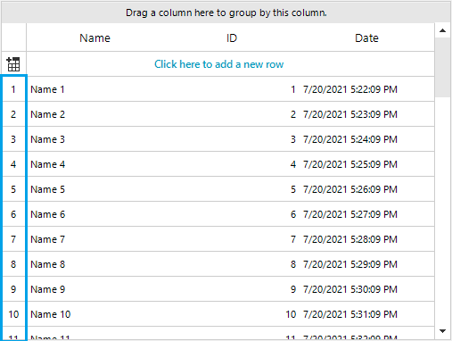
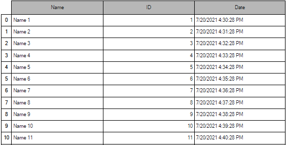

## Environment
 
|Product Version|Product|Author|
|----|----|----|
|2021.2.511|RadGridView for WinForms|[Nadya Karaivanova](https://www.telerik.com/blogs/author/nadya-karaivanova)|
 
## Description

A client's requirement is to display row numbers in front of each row in **RadGridView**. This can be easily achieved in **ViewCellFormatting** event where you can sync the **e.CellElement.Text** to display the respective **CellElement.RowIndex**. However, when printing the grid using [RadPrintDocument](https://docs.telerik.com/devtools/winforms/telerik-presentation-framework/printing-support/radprintdocument/overview), this column is not automatically printed. 




This tutorial will demonstrate how you can print the most left column in **RadGridView** containing row numbers.
 
## Solution 

Let's first set up our grid to display row numbers at the beginning of each row:


````C#
public RadForm1()
{
    InitializeComponent();
    this.radGridView1.DataSource = this.GetData();
    this.radGridView1.AutoSizeColumnsMode = GridViewAutoSizeColumnsMode.Fill;
    this.radGridView1.ViewCellFormatting += RadGridView1_ViewCellFormatting;
    this.radGridView1.PrintCellPaint += RadGridView1_PrintCellPaint;
}

private void RadGridView1_ViewCellFormatting(object sender, CellFormattingEventArgs e)
{
    if (e.CellElement is GridRowHeaderCellElement && e.CellElement.RowIndex >= 0)
    {
        e.CellElement.Text = (e.CellElement.RowIndex + 1).ToString();
    }
}

````
````VB.NET
    Public Sub New()
        InitializeComponent()
        Me.radGridView1.DataSource = Me.GetData()
        Me.radGridView1.AutoSizeColumnsMode = GridViewAutoSizeColumnsMode.Fill
        Me.radGridView1.ViewCellFormatting += AddressOf RadGridView1_ViewCellFormatting
        Me.radGridView1.PrintCellPaint += RadGridView1_PrintCellPaint
    End Sub

    Private Sub RadGridView1_ViewCellFormatting(ByVal sender As Object, ByVal e As CellFormattingEventArgs)
        If TypeOf e.CellElement Is GridRowHeaderCellElement AndAlso e.CellElement.RowIndex >= 0 Then
            e.CellElement.Text = (e.CellElement.RowIndex + 1).ToString()
        End If
    End Sub

````

Then, to print this column in the **RadPrintDocument** it is neccessary to handle the [PrintCellPaint](https://docs.telerik.com/devtools/winforms/controls/gridview/printing-support/events-and-customization#printcellpaint) event and paint the necessary info. This event allow you to access the cell and to paint in it whatever you need.


````C#
private void RadGridView1_PrintCellPaint(object sender, PrintCellPaintEventArgs e)
{
    if (e.Row is GridViewDataRowInfo && e.Column.FieldName == "Name")
    {
        Rectangle rect = new Rectangle();
        rect.X = e.CellRect.X - 25;
        rect.Y = e.CellRect.Y;
        rect.Width = 25;
        rect.Height = e.CellRect.Height;
        StringFormat sf = new StringFormat();
        sf.LineAlignment = StringAlignment.Center;
        sf.Alignment = StringAlignment.Center;
        // Row index text
        e.Graphics.DrawString(e.Row.Index.ToString(), Control.DefaultFont, Brushes.Black, rect, sf);
        // Row index border
        e.Graphics.DrawRectangle(Pens.Black, rect);
    }
}

````
````VB.NET
Private Sub RadGridView1_PrintCellPaint(ByVal sender As Object, ByVal e As PrintCellPaintEventArgs)
    If TypeOf e.Row Is GridViewDataRowInfo AndAlso e.Column.FieldName = "Name" Then
        Dim rect As Rectangle = New Rectangle()
        rect.X = e.CellRect.X - 25
        rect.Y = e.CellRect.Y
        rect.Width = 25
        rect.Height = e.CellRect.Height
        Dim sf As StringFormat = New StringFormat()
        sf.LineAlignment = StringAlignment.Center
        sf.Alignment = StringAlignment.Center
        'Row index text
        e.Graphics.DrawString(e.Row.Index.ToString(), Control.DefaultFont, Brushes.Black, rect, sf)
        'Row index border
        e.Graphics.DrawRectangle(Pens.Black, rect)
    End If
End Sub

````

Thus, when printing the grid via the PrintButton_Click you should see the printed row numbers in the document:

````C#
private void PrintButton_Click(object sender, EventArgs e)
{
    RadPrintDocument doc = new RadPrintDocument();
    doc.AssociatedObject = this.radGridView1;
    doc.Print();
}

````
````VB.NET
Private Sub PrintButton_Click(ByVal sender As Object, ByVal e As EventArgs)
    Dim doc As RadPrintDocument = New RadPrintDocument()
    doc.AssociatedObject = Me.radGridView1
    doc.Print()
End Sub

````



