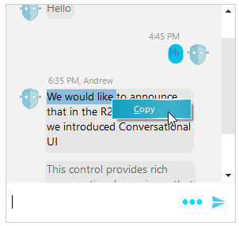

## Environment
 
|Product Version|Product|Author|
|----|----|----|
|2019.3.1022|RadChat for WinForms|[Desislava Yordanova](https://www.telerik.com/blogs/author/desislava-yordanova)|
 
## Description

By default, the messages in **RadChat** visualize the text content but it doesn't provide text selection and copy behavior. This tutorial demonstrates how to achieve select and copy functionality of the text in chat messages.



## Solution 

It is necessary to create a derivative of **TextMessageItemElement** and replace its **ChatMessageBubbleElement** with a custom one which hosts a read-only **RadTextBoxControlElement**. Thus, you will obtain text selection and benefit from the default context menu of the text box element. 

Then, create a custom [Chat Factory]() and integrate the custom message element as follows:
 

````C#

  public RadForm1()
{
    InitializeComponent();
    this.radChat1.Author = new Author(Properties.Resources.bot, "Nancy");
    
    this.radChat1.ChatElement.ChatFactory = new CustomChatFactory();

    Author author2 = new Author(Properties.Resources.bot, "Andrew");
    ChatTextMessage message1 = new ChatTextMessage("Hello", author2, DateTime.Now.AddHours(1));
    this.radChat1.AddMessage(message1);
    ChatTextMessage message2 = new ChatTextMessage("Hi", this.radChat1.Author, DateTime.Now.AddHours(1).AddMinutes(10));
    this.radChat1.AddMessage(message2);
    ChatTextMessage message3 = new ChatTextMessage("We would like to announce that in the R2 2018 release " +
                                                   "we introduced Conversational UI", author2, DateTime.Now.AddHours(3));
    this.radChat1.AddMessage(message3);
    ChatTextMessage message4 = new ChatTextMessage("This control provides rich conversational experience " +
                                                   "that goes beyond the natural language understanding and " +
                                                   "personality of your chatbot.", author2, DateTime.Now.AddHours(3));
    this.radChat1.AddMessage(message4);
}

public class CustomChatFactory : ChatFactory
{
    public override BaseChatItemElement CreateItemElement(BaseChatDataItem item)
    {
        if (item.GetType() == typeof(TextMessageDataItem))
        {
            return new MyTextMessageItemElement();
        }
        return base.CreateItemElement(item);
    }
}

public class MyTextMessageItemElement : TextMessageItemElement
{
    protected override Type ThemeEffectiveType
    {
        get
        {
            return typeof(TextMessageItemElement);
        }
    }

    protected override LightVisualElement CreateMainMessageElement()
    {
        return new CustomChatMessageBubbleElement();
    }

    public override void Synchronize()
    {
        base.Synchronize();
        CustomChatMessageBubbleElement bubble = this.MainMessageElement as CustomChatMessageBubbleElement;
        bubble.DrawText = false;
        bubble.TextBoxElement.Multiline = true;
        bubble.TextBoxElement.DrawFill = false;
        bubble.TextBoxElement.DrawBorder = false;
        bubble.TextBoxElement.IsReadOnly = true;
    }
}

public class CustomChatMessageBubbleElement : ChatMessageBubbleElement
{
    protected override Type ThemeEffectiveType
    {
        get
        {
            return typeof(ChatMessageBubbleElement);
        }
    }

    RadTextBoxControlElement textBoxElement;

    public RadTextBoxControlElement TextBoxElement
    {
        get
        {
            return this.textBoxElement;
        }
    }

    protected override void CreateChildElements()
    {
        base.CreateChildElements();
        textBoxElement = new RadTextBoxControlElement();
        textBoxElement.ContextMenuOpening += textBoxElement_ContextMenuOpening;
        this.Children.Add(textBoxElement);
    }

    private void textBoxElement_ContextMenuOpening(object sender, TreeBoxContextMenuOpeningEventArgs e)
    {
        foreach (RadItem item in e.ContextMenu.Items)
        {
            if (item.Text.Contains("&Copy"))
            {
                item.Visibility = ElementVisibility.Visible;
            }
            else
            {
                item.Visibility = ElementVisibility.Collapsed;
            }
        }
    }

    public override string Text
    {
        get
        {
            return base.Text;
        }
        set
        {
            base.Text = value;
            this.textBoxElement.Text = value;
        }
    }
}
      
        
````
````VB.NET

 Public Sub New()
    InitializeComponent()
    Me.RadChat1.Author = New Author(My.Resources.bot, "Nancy")
    Me.RadChat1.ChatElement.ChatFactory = New CustomChatFactory()
    Dim author2 As Author = New Author(My.Resources.bot, "Andrew")
    Dim message1 As ChatTextMessage = New ChatTextMessage("Hello", author2, DateTime.Now.AddHours(1))
    Me.RadChat1.AddMessage(message1)
    Dim message2 As ChatTextMessage = New ChatTextMessage("Hi", Me.RadChat1.Author, DateTime.Now.AddHours(1).AddMinutes(10))
    Me.RadChat1.AddMessage(message2)
    Dim message3 As ChatTextMessage = New ChatTextMessage("We would like to announce that in the R2 2018 release " &
                                                          "we introduced Conversational UI", author2, DateTime.Now.AddHours(3))
    Me.RadChat1.AddMessage(message3)
    Dim message4 As ChatTextMessage = New ChatTextMessage("This control provides rich conversational experience " &
                                                          "that goes beyond the natural language understanding and " &
                                                          "personality of your chatbot.", author2, DateTime.Now.AddHours(3))
    Me.RadChat1.AddMessage(message4)
End Sub

Public Class CustomChatFactory
    Inherits ChatFactory

    Public Overrides Function CreateItemElement(ByVal item As BaseChatDataItem) As BaseChatItemElement
        If item.[GetType]() = GetType(TextMessageDataItem) Then
            Return New MyTextMessageItemElement()
        End If

        Return MyBase.CreateItemElement(item)
    End Function
End Class

Public Class MyTextMessageItemElement
    Inherits TextMessageItemElement

    Protected Overrides ReadOnly Property ThemeEffectiveType As Type
        Get
            Return GetType(TextMessageItemElement)
        End Get
    End Property

    Protected Overrides Function CreateMainMessageElement() As LightVisualElement
        Return New CustomChatMessageBubbleElement()
    End Function

    Public Overrides Sub Synchronize()
        MyBase.Synchronize()
        Dim bubble As CustomChatMessageBubbleElement = TryCast(Me.MainMessageElement, CustomChatMessageBubbleElement)
        bubble.DrawText = False
        bubble.TextBoxElement.Multiline = True
        bubble.TextBoxElement.DrawFill = False
        bubble.TextBoxElement.DrawBorder = False
        bubble.TextBoxElement.IsReadOnly = True
    End Sub
End Class

Public Class CustomChatMessageBubbleElement
    Inherits ChatMessageBubbleElement

    Protected Overrides ReadOnly Property ThemeEffectiveType As Type
        Get
            Return GetType(ChatMessageBubbleElement)
        End Get
    End Property

    Private _textBoxElement As RadTextBoxControlElement

    Public ReadOnly Property TextBoxElement As RadTextBoxControlElement
        Get
            Return Me._textBoxElement
        End Get
    End Property

    Protected Overrides Sub CreateChildElements()
        MyBase.CreateChildElements()
        _textBoxElement = New RadTextBoxControlElement()
        AddHandler _textBoxElement.ContextMenuOpening, AddressOf textBoxElement_ContextMenuOpening
        Me.Children.Add(_textBoxElement)
    End Sub

    Private Sub textBoxElement_ContextMenuOpening(ByVal sender As Object, ByVal e As TreeBoxContextMenuOpeningEventArgs)
        For Each item As RadItem In e.ContextMenu.Items

            If item.Text.Contains("&Copy") Then
                item.Visibility = ElementVisibility.Visible
            Else
                item.Visibility = ElementVisibility.Collapsed
            End If
        Next
    End Sub

    Public Overrides Property Text As String
        Get
            Return MyBase.Text
        End Get
        Set(ByVal value As String)
            MyBase.Text = value
            Me._textBoxElement.Text = value
        End Set
    End Property
End Class
  


```` 

## See Also

* [How to Display Code Snippets in Chat Messages]()
* [Messages]()
* [ChatElementFactory]()


    
   
  
    
 
