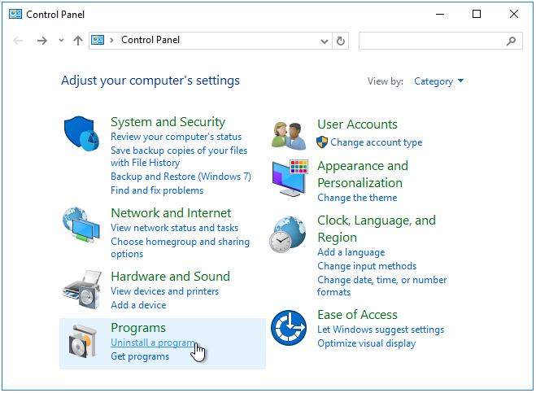
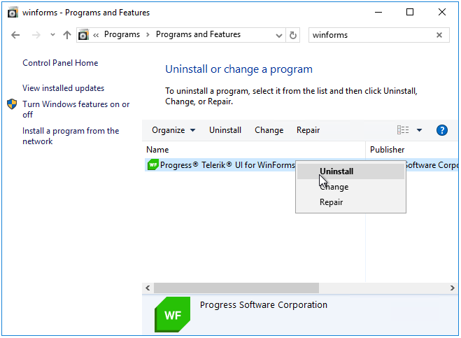
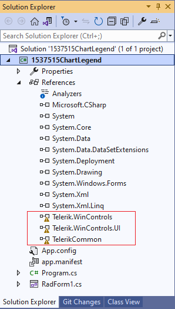
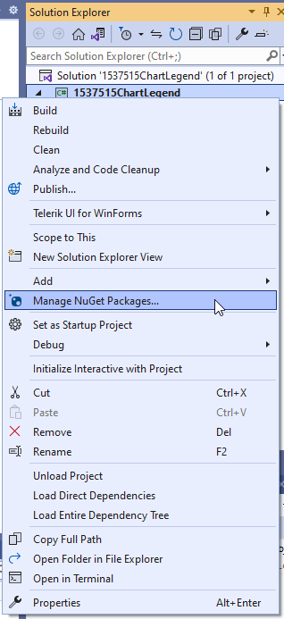
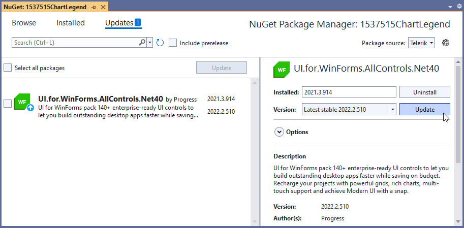
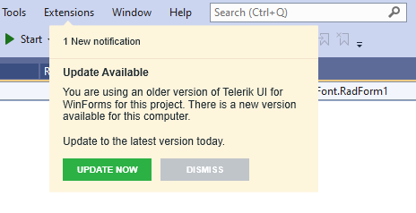
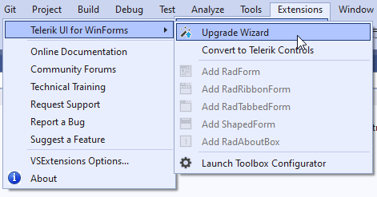

## Environment
 
|Product Version|Product|Author|
|----|----|----|
|2022.2.510|UI for WinForms|[Desislava Yordanova](https://www.telerik.com/blogs/author/desislava-yordanova)|

## Description

When a new version of the Telerik UI for WinForms suite is released, a common requirement for our customers is to upgrade their projects. This article lists different approaches that you may follow. 

## Manual Upgrade

Usually, the previously installed version of the Telerik UI for WinForms suite should be uninstalled first from the WinForms Control Panel: *Control Panel\Programs\Programs and Features*:

Then, the new version should be installed, e.g. by installing the **.msi** from the [Downloads]() section in the Telerik account: [Installing On Your Computer]() 

### Update Telerik Assemblies

If you have a project that uses an older version of the Telerik UI for Winforms suite, most probably you wouldn't be able to build the project or open the designer. This is because it still has references to the old version which is not available on the local machine anymore:

1\. Check the references to all Telerik controls in your project and make sure that they are the same version considering the suffix as well (.20 or .40) since it is usually the most common reason for such a behavior after upgrading. Better yet, you can remove all references and add them anew by using the DLLs from your fresh installation: [Updating Assemblies in a Project]().

2\. Delete the **license.licx** file. 

3\. After that, you should rebuild your project, close Visual Studio and open it again to make sure that no references are kept in the memory by Visual Studio. 

4\. Ensure that no old versions are available in GAC: [Examine the GAC and remove old assemblies]()
 
## Update Telerik NuGet Packages

In case of using the [Telerik NuGet packages]() in your project, you will need to update the installed package accordingly:

## Automatic Upgrade

Once a new version is released you will be notified via the [Download New Version]() message:

The Latest Version Acquirer tool automatically retrieves the freshest Telerik UI for WinForms distribution, available on the Telerik website. Clicking the `Update Now` button starts the [Upgrade Wizard]() which is used to change the version of Telerik UI for WinForms your projects use.

In addition to the pure assembly reference change, the upgrade wizard provides several important features:

* Check if a new version of Telerik UI for WinForms is available on the Telerik website.

* Download a newly discovered version.

* Visual Studio toolbox update.

* Project themes upgrade.

* Current project backup.

>important The Upgrade Wizard doesn't update the NuGet package. In case of using the NuGet approach, feel free to update the package.

# See Also

* [Updating Assemblies in a Project]()
* [Install using NuGet Packages]()
* [Upgrade Wizard]()
* [Download New Version]()
* [Designer is Not Loading]()
