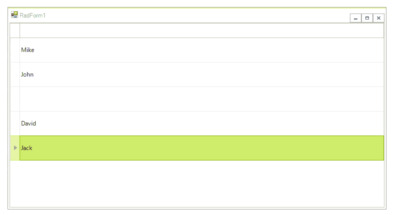

|Product Version|Product|Author|Last modified|
|----|----|----|----|
|2017.2.502|RadGridView for WinForms|Dimitar Karamfilov|January 11, 2018|


The below example demonstrates how one can use the **InkEdit** control which comes with the Microsoft Tablet PC Platform SDK, to enter data in RadGridView using a pen device.
  
  

First, you need to add a reference to the Microsft.Ink.dll. This assembly is part of the Microsoft Tablet PC Platform SDK (1.7 is the latest version).

Detailed information about the ink support in WinForms and WPF can be found in the following article: [https://docs.microsoft.com/en-us/dotnet/framework/wpf/advanced/the-ink-object-model-windows-forms-and-com-versus-wpf#enabling-ink-in-an-application](https://docs.microsoft.com/en-us/dotnet/framework/wpf/advanced/the-ink-object-model-windows-forms-and-com-versus-wpf#enabling-ink-in-an-application)


Let’s start with the example.

To use pen input, we will first need a [custom editor](https://docs.telerik.com/devtools/winforms/gridview/editors/using-custom-editors) which will host the InkEdit control. The **InkEdit** control inherits the standard **RichTextBox**, therefore we need [RadHostItem](https://docs.telerik.com/devtools/winforms/telerik-presentation-framework/elements/use-control-inside-an-element) in order to add it inside RadGridView.

````C#
class GridInkEditor : BaseGridEditor
{
    InkEdit inkEdit1;
    public override object Value
    {
        get
        {
            return inkEdit1.Text;
        }
 
        set
        {
            if (value != null)
            {
                inkEdit1.Text = value.ToString();
            }
 
        }
    }
    protected override RadElement CreateEditorElement()
    {
        this.inkEdit1 = new InkEdit();
        this.inkEdit1.RecoTimeout = 1000;
      
         
        this.inkEdit1.UseMouseForInput = true;
 
        var host = new RadHostItem(inkEdit1);
        host.BackColor = System.Drawing.Color.White;
        return host;
    }
}

````
````VB.NET
Class GridInkEditor
    Inherits BaseGridEditor

    Private inkEdit1 As InkEdit

    Public Overrides Property Value As Object
        Get
            Return inkEdit1.Text
        End Get
        Set(ByVal value As Object)

            If value IsNot Nothing Then
                inkEdit1.Text = value.ToString()
            End If
        End Set
    End Property

    Protected Overrides Function CreateEditorElement() As RadElement
        Me.inkEdit1 = New InkEdit()
        Me.inkEdit1.RecoTimeout = 1000
        Me.inkEdit1.UseMouseForInput = True
        Dim host = New RadHostItem(inkEdit1)
        host.BackColor = System.Drawing.Color.White
        Return host
    End Function
End Class


````

When the editor is created we should add a [GridViewTextBoxColumn](https://docs.telerik.com/devtools/winforms/gridview/columns/column-types/gridviewtextboxcolumn) which will display the text. Once the users start editing operation, the InkControl will appear and the user will be able to enter the data using a pen.


````C#
public RadForm1()
{
    InitializeComponent();
    radGridView1.Columns.Add(new GridViewTextBoxColumn() { Name = "InkColumn" });
    radGridView1.AutoSizeColumnsMode = GridViewAutoSizeColumnsMode.Fill;
    radGridView1.EnableGrouping = false;
    radGridView1.AllowAddNewRow = false;
 
    for (int i = 0; i < 10; i++)
    {
        radGridView1.Rows.Add("Row Index" + i);
 
    }
    radGridView1.Font = new Font("Segoe UI", 16, FontStyle.Regular);
    radGridView1.TableElement.RowHeight = 50;
    radGridView1.EditorRequired += RadGridView1_EditorRequired;
}
 
private void RadGridView1_EditorRequired(object sender, EditorRequiredEventArgs e)
{
    if (radGridView1.CurrentColumn.Name == "InkColumn")
    {
        e.EditorType = typeof(GridInkEditor);
    }
}

````
````VB.NET
Class SurroundingClass
    Public Sub New()
        InitializeComponent()
        radGridView1.Columns.Add(New GridViewTextBoxColumn() With {
            .Name = "InkColumn"
        })
        radGridView1.AutoSizeColumnsMode = GridViewAutoSizeColumnsMode.Fill
        radGridView1.EnableGrouping = False
        radGridView1.AllowAddNewRow = False

        For i As Integer = 0 To 10 - 1
            radGridView1.Rows.Add("Row Index" & i)
        Next

        radGridView1.Font = New Font("Segoe UI", 16, FontStyle.Regular)
        radGridView1.TableElement.RowHeight = 50
        AddHandler radGridView1.EditorRequired, AddressOf RadGridView1_EditorRequired
    End Sub

    Private Sub RadGridView1_EditorRequired(ByVal sender As Object, ByVal e As EditorRequiredEventArgs)
        If radGridView1.CurrentColumn.Name = "InkColumn" Then
            e.EditorType = GetType(GridInkEditor)
        End If
    End Sub
End Class

````

You can download a VB and C# project from the following [link](https://github.com/telerik/winforms-sdk/tree/master/GridView/Ink_Projects).


