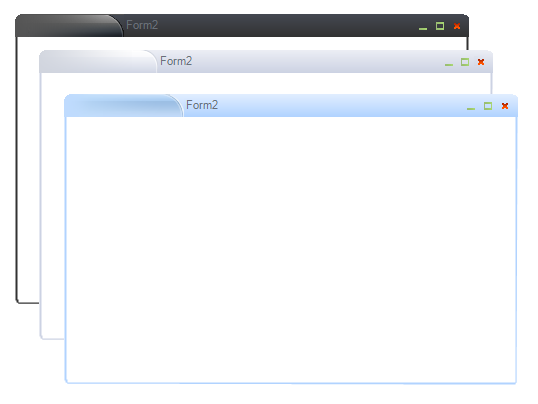

|Product Version|Product|Author|Last modified|
|----|----|----|----|
|Q2 2008|RadControls for WinForms|Tsvetan Raikov|September 10, 2008|

  
**HOW-TO**  
 Implement a chrome window with RadControls for WinForms  
   
**SOLUTION**
To implement a chrome window follow the steps below:  
 
1.Inherit your form from ShapedForm to control the shape, border and background color of the form:  

````C#
using System;  
using System.Windows.Forms;  
using Telerik.WinControls;  
using Telerik.WinControls.UI;  
 
 
public partial class Form1: ShapedForm  
{  
      public Form9()  
      {  
            this.Shape = new RoundRectShape(5);  
            this.BorderColor = Color.Blue;  
            this.BorderWidth = 2;  
 
 
            InitializeComponent();  
      }  
} 

````
````VB.NET
Imports System 
Imports System.Windows.Forms 
Imports Telerik.WinControls 
Imports Telerik.WinControls.UI 
 
Public Partial Class Form1 
    Inherits ShapedForm 
    Public Sub New() 
        Me.Shape = New RoundRectShape(5) 
        Me.BorderColor = Color.Blue 
        Me.BorderWidth = 2 
        
        
        InitializeComponent() 
    End Sub 
End Class 

```` 

2.Drop a **RadTitleBar** control to the form and dock it to the top. If the selected **RadTitleBar** theme does not have system buttons, drop an ImageList and fill it with three images (minimize, maximize and close). Associate the ImageList with **RadTitleBar** control or use the Visual Style Builder to style the title bar. NOTE that the **Maximize** option of the form will work correctly only if the **FormBorderStyle, MinimizeBox**, **MaximizeBox** and **ControlBox**  properties have default values.

3.Run the form.

 
The end result should be similar to the following:  

   

