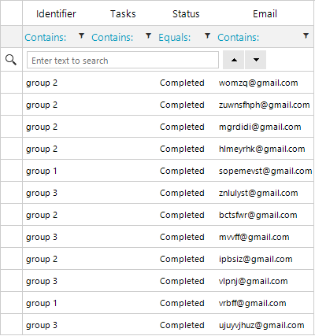

## Environment
|Product Version|Product|Author|
|----|----|----|
|2022.3.913|RadGridView for WinForms|[Desislava Yordanova](https://www.telerik.com/blogs/author/desislava-yordanova)|

## Description

When RadGridView has a column in which most of the cells values are equal, the sorting seems to be slower than the case if the cells values are different with the same number of rows. This difference is observed due to the sorting algorithm that RadGridView internally uses.

>caption Default sorting performance with 5000 records

 

## Solution

By default, if the rows count is less than **10 000** the grid uses quick sort to order the items. If there are more items, a Red-Black tree is used. This is controlled by the **UseHybridIndex** property.

It is known behavior that the quick sort exhibits poor performance for inputs that contain many repeated elements. That is why in order to get better performance, it is necessary to set the **UseHybridIndex** property to a smaller value:

 
````C#

RadDataView<GridViewRowInfo> dataView = this.gridAdditionalTasks.GridViewElement.Template.ListSource.CollectionView as RadDataView<GridViewRowInfo>;
HybridIndex<GridViewRowInfo> indexer = dataView.Indexer as HybridIndex<GridViewRowInfo>;
indexer.Threshold = 500;

````
````VB.NET

Dim dataView As RadDataView(Of GridViewRowInfo) = TryCast(Me.RadGridView1.GridViewElement.Template.ListSource.CollectionView, RadDataView(Of GridViewRowInfo))
Dim indexer As HybridIndex(Of GridViewRowInfo) = TryCast(dataView.Indexer, HybridIndex(Of GridViewRowInfo))
indexer.Threshold = 500

````

>caption Improved sorting performance with 5000 records

 

# See Also

* [Basic Sorting]()
* [Use Custom Comparer to Speed up the Sorting in RadGridView]()
* [Creating Custom Cells]()