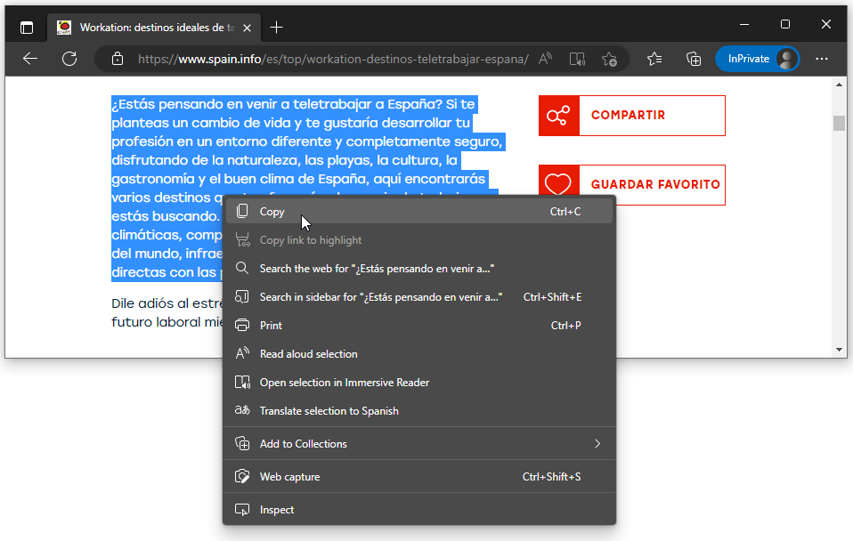
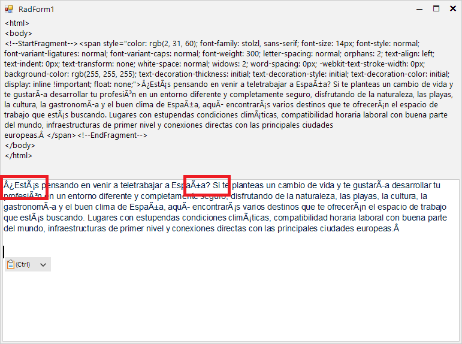
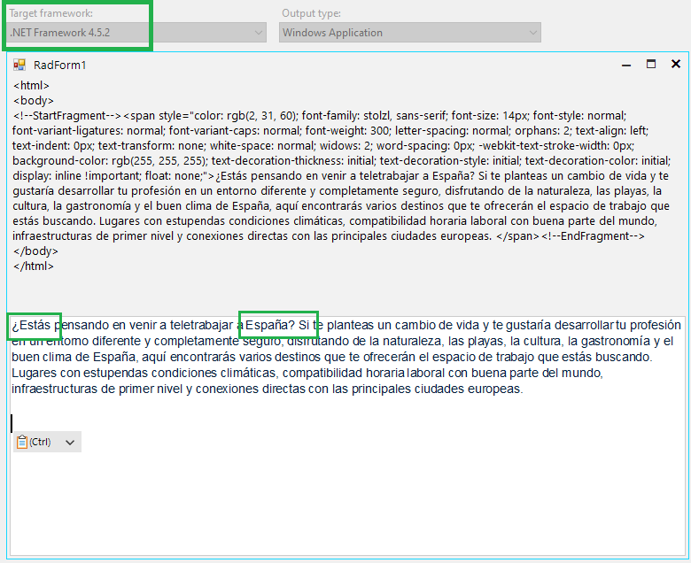
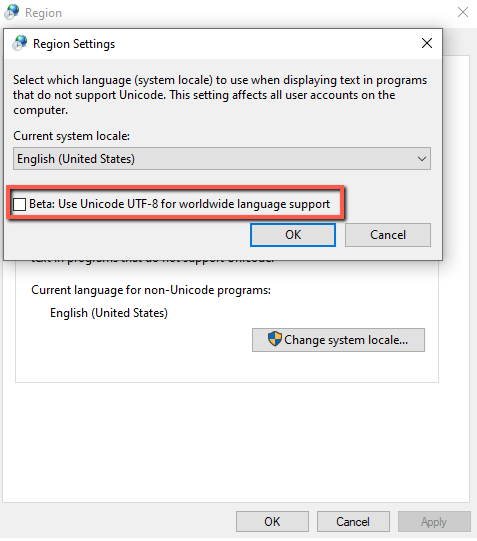

## Environment
|Product Version|Product|Author|
|----|----|----|
|2023.1.117|RadRichTextEditor for WinForms|[Desislava Yordanova](https://www.telerik.com/blogs/author/desislava-yordanova)|

## Description

When the end-users copy some Spanish text from a web pages and paste it in RadRichTextEditor, weird symbols are inserted:

 

## Solution

It seems to be an issue with **.NET 4.0** which is addressed in the later .NET versions: [DataFormats.Html specification states it's encoded in UTF-8. But there's a bug in .NET 4 Framework and lower, and it actually reads as UTF-8 as Windows-1252. You get a lot of wrong encodings, leading funny/bad characters such as 'Å','‹','Å’','Ž','Å¡','Å“','ž','Ÿ','Â','¡','¢','£','¤','Â¥','¦','§','¨','©'](https://stackoverflow.com/a/38067962).

The possible solution is to use higher version than .NET 4.0:

It is also possible to try the option called ["Beta: Use Unicode UTF-8 for worldwide language support"](https://stackoverflow.com/questions/56419639/what-does-beta-use-unicode-utf-8-for-worldwide-language-support-actually-do) and test whether the default behavior will be affected in a positive way:

 
