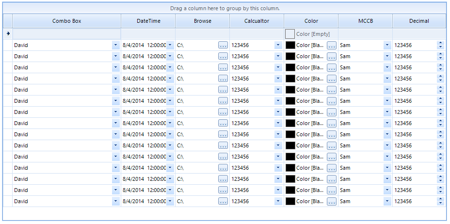

## Environment
 
|Product Version|Product|Author|
|----|----|----|
|2019.3.917|RadGridView for WinForms|[Nadya Karaivanova]|
 

## Description

A common requirement is to indicate the column type and make the editors visible when the grid is first shown. For example, if you have **GridViewComboBoxColumn** and you want the end user to have the opportunity to choose from a list of predefined items.

## Solution 

First you should create a custom cell class that inherits the appropriate cell element. For example, if you have **GridViewComboBoxColumn** you should inherits the **GridComboBoxCellElement**. Afterwards, you can create a custom column class that inherits the corresponding column. In my example it should inherits the **GridViewComboBoxColumn**. Keep in mind that this approach can be easily adopted for other column types by changing the inherited column and cell type. 

>note A complete solution in C# and VB.NET is available in our [SDK repository](https://github.com/telerik/winforms-sdk/tree/master/GridView/RadGridViewColumn-Indicate-Editor-Type)

    
   
  
    
 
