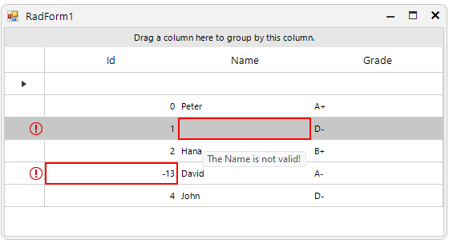
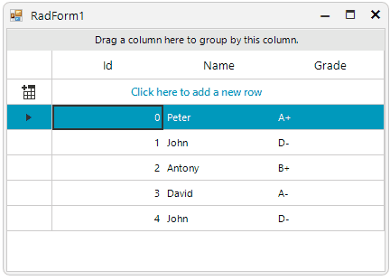
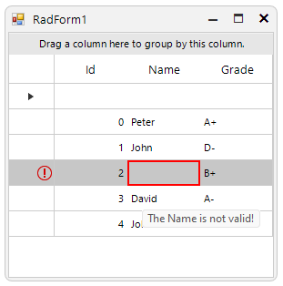

### Environment
 
|Product Version|Product|Author|
|----|----|----|
|2023.2.718|RadGridView for WinForms|[Desislava Yordanova](https://www.telerik.com/blogs/author/desislava-yordanova)|
 
## Description
 
RadGridView is one of the most commonly used controls for presenting data and allowing the end users add/update/delete the records. Indicating wrong/incorrect values is very essential for each application that offers data manipulation. This article demonstrates how to show incorrect values entered in the grid's cells.



## Solution

The [IDataErrorInfo](https://learn.microsoft.com/en-us/previous-versions/windows/apps/743swcz7(v=vs.105)) interface provides the functionality to offer custom error information that a user interface can bind to. If the bound objects to the grid rows implements the IDataErrorInfo interface, once the end user enters an incorrect value and commits the editor's changes, the error icon appears with the appropriate message:  

 
 
````C#

        BindingList<Student> collectionOfStudents = new BindingList<Student>(); 
        public RadForm1()
        {
            InitializeComponent();

            collectionOfStudents.Add(new Student(0, "Peter", "A+"));
            collectionOfStudents.Add(new Student(1, "John", "D-"));
            collectionOfStudents.Add(new Student(2, "Antony", "B+"));
            collectionOfStudents.Add(new Student(3, "David", "A-"));
            collectionOfStudents.Add(new Student(4, "John", "D-"));
               

            this.radGridView1.AutoGenerateHierarchy = true;
            this.radGridView1.DataSource = collectionOfStudents;
            this.radGridView1.MasterTemplate.AutoSizeColumnsMode = GridViewAutoSizeColumnsMode.Fill; 
            this.radGridView1.TableElement.RowHeaderColumnWidth = 50;
        }

        public class Student : System.ComponentModel.INotifyPropertyChanged, IDataErrorInfo
        {
            int m_id;
            string m_name;
            string m_grade;
            public event PropertyChangedEventHandler PropertyChanged;
            public Student(int m_id, string m_name, string m_grade)
            {
                this.m_id = m_id;
                this.m_name = m_name;
                this.m_grade = m_grade;
            }
            public int Id
            {
                get
                {
                    return m_id;
                }
                set
                {
                    if (this.m_id != value)
                    {
                        this.m_id = value;
                        OnPropertyChanged("Id");
                    }
                }
            }
            public string Name
            {
                get
                {
                    return m_name;
                }
                set
                {
                    if (this.m_name != value)
                    {
                        this.m_name = value;
                        OnPropertyChanged("Name");
                    }
                }
            }
            public string Grade
            {
                get
                {
                    return m_grade;
                }
                set
                {
                    if (this.m_grade != value)
                    {
                        this.m_grade = value;
                        OnPropertyChanged("Grade");
                    }
                }
            }

            public string this[string columnName]
            {
                get
                {
                    if (columnName == "Name" && (this.Name == string.Empty || this.Name == null))
                    {
                        return "The Name is not valid!";
                    }
                    else if (columnName == "Id" && this.Id < 0)
                    {
                        return "The Id is not valid!";
                    }
                    return string.Empty;
                }
            }

            [Browsable(false)]
            public string Error
            {
                get
                {
                    if (this.Id <= -1)
                    {
                        return "Please enter valid Id for this Student!";
                    }
                    if (this.Name == string.Empty || this.Name == null)
                    {
                        return "Please enter valid Name for this Student!";
                    }
                    return string.Empty;
                }
            }
            protected virtual void OnPropertyChanged(string propertyName)
            {
                if (PropertyChanged != null)
                {
                    PropertyChanged(this, new PropertyChangedEventArgs(propertyName));
                }
            }
        }
         

````
````VB.NET

    Private collectionOfStudents As BindingList(Of Student) = New BindingList(Of Student)()

    Public Sub New()
        InitializeComponent()
        collectionOfStudents.Add(New Student(0, "Peter", "A+"))
        collectionOfStudents.Add(New Student(1, "John", "D-"))
        collectionOfStudents.Add(New Student(2, "Antony", "B+"))
        collectionOfStudents.Add(New Student(3, "David", "A-"))
        collectionOfStudents.Add(New Student(4, "John", "D-"))
        Me.RadGridView1.AutoGenerateHierarchy = True
        Me.RadGridView1.DataSource = collectionOfStudents
        Me.RadGridView1.MasterTemplate.AutoSizeColumnsMode = GridViewAutoSizeColumnsMode.Fill
        Me.RadGridView1.TableElement.RowHeaderColumnWidth = 50
    End Sub

    Public Class Student
        Implements INotifyPropertyChanged, IDataErrorInfo

        Private m_id As Integer
        Private m_name As String
        Private m_grade As String
        Public Event PropertyChanged As PropertyChangedEventHandler
        Private Event INotifyPropertyChanged_PropertyChanged As PropertyChangedEventHandler Implements INotifyPropertyChanged.PropertyChanged

        Public Sub New(ByVal m_id As Integer, ByVal m_name As String, ByVal m_grade As String)
            Me.m_id = m_id
            Me.m_name = m_name
            Me.m_grade = m_grade
        End Sub

        Public Property Id As Integer
            Get
                Return m_id
            End Get
            Set(ByVal value As Integer)

                If Me.m_id <> value Then
                    Me.m_id = value
                    OnPropertyChanged("Id")
                End If
            End Set
        End Property

        Public Property Name As String
            Get
                Return m_name
            End Get
            Set(ByVal value As String)

                If Me.m_name <> value Then
                    Me.m_name = value
                    OnPropertyChanged("Name")
                End If
            End Set
        End Property

        Public Property Grade As String
            Get
                Return m_grade
            End Get
            Set(ByVal value As String)

                If Me.m_grade <> value Then
                    Me.m_grade = value
                    OnPropertyChanged("Grade")
                End If
            End Set
        End Property

        Private ReadOnly Property IDataErrorInfo_Item(columnName As String) As String Implements IDataErrorInfo.Item
            Get
                If columnName = "Name" AndAlso (Me.Name = String.Empty OrElse Me.Name Is Nothing) Then
                    Return "The Name is not valid!"
                ElseIf columnName = "Id" AndAlso Me.Id < 0 Then
                    Return "The Id is not valid!"
                End If

                Return String.Empty
            End Get
        End Property

        Private ReadOnly Property IDataErrorInfo_Error As String Implements IDataErrorInfo.Error
            Get
                If Me.Id <= -1 Then
                    Return "Please enter valid Id for this Student!"
                End If

                If Me.Name = String.Empty OrElse Me.Name Is Nothing Then
                    Return "Please enter valid Name for this Student!"
                End If

                Return String.Empty
            End Get
        End Property

        Protected Overridable Sub OnPropertyChanged(ByVal propertyName As String)
            RaiseEvent PropertyChanged(Me, New PropertyChangedEventArgs(propertyName))
        End Sub
    End Class   
    
````

 You can also use the **ContainsErrors** property which indicates whether a cell or row contain errors. You should handle the **CellFormatting** event in this case:

 ````C#

        private void radGridView1_CellFormatting(object sender, CellFormattingEventArgs e)
        {
            GridDataCellElement cell = e.CellElement as GridDataCellElement;
            if (cell != null)
            {
                if (cell.ContainsErrors)
                {
                    cell.DrawBorder = true;
                    cell.BorderBoxStyle = BorderBoxStyle.SingleBorder;
                    cell.BorderWidth = 2;
                    cell.BorderColor = Color.Red;
                }
                else
                {
                    cell.ResetValue(LightVisualElement.DrawBorderProperty, ValueResetFlags.Local);
                    cell.ResetValue(LightVisualElement.BorderBoxStyleProperty, ValueResetFlags.Local);
                    cell.ResetValue(LightVisualElement.BorderWidthProperty, ValueResetFlags.Local);
                    cell.ResetValue(LightVisualElement.BorderColorProperty, ValueResetFlags.Local);
                }
            }
        }      

````
````VB.NET

     Private Sub radGridView1_CellFormatting(ByVal sender As Object, ByVal e As CellFormattingEventArgs) Handles RadGridView1.CellFormatting
        Dim cell As GridDataCellElement = TryCast(e.CellElement, GridDataCellElement)

        If cell IsNot Nothing Then

            If cell.ContainsErrors Then
                cell.DrawBorder = True
                cell.BorderBoxStyle = BorderBoxStyle.SingleBorder
                cell.BorderWidth = 2
                cell.BorderColor = Color.Red
            Else
                cell.ResetValue(LightVisualElement.DrawBorderProperty, ValueResetFlags.Local)
                cell.ResetValue(LightVisualElement.BorderBoxStyleProperty, ValueResetFlags.Local)
                cell.ResetValue(LightVisualElement.BorderWidthProperty, ValueResetFlags.Local)
                cell.ResetValue(LightVisualElement.BorderColorProperty, ValueResetFlags.Local)
            End If
        End If
    End Sub   
    
````
As a result the cell containing a wrong value will be highlighted with a red border:



# See Also

 * [Data validation]()
 * [Editing Lifecycle]()
 * [Formatting Cells]()

