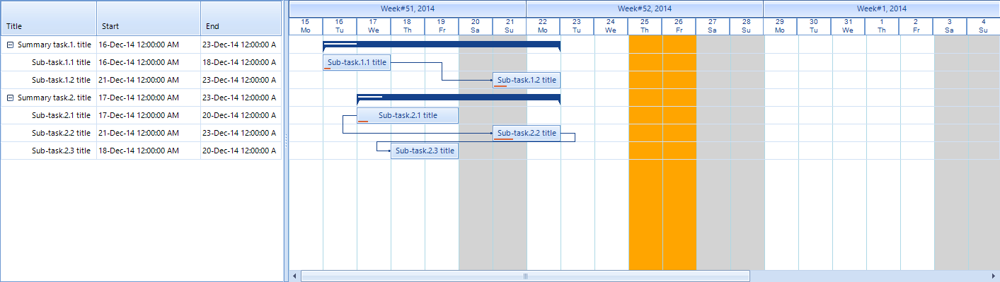
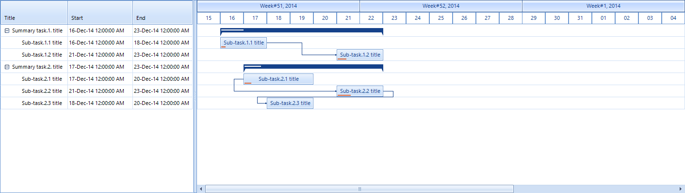

|Date Posted|Product|Author|
|----|----|----|
|February 09, 2015|RadGanttView for WinForms|[Hristo Merdjanov](https://www.telerik.com/blogs/author/hristo-merdjanov)|

## Problem

By default, **RadGanttView** visualizes its items in rows, where all tasks are aligned according to the beginning and end time of each task. There is no clear column indication in the **GraphicalViewElement**.  This article demonstrates a sample approach how to achieve it.
 
## Solution

We need to override the **PaintElement** method in the **GanttViewGraphicalViewElement.** For this purpose, we should also create a custom **RadGanttView** control containing a custom **RadGanttViewElement**.
 

 
Let`s first populate some data in our **RadGanttView**:  
 
````C#
private void AddTasks()
{
    //Setup data items
    GanttViewDataItem item1 = new GanttViewDataItem();
    item1.Start = new DateTime(2014, 12, 15);
    item1.End = new DateTime(2014, 12, 20);
    item1.Progress = 30m;
    item1.Title = "Summary task.1. title";
 
    GanttViewDataItem subItem11 = new GanttViewDataItem();
    subItem11.Start = new DateTime(2014, 12, 16);
    subItem11.End = new DateTime(2014, 12, 18);
    subItem11.Progress = 10m;
    subItem11.Title = "Sub-task.1.1 title";
 
    GanttViewDataItem subItem12 = new GanttViewDataItem();
    subItem12.Start = new DateTime(2014, 12, 21);
    subItem12.End = new DateTime(2014, 12, 23);
    subItem12.Progress = 20m;
    subItem12.Title = "Sub-task.1.2 title";
 
    //Add subitems
    item1.Items.Add(subItem11);
    item1.Items.Add(subItem12);
 
    this.customRadGanttView.Items.Add(item1);
 
    GanttViewDataItem item2 = new GanttViewDataItem();
    item2.Start = new DateTime(2014, 12, 21);
    item2.End = new DateTime(2014, 12, 12);
    item2.Progress = 40m;
    item2.Title = "Summary task.2. title";
 
    GanttViewDataItem subitem21 = new GanttViewDataItem();
    subitem21.Start = new DateTime(2014, 12, 17);
    subitem21.End = new DateTime(2014, 12, 20);
    subitem21.Progress = 10m;
    subitem21.Title = "Sub-task.2.1 title";
 
    GanttViewDataItem subitem22 = new GanttViewDataItem();
    subitem22.Start = new DateTime(2014, 12, 21);
    subitem22.End = new DateTime(2014, 12, 23);
    subitem22.Progress = 30m;
    subitem22.Title = "Sub-task.2.2 title";
 
    GanttViewDataItem subitem23 = new GanttViewDataItem();
    subitem23.Start = new DateTime(2014, 12, 18);
    subitem23.End = new DateTime(2014, 12, 20);
    subitem23.Title = "Sub-task.2.3 title";
 
    //Add subitems
    item2.Items.Add(subitem21);
    item2.Items.Add(subitem22);
    item2.Items.Add(subitem23);
 
    this.customRadGanttView.Items.Add(item2);
 
    //Add links between items
    GanttViewLinkDataItem link1 = new GanttViewLinkDataItem();
    link1.StartItem = subItem11;
    link1.EndItem = subItem12;
    link1.LinkType = TasksLinkType.FinishToStart;
    this.customRadGanttView.Links.Add(link1);
 
    GanttViewLinkDataItem link2 = new GanttViewLinkDataItem();
    link2.StartItem = subitem21;
    link2.EndItem = subitem22;
    link2.LinkType = TasksLinkType.StartToStart;
    this.customRadGanttView.Links.Add(link2);
 
    GanttViewLinkDataItem link3 = new GanttViewLinkDataItem();
    link3.StartItem = subitem22;
    link3.EndItem = subitem23;
    link3.LinkType = TasksLinkType.FinishToStart;
    this.customRadGanttView.Links.Add(link3);
 
    GanttViewTextViewColumn titleColumn = new GanttViewTextViewColumn("Title");
    GanttViewTextViewColumn startColumn = new GanttViewTextViewColumn("Start");
    GanttViewTextViewColumn endColumn = new GanttViewTextViewColumn("End");
 
    this.customRadGanttView.GanttViewElement.Columns.Add(titleColumn);
    this.customRadGanttView.GanttViewElement.Columns.Add(startColumn);
    this.customRadGanttView.GanttViewElement.Columns.Add(endColumn);
}

````
````VB.NET
Private Sub AddTasks()
    'Setup data items
    Dim item1 As New GanttViewDataItem()
    item1.Start = New DateTime(2014, 12, 15)
    item1.[End] = New DateTime(2014, 12, 20)
    item1.Progress = 30D
    item1.Title = "Summary task.1. title"
 
    Dim subItem11 As New GanttViewDataItem()
    subItem11.Start = New DateTime(2014, 12, 16)
    subItem11.[End] = New DateTime(2014, 12, 18)
    subItem11.Progress = 10D
    subItem11.Title = "Sub-task.1.1 title"
 
    Dim subItem12 As New GanttViewDataItem()
    subItem12.Start = New DateTime(2014, 12, 21)
    subItem12.[End] = New DateTime(2014, 12, 23)
    subItem12.Progress = 20D
    subItem12.Title = "Sub-task.1.2 title"
 
    'Add subitems
    item1.Items.Add(subItem11)
    item1.Items.Add(subItem12)
 
    Me.CustomRadGanttView.Items.Add(item1)
 
    Dim item2 As New GanttViewDataItem()
    item2.Start = New DateTime(2014, 12, 21)
    item2.[End] = New DateTime(2014, 12, 12)
    item2.Progress = 40D
    item2.Title = "Summary task.2. title"
 
    Dim subitem21 As New GanttViewDataItem()
    subitem21.Start = New DateTime(2014, 12, 17)
    subitem21.[End] = New DateTime(2014, 12, 20)
    subitem21.Progress = 10D
    subitem21.Title = "Sub-task.2.1 title"
 
    Dim subitem22 As New GanttViewDataItem()
    subitem22.Start = New DateTime(2014, 12, 21)
    subitem22.[End] = New DateTime(2014, 12, 23)
    subitem22.Progress = 30D
    subitem22.Title = "Sub-task.2.2 title"
 
    Dim subitem23 As New GanttViewDataItem()
    subitem23.Start = New DateTime(2014, 12, 18)
    subitem23.[End] = New DateTime(2014, 12, 20)
    subitem23.Title = "Sub-task.2.3 title"
 
    'Add subitems
    item2.Items.Add(subitem21)
    item2.Items.Add(subitem22)
    item2.Items.Add(subitem23)
 
    Me.CustomRadGanttView.Items.Add(item2)
 
    'Add links between items
    Dim link1 As New GanttViewLinkDataItem()
    link1.StartItem = subItem11
    link1.EndItem = subItem12
    link1.LinkType = TasksLinkType.FinishToStart
    Me.CustomRadGanttView.Links.Add(link1)
 
    Dim link2 As New GanttViewLinkDataItem()
    link2.StartItem = subitem21
    link2.EndItem = subitem22
    link2.LinkType = TasksLinkType.StartToStart
    Me.CustomRadGanttView.Links.Add(link2)
 
    Dim link3 As New GanttViewLinkDataItem()
    link3.StartItem = subitem22
    link3.EndItem = subitem23
    link3.LinkType = TasksLinkType.FinishToStart
    Me.CustomRadGanttView.Links.Add(link3)
 
    Dim titleColumn As New GanttViewTextViewColumn("Title")
    Dim startColumn As New GanttViewTextViewColumn("Start")
    Dim endColumn As New GanttViewTextViewColumn("End")
 
    Me.CustomRadGanttView.GanttViewElement.Columns.Add(titleColumn)
    Me.CustomRadGanttView.GanttViewElement.Columns.Add(startColumn)
    Me.CustomRadGanttView.GanttViewElement.Columns.Add(endColumn)
End Sub

````

Below is a screenshot of the control with its default look:



We can now start our own implementation of the **CustomGanttViewGraphicalViewElement** by inheriting the **GanttViewGraphicalViewElement** class. Following our business logic we should create a public property which will contain a list of the customized special days. In the **PaintElement** method override we are going to paint a vertical line for each date as well as a grey background for the weekends and an orange background for the special dates. 


````C#
public class CustomGanttViewGraphicalViewElement : GanttViewGraphicalViewElement
{
    private List<DateTime> specialDates = new List<DateTime>();
 
    public CustomGanttViewGraphicalViewElement(RadGanttViewElement ganttView)
        : base(ganttView)
    { }
 
    public List<DateTime> SpecialDates
    {
        get { return specialDates; }
        set { specialDates = value; }
    }
 
    protected override Type ThemeEffectiveType
    {
        get { return typeof(GanttViewGraphicalViewElement); }
    }
 
    //Logic for painting the elements
    protected override void PaintElement(Telerik.WinControls.Paint.IGraphics graphics, float angle, System.Drawing.SizeF scale)
    {
        base.PaintElement(graphics, angle, scale);
 
        Rectangle clipRect = this.Bounds;
        Graphics g = graphics.UnderlayGraphics as Graphics;
 
        g.SetClip(clipRect);
 
        DateTime currentDate = this.TimelineBehavior.AdjustedTimelineStart;
 
        while (currentDate <= this.TimelineBehavior.AdjustedTimelineEnd)
        {
            float x = (float)((currentDate - this.TimelineBehavior.AdjustedTimelineStart).TotalSeconds / this.OnePixelTime.TotalSeconds);
            x -= this.HorizontalScrollBarElement.Value;
            float y = this.GanttViewElement.HeaderHeight;
            float y2 = this.Bounds.Height;
 
            if (currentDate.DayOfWeek == DayOfWeek.Saturday || currentDate.DayOfWeek == DayOfWeek.Sunday)
            {
                graphics.FillRectangle(new RectangleF(x, y, 100f, y2), Color.LightGray);
            }
            else if (this.SpecialDates.Contains(currentDate.Date))
            {
                graphics.FillRectangle(new RectangleF(x, y, 100f, y2), Color.Orange);
            }
            else
            {
                graphics.FillRectangle(new RectangleF(x, y, 100f, y2), Color.White);
            }
 
            graphics.DrawLine(Color.LightBlue, x, y, x, y2);
 
            currentDate = currentDate.AddDays(1);
        }
 
        g.ResetClip();
    }
}

````
````VB.NET
Public Class CustomGanttViewGraphicalViewElement
    Inherits GanttViewGraphicalViewElement
 
    Private m_specialDates As New List(Of DateTime)()
 
    Public Sub New(ganttView As RadGanttViewElement)
        MyBase.New(ganttView)
    End Sub
 
    Public Property SpecialDates() As List(Of DateTime)
        Get
            Return m_specialDates
        End Get
        Set(value As List(Of DateTime))
            m_specialDates = value
        End Set
    End Property
 
    Protected Overrides ReadOnly Property ThemeEffectiveType() As Type
        Get
            Return GetType(GanttViewGraphicalViewElement)
        End Get
    End Property
 
    'Logic for painting the elements
    Protected Overrides Sub PaintElement(graphics As Telerik.WinControls.Paint.IGraphics, angle As Single, scale As System.Drawing.SizeF)
        MyBase.PaintElement(graphics, angle, scale)
 
        Dim clipRect As Rectangle = Me.Bounds
        Dim g As Graphics = TryCast(graphics.UnderlayGraphics, Graphics)
 
        g.SetClip(clipRect)
 
        Dim currentDate As DateTime = Me.TimelineBehavior.AdjustedTimelineStart
 
        While currentDate <= Me.TimelineBehavior.AdjustedTimelineEnd
            Dim x As Single = CSng((currentDate - Me.TimelineBehavior.AdjustedTimelineStart).TotalSeconds / Me.OnePixelTime.TotalSeconds)
            x -= Me.HorizontalScrollBarElement.Value
            Dim y As Single = Me.GanttViewElement.HeaderHeight
            Dim y2 As Single = Me.Bounds.Height
 
            If currentDate.DayOfWeek = DayOfWeek.Saturday OrElse currentDate.DayOfWeek = DayOfWeek.Sunday Then
                graphics.FillRectangle(New RectangleF(x, y, 100.0F, y2), Color.LightGray)
            ElseIf Me.SpecialDates.Contains(currentDate.[Date]) Then
                graphics.FillRectangle(New RectangleF(x, y, 100.0F, y2), Color.Orange)
            Else
                graphics.FillRectangle(New RectangleF(x, y, 100.0F, y2), Color.White)
            End If
 
            graphics.DrawLine(Color.LightBlue, x, y, x, y2)
 
            currentDate = currentDate.AddDays(1)
        End While
 
        g.ResetClip()
    End Sub

````

Now, we are ready to substitute the **GanttViewGraphicalViewElement** in the **RadGanttViewElement** class. For the purpose we should make our own implementation and perform this operation:


````C#
public class CustomGanttViewElement : RadGanttViewElement
{
    protected override GanttViewGraphicalViewElement
CreateGraphicalViewElement(RadGanttViewElement ganttView)
    {
        return new CustomGanttViewGraphicalViewElement(this);
    }
 
    protected override Type ThemeEffectiveType
    {
        get { return typeof(RadGanttViewElement); }
    }
}


````
````VB.NET
Public Class CustomGanttViewElement
    Inherits RadGanttViewElement
 
    Protected Overrides Function CreateGraphicalViewElement(ganttView As RadGanttViewElement) As GanttViewGraphicalViewElement
        Return New CustomGanttViewGraphicalViewElement(Me)
    End Function
 
    Protected Overrides ReadOnly Property ThemeEffectiveType() As Type
        Get
            Return GetType(RadGanttViewElement)
        End Get
    End Property
End Class

````

Going up in the hierarchy, now we should create our own **RadGanttView** control containing the already created in the previous step **CustomGanttViewElement**:

````C#
public class CustomGanttView : RadGanttView
{
    protected override RadGanttViewElement CreateGanttViewElement()
    {
        return new CustomGanttViewElement();
    }
 
    public override string ThemeClassName
    {
        get { return typeof(RadGanttView).FullName; }
    }
}

````
````VB.NET
Public Class CustomGanttView
    Inherits RadGanttView
 
    Protected Overrides Function CreateGanttViewElement() As RadGanttViewElement
        Return New CustomGanttViewElement()
    End Function
 
    Public Overrides Property ThemeClassName As String
        Get
            Return GetType(RadGanttView).FullName
        End Get
        Set(value As String)
            MyBase.ThemeClassName = value
        End Set
    End Property
End Class

````

>note A complete solution in C# and VB.NET can be found [here](https://github.com/telerik/winforms-sdk/tree/master/GanttView/RadGanttViewIndicatingSpecialDays).

