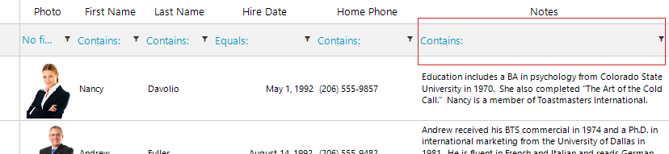
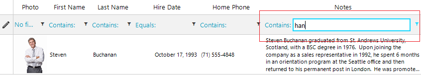
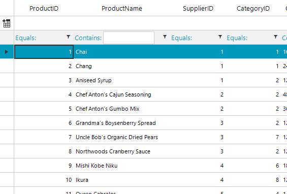

## Environment
 
|Product Version|Product|Author|
|----|----|----|
|2022.1.222|RadGridView for WinForms|[Desislava Yordanova](https://www.telerik.com/blogs/author/desislava-yordanova)|


## Description

**RadGridView** uses an [editing mechanism]() which means that when you need to edit a single cell, an appropriate editor is activated. Once the editor's value is confirmed (e.g. by pressing Enter), the value is committed to the respective cell. The same approach is followed for the filter cells. Only a single cell can be in edit mode at a time. That is why the textbox is not visible until the filter cell enters edit mode. 

|Normal state|Edit mode|
|----|----|
|||

A common requirement is to indicate the editor in the filter cells even though the grid is not in edit mode. This article demonstrates a sample approach how to indicate the **RadTextBoxEditor** in the filter cells for the **GridViewTextBoxColumn**. However, this approach can be adopted for other column types as well. 

## Solution

We will use a RadGridView bound to the Northwind.Products table. Then, we will replace the "ProductName" column with a custom one. 

1\. Create a derivative of **GridFilterCellElement** and add a RadTextBoxControlElement to it which will be visible only when the filter cell is NOT in edit mode. Once the editor is activated, the RadTextBoxControlElement will be collapsed. Its purpose is to indicate the end users that there is a textbox editor for filtering. 

2\. Create a derivative of **GridViewTextBoxColumn** and replace the default **GridFilterCellElement** with the custom one in the **GetCellType** method. 

The achieved result is illustrated below:
 



````C# 
       
private void RadForm1_Load(object sender, EventArgs e)
{ 
    this.productsTableAdapter.Fill(this.nwindDataSet.Products);
    this.radGridView1.DataSource = this.productsBindingSource;

    this.radGridView1.Columns.Remove("ProductName");
    CustomTextBoxColumn productNameColumn = new CustomTextBoxColumn();
    productNameColumn.Name = productNameColumn.FieldName = productNameColumn.HeaderText = "ProductName";
    this.radGridView1.Columns.Insert(1, productNameColumn);
    this.radGridView1.AutoSizeColumnsMode = GridViewAutoSizeColumnsMode.Fill;

    this.radGridView1.EnableFiltering = true;
}

public class CustomTextBoxColumn : GridViewTextBoxColumn
{
    public override Type GetCellType(GridViewRowInfo row)
    {
        if (row is GridViewFilteringRowInfo)
        {
            return typeof(CustomFilterCellElement);
        }
        return base.GetCellType(row);
    }
}

public class CustomFilterCellElement : GridFilterCellElement
{ 
    public CustomFilterCellElement(GridViewDataColumn column, GridRowElement row) : base(column, row)
    {
    }

    public override bool IsCompatible(GridViewColumn data, object context)
    {
        return data is CustomTextBoxColumn && context is GridFilterRowElement; 
    }

    RadTextBoxControlElement textBoxElement = new RadTextBoxControlElement();

    protected override void CreateChildElements()
    {
        base.CreateChildElements();
        textBoxElement.ShouldHandleMouseInput = false;
        textBoxElement.NotifyParentOnMouseInput = true;
        this.Children.Add(textBoxElement);
    } 
    protected override void SetContentCore(object value)
    {
        base.SetContentCore(value);
        this.textBoxElement.Text = value + ""; 
    }

    public override void AddEditor(IInputEditor editor)
    {
        this.textBoxElement.Visibility = ElementVisibility.Collapsed;
        base.AddEditor(editor);
    }

    public override void RemoveEditor(IInputEditor editor)
    {
        base.RemoveEditor(editor);
        this.textBoxElement.Visibility = ElementVisibility.Visible;
        this.RowInfo.InvalidateRow();
    }

    protected override SizeF ArrangeOverride(SizeF finalSize)
    {
        SizeF s = base.ArrangeOverride(finalSize);

        this.textBoxElement.Arrange(new RectangleF(this.FilterOperatorText.DesiredSize.Width, 2,
            finalSize.Width - this.FilterOperatorText.DesiredSize.Width - this.FilterButton.DesiredSize.Width - 10, s.Height - 5));
        return s;
    }
}
    
````
````VB.NET

Private Sub RadForm1_Load(sender As Object, e As EventArgs) Handles MyBase.Load
    Me.ProductsTableAdapter.Fill(Me.NwindDataSet.Products)
    Me.RadGridView1.DataSource = Me.ProductsBindingSource
    Me.RadGridView1.Columns.Remove("ProductName")
    Dim productNameColumn As CustomTextBoxColumn = New CustomTextBoxColumn()
    productNameColumn.HeaderText = "ProductName"
    productNameColumn.FieldName = "ProductName"
    productNameColumn.Name = "ProductName"
    Me.RadGridView1.Columns.Insert(1, productNameColumn)
    Me.RadGridView1.AutoSizeColumnsMode = GridViewAutoSizeColumnsMode.Fill
    Me.RadGridView1.EnableFiltering = True
End Sub

Public Class CustomTextBoxColumn
    Inherits GridViewTextBoxColumn

    Public Overrides Function GetCellType(ByVal row As GridViewRowInfo) As Type
        If TypeOf row Is GridViewFilteringRowInfo Then
            Return GetType(CustomFilterCellElement)
        End If

        Return MyBase.GetCellType(row)
    End Function 
End Class

Public Class CustomFilterCellElement
    Inherits GridFilterCellElement

    Public Sub New(ByVal column As GridViewDataColumn, ByVal row As GridRowElement)
        MyBase.New(column, row)
    End Sub

    Public Overrides Function IsCompatible(ByVal data As GridViewColumn, ByVal context As Object) As Boolean
        Return TypeOf data Is CustomTextBoxColumn AndAlso TypeOf context Is GridFilterRowElement
    End Function

    Private textBoxElement As RadTextBoxControlElement

    Protected Overrides Sub CreateChildElements()
        MyBase.CreateChildElements()
        textBoxElement = New RadTextBoxControlElement()
        textBoxElement.ShouldHandleMouseInput = False
        textBoxElement.NotifyParentOnMouseInput = True
        Me.Children.Add(textBoxElement)
    End Sub

    Protected Overrides Sub SetContentCore(ByVal value As Object)
        MyBase.SetContentCore(value)
        Me.textBoxElement.Text = value & ""
    End Sub

    Public Overrides Sub AddEditor(ByVal editor As IInputEditor)
        Me.textBoxElement.Visibility = ElementVisibility.Collapsed
        MyBase.AddEditor(editor)
    End Sub

    Public Overrides Sub RemoveEditor(ByVal editor As IInputEditor)
        MyBase.RemoveEditor(editor)
        Me.textBoxElement.Visibility = ElementVisibility.Visible
        Me.RowInfo.InvalidateRow()
    End Sub

    Protected Overrides Function ArrangeOverride(ByVal finalSize As SizeF) As SizeF
        Dim s As SizeF = MyBase.ArrangeOverride(finalSize)
        Me.textBoxElement.Arrange(New RectangleF(Me.FilterOperatorText.DesiredSize.Width, 2, _
           finalSize.Width - Me.FilterOperatorText.DesiredSize.Width - Me.FilterButton.DesiredSize.Width - 10, s.Height - 5))
        Return s
    End Function 
End Class

````


# See Also

* [Creating Custom Cells]()
* [Put a filter cell into edit mode programmatically]()