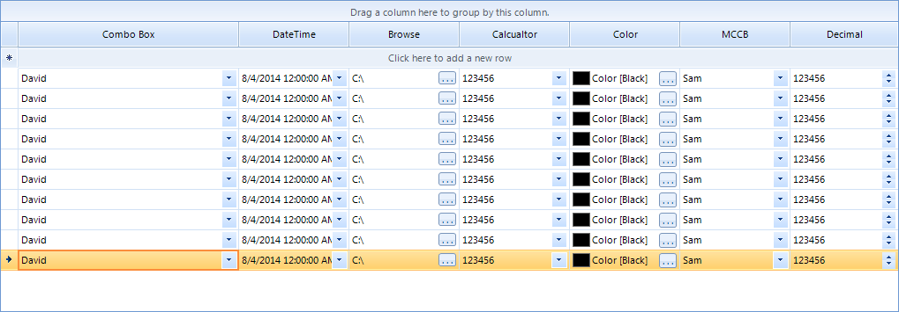

## Problem   
 You want to indicate the column type when the grid is first shown. For example, if you have **GridViewComboBoxColumn** you will want the user to know that he or she can choose from a list of predefined items.  
 
 
 

## Solution   

Create a custom column which contains an element that indicates the column type. For example, if you have a **GridViewComboBoxColumn**, you can add an arrow button that looks-like the one in the default drop down editor.  
 
First, you can create a class that inherits the **GridComboBoxCellElement**. Afterwards, you can add the indicator element (button element in this example) and style it to look like the default editor. You can subscribe to the Click event of the button and directly show the editor when the button is clicked as well.  

````C#
public class IndicatedComboBoxCellElement : GridComboBoxCellElement
{
    private RadDropDownListArrowButtonElement indicator;
 
    public IndicatedComboBoxCellElement(GridViewColumn column, GridRowElement row) : base(column, row)
    {
        //this code adds a registration for RadDropDownListArrowButtonElement in order to allow its usage in other controls
        Theme theme = ThemeRepository.ControlDefault;
        StyleGroup sg = theme.FindStyleGroup("Telerik.WinControls.UI.RadDropDownList");
        sg.Registrations.Add(new StyleRegistration("Telerik.WinControls.UI.RadDropDownListArrowButtonElement"));
 
        indicator = new RadDropDownListArrowButtonElement();
        indicator.MaxSize = new System.Drawing.Size(18, 20);
        indicator.Alignment = ContentAlignment.MiddleRight;
        indicator.NotifyParentOnMouseInput = false;
        indicator.Click += indicator_Click;
 
        this.Children.Add(indicator);
    }
    
    protected override void OnCellFormatting(CellFormattingEventArgs e)
    {
        base.OnCellFormatting(e);
        if (indicator != null)
        {
            indicator.Visibility = ((IndicatedComboBoxColumn)this.ColumnInfo).EnableIndicator == true ? ElementVisibility.Visible : ElementVisibility.Collapsed;
        }
    }
     
    void indicator_Click(object sender, EventArgs e)
    {
        this.GridControl.CellEditorInitialized += grid_CellEditorInitialized;
 
        this.GridControl.EndEdit();
        this.GridControl.BeginEdit();
    }
 
    void grid_CellEditorInitialized(object sender, GridViewCellEventArgs e)
    {
        RadDropDownListEditor editor = e.ActiveEditor as RadDropDownListEditor;
        if (editor != null)
        {
            this.GridControl.CellEditorInitialized -= grid_CellEditorInitialized;
 
            RadDropDownListEditorElement element = editor.EditorElement as RadDropDownListEditorElement;
            element.ShowPopup();
        }
    }
 
    protected override Type ThemeEffectiveType
    {
        get
        {
            return typeof(GridComboBoxCellElement);
        }
    }
 
    public override bool IsCompatible(GridViewColumn data, object context)
    {
        return data is IndicatedComboBoxColumn && context is GridDataRowElement;
    }
}

````
````VB.NET
Public Class IndicatedComboBoxCellElement
    Inherits GridComboBoxCellElement
 
    Private indicator As RadDropDownListArrowButtonElement
 
    Public Sub New(ByVal column As GridViewColumn, ByVal row As GridRowElement)
        MyBase.New(column, row)
        'this code adds a registration for RadDropDownListArrowButtonElement in order to allow its usage in other controls
        Dim theme As Theme = ThemeRepository.ControlDefault
        Dim sg As StyleGroup = theme.FindStyleGroup("Telerik.WinControls.UI.RadDropDownList")
        sg.Registrations.Add(New StyleRegistration("Telerik.WinControls.UI.RadDropDownListArrowButtonElement"))
 
        indicator = New RadDropDownListArrowButtonElement()
        indicator.MaxSize = New System.Drawing.Size(18, 20)
        indicator.Alignment = ContentAlignment.MiddleRight
        indicator.NotifyParentOnMouseInput = False
        AddHandler indicator.Click, AddressOf indicator_Click
 
        Me.Children.Add(indicator)
    End Sub
 
    Protected Overrides Sub OnCellFormatting(ByVal e As CellFormattingEventArgs)
        MyBase.OnCellFormatting(e)
        If indicator IsNot Nothing Then
            indicator.Visibility = If(CType(Me.ColumnInfo, IndicatedComboBoxColumn).EnableIndicator = True, ElementVisibility.Visible, ElementVisibility.Collapsed)
        End If
    End Sub
 
    Private Sub indicator_Click(ByVal sender As Object, ByVal e As EventArgs)
        AddHandler Me.GridControl.CellEditorInitialized, AddressOf grid_CellEditorInitialized
 
        Me.GridControl.EndEdit()
        Me.GridControl.BeginEdit()
    End Sub
 
    Private Sub grid_CellEditorInitialized(ByVal sender As Object, ByVal e As GridViewCellEventArgs)
 
        Dim currentEditor As RadDropDownListEditor = TryCast(e.ActiveEditor, RadDropDownListEditor)
        If currentEditor IsNot Nothing Then
            RemoveHandler Me.GridControl.CellEditorInitialized, AddressOf grid_CellEditorInitialized
 
            Dim element As RadDropDownListEditorElement = TryCast(currentEditor.EditorElement, RadDropDownListEditorElement)
            element.ShowPopup()
        End If
    End Sub
 
    Protected Overrides ReadOnly Property ThemeEffectiveType() As Type
        Get
            Return GetType(GridComboBoxCellElement)
        End Get
    End Property
 
    Public Overrides Function IsCompatible(ByVal data As GridViewColumn, ByVal context As Object) As Boolean
        Return TypeOf data Is IndicatedComboBoxColumn AndAlso TypeOf context Is GridDataRowElement
    End Function
End Class

````

Now, you are ready to create the custom column class. In it you can create a property, which will show or hide the indicator element. Despite that the column just inherits the default **GridViewComboBoxColumn**.

````C#
public class IndicatedComboBoxColumn : GridViewComboBoxColumn
{
    private bool enableIndicator;
 
    public IndicatedComboBoxColumn()
    {
        enableIndicator = true;
    }
 
    public bool EnableIndicator
    {
        get
        {
            return this.enableIndicator;
        }
        set
        {
            this.enableIndicator = value;
            this.OwnerTemplate.Refresh();
        }
    }
 
    public override Type GetCellType(GridViewRowInfo row)
    {
        if (row is GridViewDataRowInfo)
        {
            return typeof(IndicatedComboBoxCellElement);
        }
        return base.GetCellType(row);
    }
}

````
````VB.NET
Public Class IndicatedComboBoxColumn
    Inherits GridViewComboBoxColumn
 
    Private _enableIndicator As Boolean
 
    Public Sub New()
        _enableIndicator = True
    End Sub
 
    Public Property EnableIndicator() As Boolean
        Get
            Return Me._enableIndicator
        End Get
        Set(ByVal value As Boolean)
            Me._enableIndicator = value
            Me.OwnerTemplate.Refresh()
        End Set
    End Property
 
    Public Overrides Function GetCellType(ByVal row As GridViewRowInfo) As Type
        If TypeOf row Is GridViewDataRowInfo Then
            Return GetType(IndicatedComboBoxCellElement)
        End If
        Return MyBase.GetCellType(row)
    End Function
End Class

````

Nevertheless, keep in mind that this approach can be easily adopted for other column types by changing the inherited column and the styles of the indicator (other element can be used as well). In the sample projects [here](https://github.com/telerik/winforms-sdk/tree/master/GridView/GridViewIndicatedColumns) you can find a sample implementation for all columns that can have visible editors. 