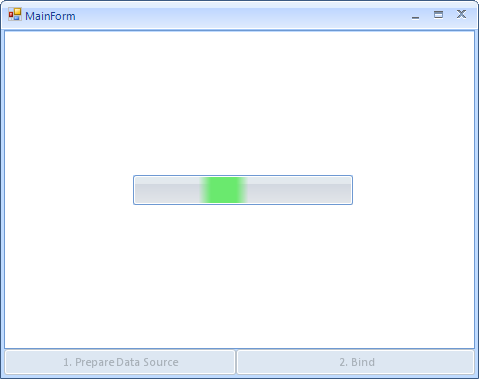
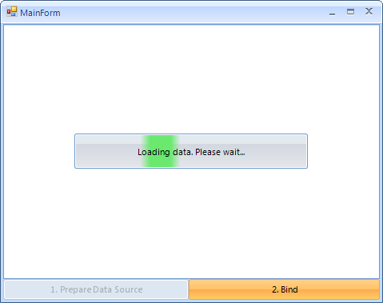
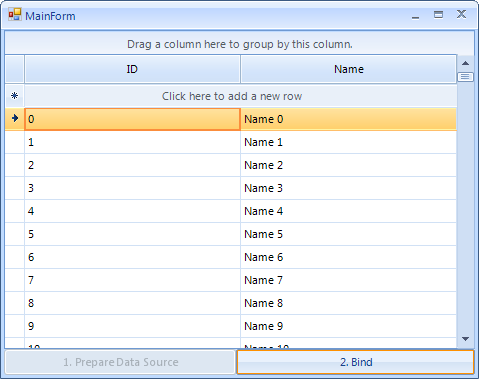

|Article relates to|Product|Author|
|----|----|----|
|Q2 2012|RadGridView for WinForms|Boryana Goncharenko|

## Problem

**RadWaitingBar** is a useful control for indicating that a long-running operation is undergoing. When using this control, however, many users face a similar issue: once the time-consuming operation is started, the control does not move its indicators and literally freezes. Typically, such an issue can be avoided if the operation is executed in another thread. Nevertheless, some rare occasions require the time-consuming process to be started in the primary UI thread, even though that the main form will remain irresponsive for a while.   
   
## Solution   

One approach to indicate to the user the undergoing time-consuming operation is to display a small RadForm containing a running **RadWaitingBar** on top of the main form until the long operation is completed. The RadForm with the **RadWaitingBar** should be started in a separate thread. The following sample application demonstrates a possible implementation.  
   
The aim of this application is demonstrate a common case which includes a long-running operation that directly accesses the primary UI thread. This time-consuming operation is the data-binding operation of a control. It can’t happen on a separate thread, so during this operation the UI of the application freezes. In order to improve the user experience, while the data-binding operation is being executed, a RadForm (WaitingForm) containing a RadWaitingBar is being displayed on top of the main form. Once the operation is completed, the WaitingForm is closed and the bound control shows the data.  
   
Below you will find snippets and comments which provide a description of the sample application. VB.NET code snippets are omitted for brevity. Projects in both C# and VB.NET can be found at the bottom of the article.  
   
1\. When the user clicks the Prepare Data Source RadButton, a data source with one million records in two columns is being prepared in a separate thread using a BackgroundWorker and its DoWork event:  
 
````C#
private void rbtnPrepareDataSource_Click(object sender, EventArgs e)
{
    this.rbtnPrepareDataSource.Enabled = false;
    this.radWaitingBar1.Visible = true;
    this.radWaitingBar1.StartWaiting();
    worker.RunWorkerAsync();
}
 
void worker_DoWork(object sender, DoWorkEventArgs e)
{
    dt = new DataTable();
 
    DataColumn dc = new DataColumn();
    dc.ColumnName = "ID";
    dt.Columns.Add(dc);
 
    DataColumn dc2 = new DataColumn();
    dc2.ColumnName = "Name";
    dt.Columns.Add(dc2);
 
    for (int i = 0; i < 1000000; i++)
    {
        DataRow dr = dt.NewRow();
        dr[0] = i;
        dr[1] = "Name " + i.ToString();
        dt.Rows.Add(dr);
    }
}

````  

Note that we are preparing the data of the data-source in a separate thread on a separate button click, using the **BackgroundWorker** component. While the data is being prepared, you will notice that the UI is responsive, because the whole operation happens on a separate thread. So, for this operation, we can put a RadWaitingBar directly on the main form.  

2\. After the data source is filled with data, we click the Bind RadButton. This shows the WaitingForm and executes the binding operation.  The WaitingForm is closed after the data-binding operation is completed.   
 
````C#
private void rbtnBind_Click(object sender, EventArgs e)
{
    if (this.radGridView1.DataSource == null)
    {
        WaitingForm.ShowForm();
        this.radGridView1.DataSource = dt;
    }
}
 
void radGridView1_DataBindingComplete(object sender, Telerik.WinControls.UI.GridViewBindingCompleteEventArgs e)
{
    WaitingForm.CloseForm();
}

````

In regards to the WaitingForm implementation, you should create several custom methods, which will allow  you to show and close the form.  
 
````C#
public partial class WaitingForm : Form
{
    private static Thread waitingThread;
    private static WaitingForm waitingForm;
 
    public WaitingForm()
    {
        InitializeComponent();
 
        MainForm f = Program.MForm;
 
        int startX = (f.Width - this.ClientSize.Width) / 2;
        int startY = (f.Height - this.ClientSize.Height) / 2;
        this.Location = new System.Drawing.Point(f.Location.X + startX, f.Location.Y + startY);
        this.Location = new System.Drawing.Point(f.Location.X + startX, f.Location.Y + startY);
 
        this.radWaitingBar1.StartWaiting();
    }
 
    public static void ShowForm()
    {
        waitingThread = new Thread(new ParameterizedThreadStart(ThreadTask));
        waitingThread.IsBackground = false;
        waitingThread.Start();
    }
 
    private static void ThreadTask(object owner)
    {
        waitingForm = new WaitingForm();
        waitingForm.ShowInTaskbar = false;
        waitingForm.Owner = (Form)owner;
        waitingForm.FormBorderStyle = FormBorderStyle.None;
        waitingForm.ControlBox = false;
        waitingForm.TopMost = true;
        waitingForm.StartPosition = FormStartPosition.Manual;
 
        Application.Run(waitingForm);
    }
 
    public static void CloseDialogDown()
    {
        Application.ExitThread();
    }
 
    public static void CloseForm()
    {
        while (waitingForm == null || !waitingForm.IsHandleCreated)
        {
            Thread.Sleep(10);
        }
        MethodInvoker mi = new MethodInvoker(CloseDialogDown);
        waitingForm.Invoke(mi);
    }
}

```` 
  

Here is the workflow of the sample application:  



*Clicking the Prepare Data Source button starts the process of preparing the data source in a separate thread using a BackgroundWorker. Since the UI remains responsive, we can show progress by using RadWaitingBar placed directly on the main form.*  
   


*Clicking the Bind button sets the data source of RadGridView to the data source that has one million records. Since this operation directly accesses the primary UI thread, the UI freezes, so we show a new form with RadWaitingBar in a separate thread. In order to improve the user experience even further, we remove the titlebar and the border of the form. This allows us to show just the RadWaitingBar.*  
   

 
*After the RadGridView is bound, the WaitingForm is closed and the bound data is shown.*  
   
So, this is it. Now you can be safe that the end-users will not try to End Task your applications, since the UI will no longer seem frozen.

>note A complete solution in C# and VB.NET can be found [here](https://github.com/telerik/winforms-sdk/tree/master/Genral_All_Controls/IndicatingOperations).