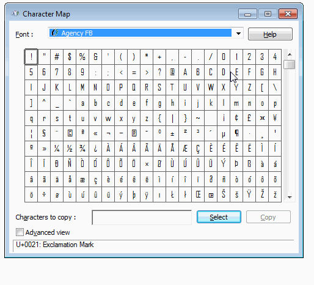
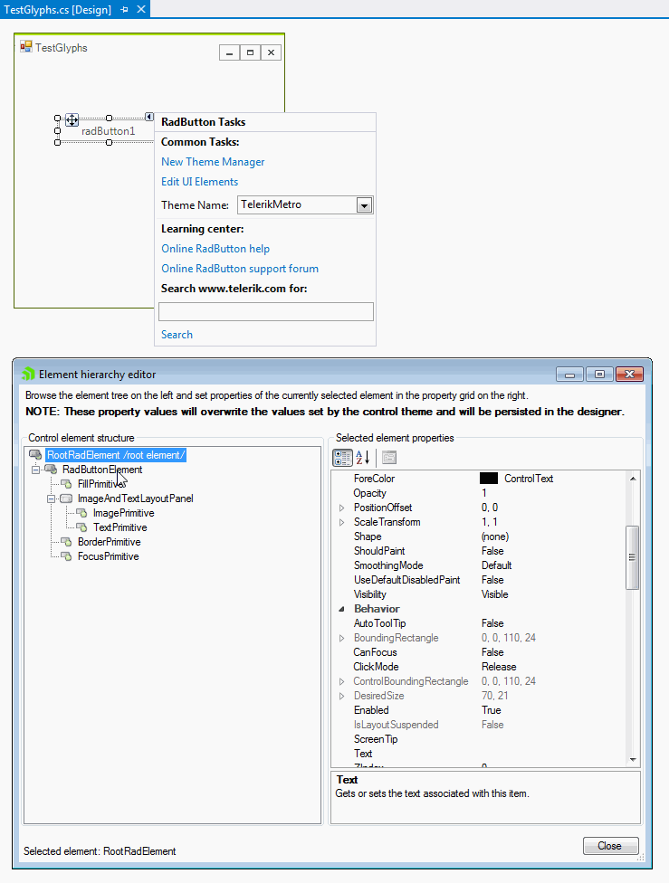

## Description

After releasing the Material themes, we introduced a new approach for adding icon-like images. We are now providing font [glyphs]() via [custom fonts](). The glyphs are vector paths which are easily scalable without loss of quality. Thus, you can very easily assign any icon which will have the same quality no matter of the control's size. 

## Solution 

You can use any custom font that provides individual glyphs. However, it is necessary to install the font first before proceeding with the following steps:

1\. Press the Windows button, type *Character Map* and press `Enter`.
2\. The Character Map will be opened. Now, you can select the desired font from the drop down, e.g. *TelerikWebUI*, select a certain symbol, press the `Select` button, then the `Copy` button. The symbol is stored in the clipboard.

>caption Figure 1: Select and copy a symbol

>important It is necessary to install the font in order to see it in the font drop down.

Next, we will set the copied symbol to a **RadButton**. Drag a **RadButton** from the Toolbox and drop it onto the form. 

3\. Select the button and click the small arrow at the top right position in order to open the Smart Tag. Open the 
*Element hierarchy editor* by clicking *Edit UI Elements*. Now, you can paste the copied symbol to the **Text** property. Then, change the **Custom Font** property to the respective font that contains the glyph.

>caption Figure 2: Paste the symbol and change the custom font

# See Also

* [Custom Fonts]()
* [Glyphs]() 

