|Date Posted|Product|Author|
|----|----|----|
|15/01/2014|Telerik UI for WinForms Visual Studio 2010 Help 3|[Desislava Yordanova](https://www.telerik.com/blogs/author/desislava-yordanova)| 
 
## How To  

Install local documentation for MS Help Viewer (1.0/1.1) in Visual Studio 2010  
   
## Description
   
Telerik UI for WinForms local documentation for Visual Studio 2010 (Help3) is distributed as a separate installation. The zipped Help3 installation can be downloaded from your Telerik account and installed using the instructions below:  
   
## Solution

How to install local documentation on our machine:  
 
1\. Unblock the downloaded file. This is done by right-clicking the file -&gt; properties -&gt; clicking on the Unblock button in the General tab. If this button is not present this step is not needed.

2\. Unzip the documentation archive (Telerik\_UI\_For\_WinForms\_MsHelp3\_2013\_x\_xx\_xx.zip) content downloaded from Telerik website.

3\. Launch HelpLibManager utility.
     
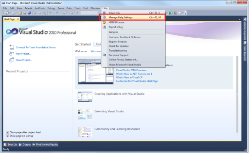

4\. [Optional] If not initialized set Help Viewer local content location
    
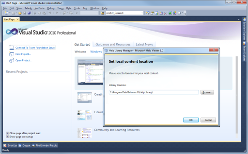

5\. Select ‘**Install content from disk**’ option. In case that you have already installed another local documentation of Telerik UI for WinForms, you should remove the old one before installing the new one through the '**Remove content**' option.
    
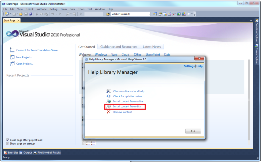

6\. Browse to the **.msha**   

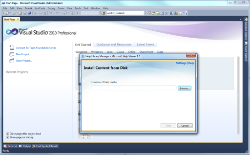

7\. **Select it**, click **Open** and **Next**  

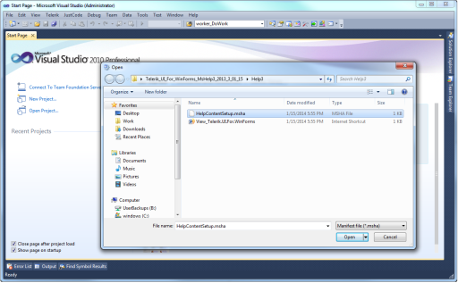
 
8\. Click ‘**Add**’ action   

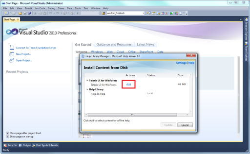

9\. Click ‘**Update**’ button  
 
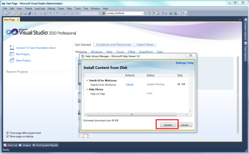

10\. When asked to proceed click ‘**Yes**’. Note that it could take some time to finish the installation. 
    
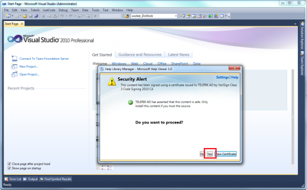

11\. Finish the installation
    

12\. Launch the local help viewer
       
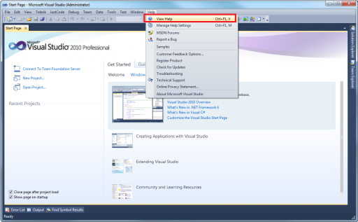

13\. If not initialized choose to view local help content
       
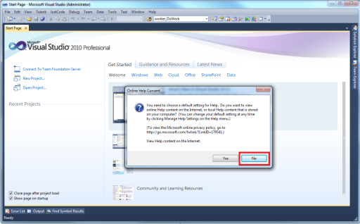

14\. Enjoy
    
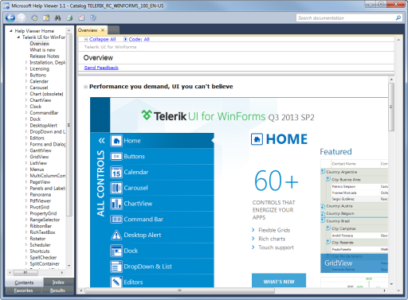

