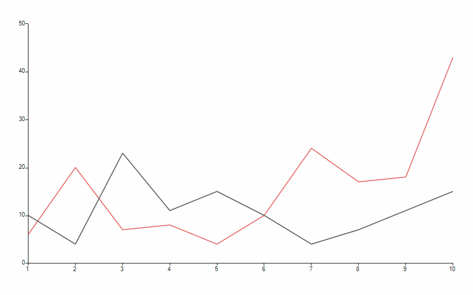

|Date Posted|Product|Author|
|----|----|----|
|December 11, 2015|RadChartView for WinForms|[Hristo Merdjanov](https://www.telerik.com/blogs/author/hristo-merdjanov)|

## Problem

**ChartPanZoomController**, **ChartTrackBallController** and the **LassoZoomController** rely on the same mouse states in order to provide their functionality. Combining the tree in a single project might lead to an unexpected result, e.g. the panning feature would be overridden by the **LassoZoomController**.

## Solution

Extend the **LassoZoomController** and perform lasso selection only if a modifier key is being pressed. In order to implement this feature we would need to create the following classes:

- **MyLassoZoomController**: Inheriting the base **LassoZoomController** class and overriding the **OnMouseMove** and **OnMouseUp** methods.
- **MyLassoZoomView**: A view class needed by the controller to render the selection rectangle.


The animation below demonstrates how the chart control behaves after implementing this solution:  



1\. Let us first setup our chart control and bind it to some data:
         
````C#
public partial class Form1 : Form
{
    public Form1()
    {
        InitializeComponent();
 
        ChartPanZoomController panZoomController = new ChartPanZoomController();
        radChartView1.Controllers.Add(panZoomController);
 
        ChartTrackballController chartTrackBallController = new ChartTrackballController();
        radChartView1.Controllers.Add(chartTrackBallController);
 
        MyLassoZoomController lassoZoomController = new MyLassoZoomController();
        this.radChartView1.Controllers.Add(lassoZoomController);
 
        this.BindChart();
    }
 
    private void BindChart()
    {
        this.radChartView1.AreaType = ChartAreaType.Cartesian;
 
        LineSeries lineSeries1 = new LineSeries();
        lineSeries1.Name = "X";
        lineSeries1.DataPoints.Add(new CategoricalDataPoint(10, "1"));
        lineSeries1.DataPoints.Add(new CategoricalDataPoint(4, "2"));
        lineSeries1.DataPoints.Add(new CategoricalDataPoint(23, "3"));
        lineSeries1.DataPoints.Add(new CategoricalDataPoint(11, "4"));
        lineSeries1.DataPoints.Add(new CategoricalDataPoint(15, "5"));
        lineSeries1.DataPoints.Add(new CategoricalDataPoint(10, "6"));
        lineSeries1.DataPoints.Add(new CategoricalDataPoint(4, "7"));
        lineSeries1.DataPoints.Add(new CategoricalDataPoint(7, "8"));
        lineSeries1.DataPoints.Add(new CategoricalDataPoint(11, "9"));
        lineSeries1.DataPoints.Add(new CategoricalDataPoint(15, "10"));
 
        this.radChartView1.Series.Add(lineSeries1);
 
        LineSeries lineSeries2 = new LineSeries();
        lineSeries2.Name = "Y";
        lineSeries2.DataPoints.Add(new CategoricalDataPoint(6, "1"));
        lineSeries2.DataPoints.Add(new CategoricalDataPoint(20, "2"));
        lineSeries2.DataPoints.Add(new CategoricalDataPoint(7, "3"));
        lineSeries2.DataPoints.Add(new CategoricalDataPoint(8, "4"));
        lineSeries2.DataPoints.Add(new CategoricalDataPoint(4, "5"));
        lineSeries2.DataPoints.Add(new CategoricalDataPoint(10, "6"));
        lineSeries2.DataPoints.Add(new CategoricalDataPoint(24, "7"));
        lineSeries2.DataPoints.Add(new CategoricalDataPoint(17, "8"));
        lineSeries2.DataPoints.Add(new CategoricalDataPoint(18, "9"));
        lineSeries2.DataPoints.Add(new CategoricalDataPoint(43, "10"));
 
        this.radChartView1.Series.Add(lineSeries2);
    }
}

````
````VB.NET
Public Class Form1
    Public Sub New()
        InitializeComponent()
 
        Dim panZoomController As New ChartPanZoomController()
        RadChartView1.Controllers.Add(panZoomController)
 
        Dim chartTrackBallController As New ChartTrackballController()
        RadChartView1.Controllers.Add(chartTrackBallController)
 
        Dim lassoZoomController As New MyLassoZoomController()
        Me.RadChartView1.Controllers.Add(lassoZoomController)
 
        Me.BindChart()
    End Sub
 
    Private Sub BindChart()
        Me.RadChartView1.AreaType = ChartAreaType.Cartesian
 
        Dim lineSeries1 As New LineSeries()
        lineSeries1.Name = "X"
        lineSeries1.DataPoints.Add(New CategoricalDataPoint(10, "1"))
        lineSeries1.DataPoints.Add(New CategoricalDataPoint(4, "2"))
        lineSeries1.DataPoints.Add(New CategoricalDataPoint(23, "3"))
        lineSeries1.DataPoints.Add(New CategoricalDataPoint(11, "4"))
        lineSeries1.DataPoints.Add(New CategoricalDataPoint(15, "5"))
        lineSeries1.DataPoints.Add(New CategoricalDataPoint(10, "6"))
        lineSeries1.DataPoints.Add(New CategoricalDataPoint(4, "7"))
        lineSeries1.DataPoints.Add(New CategoricalDataPoint(7, "8"))
        lineSeries1.DataPoints.Add(New CategoricalDataPoint(11, "9"))
        lineSeries1.DataPoints.Add(New CategoricalDataPoint(15, "10"))
 
        Me.RadChartView1.Series.Add(lineSeries1)
 
        Dim lineSeries2 As New LineSeries()
        lineSeries2.Name = "Y"
        lineSeries2.DataPoints.Add(New CategoricalDataPoint(6, "1"))
        lineSeries2.DataPoints.Add(New CategoricalDataPoint(20, "2"))
        lineSeries2.DataPoints.Add(New CategoricalDataPoint(7, "3"))
        lineSeries2.DataPoints.Add(New CategoricalDataPoint(8, "4"))
        lineSeries2.DataPoints.Add(New CategoricalDataPoint(4, "5"))
        lineSeries2.DataPoints.Add(New CategoricalDataPoint(10, "6"))
        lineSeries2.DataPoints.Add(New CategoricalDataPoint(24, "7"))
        lineSeries2.DataPoints.Add(New CategoricalDataPoint(17, "8"))
        lineSeries2.DataPoints.Add(New CategoricalDataPoint(18, "9"))
        lineSeries2.DataPoints.Add(New CategoricalDataPoint(43, "10"))
 
        Me.RadChartView1.Series.Add(lineSeries2)
    End Sub
End Class

````

2\. Now we need to create the view class responsible for painting the selection rectangle:

````C#
public class MyLassoZoomView : IView
{
    private LassoZoomController owner;
 
    public MyLassoZoomView(LassoZoomController owner)
    {
        this.owner = owner;
    }
 
    public void Render(object context)
    {
        Graphics graphics = context as Graphics;
 
        using (SolidBrush brush = new SolidBrush(Color.FromArgb(127, Color.LightBlue)))
        {
            Rectangle rect = this.owner.CreateLassoRectangle();
            graphics.FillRectangle(brush, rect);
            graphics.DrawRectangle(Pens.LightBlue, rect);
        }
    }
}

````
````VB.NET
Public Class MyLassoZoomView
    Implements IView
    Private owner As LassoZoomController
 
    Public Sub New(owner As LassoZoomController)
        Me.owner = owner
    End Sub
 
    Public Sub Render(context As Object) Implements IView.Render
        Dim graphics As Graphics = TryCast(context, Graphics)
 
        Using brush As New SolidBrush(Color.FromArgb(127, Color.LightBlue))
            Dim rect As Rectangle = Me.owner.CreateLassoRectangle()
            graphics.FillRectangle(brush, rect)
            graphics.DrawRectangle(Pens.LightBlue, rect)
        End Using
    End Sub
End Class

````

3\. It is time to implement the custom functionality in our version of the "lasso" controller. The new controller will provide an option for assigning a modifier key and lasso zooming will only be allowed if this key is in pressed state while the selection is being performed. Besides the overrides of the mentioned above **OnMouseMove** and **OnMouseUp** we also need logic for receiving precise coordinates of the mouse so that the selection rectangle can be built:

````C#
public class MyLassoZoomController : LassoZoomController
{
    private ViewResult result;
    private Keys modifierKey;
 
    public MyLassoZoomController()
        : this(Keys.Control) { }
 
    public MyLassoZoomController(Keys key)
    {
        this.result = new ViewResult(new MyLassoZoomView(this));
        this.modifierKey = key;
    }
 
    public Keys ModifierKey
    {
        get
        {
            return this.modifierKey;
        }
        set
        {
            if (value == (Keys.Control | Keys.Shift | Keys.Alt))
            {
                this.modifierKey = value;
            }
            else
            {
                throw new ArgumentException("Passed key needs to be Control, Shift or Alt");
            }
        }
    }
 
    protected override ActionResult OnMouseUp(MouseEventArgs e)
    {
        if (Control.ModifierKeys == this.modifierKey)
        {
            this.View.ShowTrackBall = true;
            this.View.ShowPanZoom = true;
        }
 
        return base.OnMouseUp(e);
    }
 
    protected override ActionResult OnMouseDown(System.Windows.Forms.MouseEventArgs e)
    {
        if (e.Button == MouseButtons.Left && Control.ModifierKeys == this.modifierKey)
        {
            this.View.ShowTrackBall = false;
            this.View.ShowPanZoom = false;
            this.MouseDownLocation = this.ClipLocation(e.Location);
            this.result.ShouldInvalidate = true;
 
            return base.OnMouseDown(e);
        }
 
        return Controller.Empty;
    }
 
    protected override ActionResult OnMouseMove(MouseEventArgs e)
    {
        if (e.Button == MouseButtons.Left && Control.ModifierKeys == this.modifierKey)
        {
            this.MouseMoveLocation = this.ClipLocation(e.Location);
            this.result.ShouldInvalidate = true;
 
            return this.result;
        }
 
        return Controller.Empty;
    }
 
    private Point ClipLocation(Point point)
    {
        CartesianArea area = this.Area.View.GetArea<CartesianArea>();
        if (area != null)
        {
            RectangleF clipRect = this.GetCartesianClipRect();
 
            if (point.X < clipRect.X)
            {
                point = new Point((int)clipRect.X, point.Y);
            }
 
            if (point.X > clipRect.Width + clipRect.X)
            {
                point = new Point((int)clipRect.Width + (int)clipRect.X, point.Y);
            }
 
            if (point.Y < clipRect.Y)
            {
                point = new Point(point.X, (int)clipRect.Y);
            }
 
            if (point.Y > clipRect.Height + clipRect.Y)
            {
                point = new Point(point.X, (int)clipRect.Height + (int)clipRect.Y);
            }
        }
 
        return point;
    }
 
    private RectangleF GetCartesianClipRect()
    {
        float x1, x2, y1, y2;
        x1 = 0;
        y1 = 0;
        x2 = (float)this.Area.View.Viewport.Right;
        y2 = (float)this.Area.View.Viewport.Bottom;
 
        foreach (Axis axis in this.Area.View.Axes)
        {
            if (axis.AxisType == AxisType.First)
            {
                if (axis.Model.VerticalLocation == AxisVerticalLocation.Bottom)
                {
                    y2 = Math.Min(y2, (float)axis.Model.LayoutSlot.Y);
                }
                else
                {
                    y1 = Math.Max(y1, (float)axis.Model.LayoutSlot.Bottom);
 
                }
 
                x1 = Math.Min(x1, (float)axis.Model.LayoutSlot.X);
                x2 = Math.Min(x2, (float)axis.Model.LayoutSlot.Right);
            }
            else
            {
                if (axis.Model.HorizontalLocation == AxisHorizontalLocation.Left)
                {
                    x1 = Math.Max(x1, (float)axis.Model.LayoutSlot.Right);
                }
                else
                {
                    x2 = Math.Min(x2, (float)axis.Model.LayoutSlot.X);
                }
 
                y1 = Math.Max(y1, (float)axis.Model.LayoutSlot.Y);
                y2 = Math.Min(y2, (float)axis.Model.LayoutSlot.Bottom);
            }
        }
 
        RectangleF result = new RectangleF((float)this.Area.View.Viewport.X + x1, (float)this.Area.View.Viewport.Y + y1, x2 - x1 + 1, y2 - y1 + 1);
 
        return result;
    }
}

````
````VB.NET
Public Class MyLassoZoomController
    Inherits LassoZoomController
    Private result As ViewResult
    Private m_modifierKey As Keys
 
    Public Sub New()
        Me.New(Keys.Control)
    End Sub
 
    Public Sub New(key As Keys)
        Me.result = New ViewResult(New MyLassoZoomView(Me))
        Me.m_modifierKey = key
    End Sub
 
    Public Property ModifierKey() As Keys
        Get
            Return Me.m_modifierKey
        End Get
        Set(value As Keys)
            If value = (Keys.Control Or Keys.Shift Or Keys.Alt) Then
                Me.m_modifierKey = value
            Else
                Throw New ArgumentException("Passed key needs to be Control, Shift or Alt")
            End If
        End Set
    End Property
 
    Protected Overrides Function OnMouseUp(e As MouseEventArgs) As ActionResult
        If Control.ModifierKeys = Me.m_modifierKey Then
            Me.View.ShowTrackBall = True
            Me.View.ShowPanZoom = True
        End If
 
        Return MyBase.OnMouseUp(e)
    End Function
 
    Protected Overrides Function OnMouseDown(e As System.Windows.Forms.MouseEventArgs) As ActionResult
        If e.Button = MouseButtons.Left AndAlso Control.ModifierKeys = Me.m_modifierKey Then
            Me.View.ShowTrackBall = False
            Me.View.ShowPanZoom = False
            Me.MouseDownLocation = Me.ClipLocation(e.Location)
            Me.result.ShouldInvalidate = True
 
            Return MyBase.OnMouseDown(e)
        End If
 
        Return Controller.Empty
    End Function
 
    Protected Overrides Function OnMouseMove(e As MouseEventArgs) As ActionResult
        If e.Button = MouseButtons.Left AndAlso Control.ModifierKeys = Me.m_modifierKey Then
            Me.MouseMoveLocation = Me.ClipLocation(e.Location)
            Me.result.ShouldInvalidate = True
 
            Return Me.result
        End If
 
        Return Controller.Empty
    End Function
 
    Private Function ClipLocation(point As Point) As Point
        Dim area As CartesianArea = Me.Area.View.GetArea(Of CartesianArea)()
        If area IsNot Nothing Then
            Dim clipRect As RectangleF = Me.GetCartesianClipRect()
 
            If point.X < clipRect.X Then
                point = New Point(CInt(clipRect.X), point.Y)
            End If
 
            If point.X > clipRect.Width + clipRect.X Then
                point = New Point(CInt(clipRect.Width) + CInt(clipRect.X), point.Y)
            End If
 
            If point.Y < clipRect.Y Then
                point = New Point(point.X, CInt(clipRect.Y))
            End If
 
            If point.Y > clipRect.Height + clipRect.Y Then
                point = New Point(point.X, CInt(clipRect.Height) + CInt(clipRect.Y))
            End If
        End If
 
        Return point
    End Function
 
    Private Function GetCartesianClipRect() As RectangleF
        Dim x1 As Single, x2 As Single, y1 As Single, y2 As Single
        x1 = 0
        y1 = 0
        x2 = CSng(Me.Area.View.Viewport.Right)
        y2 = CSng(Me.Area.View.Viewport.Bottom)
 
        For Each axis As Axis In Me.Area.View.Axes
            If axis.AxisType = AxisType.First Then
                If axis.Model.VerticalLocation = AxisVerticalLocation.Bottom Then
                    y2 = Math.Min(y2, CSng(axis.Model.LayoutSlot.Y))
                Else
 
                    y1 = Math.Max(y1, CSng(axis.Model.LayoutSlot.Bottom))
                End If
 
                x1 = Math.Min(x1, CSng(axis.Model.LayoutSlot.X))
                x2 = Math.Min(x2, CSng(axis.Model.LayoutSlot.Right))
            Else
                If axis.Model.HorizontalLocation = AxisHorizontalLocation.Left Then
                    x1 = Math.Max(x1, CSng(axis.Model.LayoutSlot.Right))
                Else
                    x2 = Math.Min(x2, CSng(axis.Model.LayoutSlot.X))
                End If
 
                y1 = Math.Max(y1, CSng(axis.Model.LayoutSlot.Y))
                y2 = Math.Min(y2, CSng(axis.Model.LayoutSlot.Bottom))
            End If
        Next
 
        Dim result As New RectangleF(CSng(Me.Area.View.Viewport.X) + x1, CSng(Me.Area.View.Viewport.Y) + y1, x2 - x1 + 1, y2 - y1 + 1)
 
        Return result
    End Function
End Class

````

