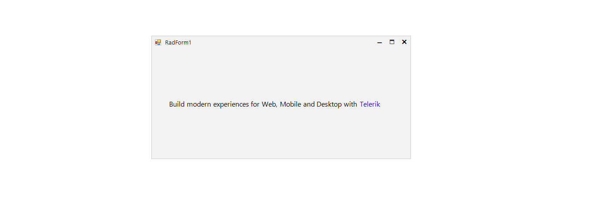

## Environment
 
|Product Version|Product|Author|
|----|----|----|
|2020.1.113|RadLabel for WinForms|[Nadya Karaivanova](https://www.telerik.com/blogs/author/nadya-karaivanova)|
 
## Description

A common requirement is to use label to display a hyperlink similar to MS [LinkLabel](https://docs.microsoft.com/en-us/dotnet/api/system.windows.forms.linklabel?view=net-5.0) control. Although, Telerik UI for Winforms does not support currently such control out of the box you can create your own RadLinkLabel control that can display links and allow users to click their way from page to page.

This tutorial demonstrates how you can create such link label with [RadLabel](https://docs.telerik.com/devtools/winforms/controls/panels-and-labels/label/overview) control.
 


## Solution 

First, you should create a custom RadLinkLabel control that inherits from **RadLabel** class. Then, override the **OnMouseEnter** method in order to change the mouse arrow into little hand and change the text color. You should override the **OnMouseLeave** method as well in a way to return back to the default cursor arrow and use another text color if you want to indicate somehow that the link has already been visited. 

A full code snippet is illustrated below:
 

````C#
public class RadLinkLabel : RadLabel
{
    bool visited;

    public RadLinkLabel()
    {
        this.Font = new Font("Segoe UI", 12, FontStyle.Regular);
        this.Text = "Telerik";
        this.ForeColor = Color.Blue;
        visited = false;
    }

    protected override void OnClick(EventArgs e)
    {
        base.OnClick(e);
        Process.Start("www.telerik.com");
        visited = true;
        this.ForeColor = Color.FromArgb(128, 96, 204);
    }

    protected override void OnMouseEnter(EventArgs e)
    {
        base.OnMouseEnter(e);
        this.Font = new Font("Segoe UI", 12, FontStyle.Underline);
        this.ForeColor = Color.Black;
        this.Cursor = Cursors.Hand;
    }

    protected override void OnMouseLeave(EventArgs e)
    {
        base.OnMouseLeave(e);
        this.Font = new Font("Segoe UI", 12, FontStyle.Regular);
        if (visited)
        {
            this.ForeColor = Color.FromArgb(128, 96, 204);
        }
        else
        {
            this.ForeColor = Color.Blue;
        }
        this.Cursor = Cursors.Default;
    }
}
   
````
````VB.NET
Public Class RadLinkLabel
    Inherits RadLabel

    Private visited As Boolean
    Public Sub New()
        Me.Font = New Font("Segoe UI", 12, FontStyle.Regular)
        Me.Text = "Telerik"
        Me.ForeColor = Color.Blue
        visited = False
    End Sub

    Protected Overrides Sub OnClick(ByVal e As EventArgs)
        MyBase.OnClick(e)
        Process.Start("www.telerik.com")
        visited = True
        Me.ForeColor = Color.FromArgb(128, 96, 204)
    End Sub

    Protected Overrides Sub OnMouseEnter(ByVal e As EventArgs)
        MyBase.OnMouseEnter(e)
        Me.Font = New Font("Segoe UI", 12, FontStyle.Underline)
        Me.ForeColor = Color.Black
        Me.Cursor = Cursors.Hand
    End Sub

    Protected Overrides Sub OnMouseLeave(ByVal e As EventArgs)
        MyBase.OnMouseLeave(e)
        Me.Font = New Font("Segoe UI", 12, FontStyle.Regular)

        If visited Then
            Me.ForeColor = Color.FromArgb(128, 96, 204)
        Else
            Me.ForeColor = Color.Blue
        End If
        Me.Cursor = Cursors.Default
    End Sub
End Class

````

