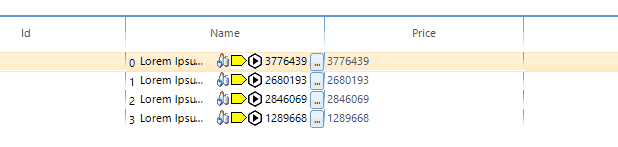

## Environment
|Product Version|Product|Author|
|----|----|----|
|2025.4.1111|RadListView for WinForms|[Dinko Krastev](https://www.telerik.com/blogs/author/dinko-krastev)|


## Description

By design, **RadListView** allows you to create and use your own custom visual items for each of its view types. The [Custom items]() help article demonstrates a step-by-step tutorial on how to use a custom items depending on the applied view. However, a common scenario is to use several elements in a custom item. In this example, we will demonstrate how to arrange elements in a custom DetailsView cell in a way that changing the width of the control will change only the text part while the rest elements will stay static. 



## Solution

For the purpose of this article, we will populate the RadListView with sample data. In the code snippet, you can observe that we need to subscribe to the __CellCreating__ event. In the event handler, you can replace the default cell element with a custom one.

````C#

public partial class Form1 : Form
{
    BindingList<TreeItem> listViewItems = new BindingList<TreeItem>();
    Random rnd = new Random();
    public Form1()
    {
        InitializeComponent();
		
        for (int i = 0; i < 4; i++)
        {
            listViewItems.Add(new TreeItem() { Id = i, Name = "Lorem Ipsum is simply dummy text of the printing and typesetting industry.", Price= rnd.Next(1000000,5000000) });
        }
		this.radListView1.ViewType = ListViewType.DetailsView;
		this.radListView1.CellCreating += RadListView1_CellCreating;
		this.radListView1.DataSource = listViewItems;
		this.radListView1.DisplayMember = "Name";
    }

    private void RadListView1_CellCreating(object sender, ListViewCellElementCreatingEventArgs e)
	{
		DetailListViewDataCellElement cell = e.CellElement as DetailListViewDataCellElement;
		if (cell != null && cell.Data.Name == "Name")
		{
			e.CellElement = new CustomDetailListViewDataCellElement(cell.RowElement, e.CellElement.Data);
		}
		else if (cell != null && cell.Data.Name != "Name")
		{
			e.CellElement = new DefaultCell(cell.RowElement, e.CellElement.Data);
		}
	}
}
public class TreeItem
{
    public int Id { get; set; }
    public string Name { get; set; }
    public decimal Price { get; set; }

}


````
````VB.NET

Public Partial Class Form1
    Inherits Form

    Private listViewItems As BindingList(Of TreeItem) = New BindingList(Of TreeItem)()
    Private rnd As Random = New Random()

    Public Sub New()
        InitializeComponent()

        For i As Integer = 0 To 4 - 1
            listViewItems.Add(New TreeItem() With {
                .Id = i,
                .Name = "Lorem Ipsum is simply dummy text of the printing and typesetting industry.",
                .Price = rnd.[Next](1000000, 5000000)
            })
        Next

        Me.radTreeView1.DataSource = listViewItems
		Me.radListView1.ViewType = ListViewType.DetailsView
		AddHandler Me.radListView1.CellCreating += RadListView1_CellCreating
		Me.radListView1.DataSource = listViewItems
		Me.radListView1.DisplayMember = "Name"
    End Sub

    Private Sub RadListView1_CellCreating(ByVal sender As Object, ByVal e As ListViewCellElementCreatingEventArgs)
		Dim cell As DetailListViewDataCellElement = TryCast(e.CellElement, DetailListViewDataCellElement)

		If cell IsNot Nothing AndAlso cell.Data.Name = "Name" Then
			e.CellElement = New CustomDetailListViewDataCellElement(cell.RowElement, e.CellElement.Data)
		ElseIf cell IsNot Nothing AndAlso cell.Data.Name <> "Name" Then
			e.CellElement = New DefaultCell(cell.RowElement, e.CellElement.Data)
		End If
	End Sub
End Class

Public Class TreeItem
    Public Property Id As Integer
    Public Property Name As String
    Public Property Price As Decimal
End Class


````

Now we need to create our custom cell. We will add different types of elements inside the custom cell. Each element will represent data related to the current cell. In our case, only the __nameElement__ TextPrimitive part will depend on its parent cell width, while the rest of the elements will not overlap each other and stay static. An important step here is to set __TextWrap__ and __AutoEllipsis__ properties of the TextPrimitive__. To arrange the elements correctly you need to override the __ArrangeOverride__ method of the __CustomContentElement__. In the method, you can calculate the width of all elements except the text part element. The width of the TextPrimitive element will be the remaining space left from the whole cell width, without the width of the other elements.

````C#

public class DefaultCell : DetailListViewDataCellElement
{
    public DefaultCell(DetailListViewVisualItem owner, ListViewDetailColumn column) : base(owner, column)
    {
    }
    protected override Type ThemeEffectiveType
    {
        get
        {
            return typeof(DetailListViewHeaderCellElement);
        }
    }
    public override bool IsCompatible(ListViewDetailColumn data, object context)
    {
        if (data.Name != "Name")
        {
            return true;
        }
        return false;
    }
}

public class CustomDetailListViewDataCellElement : DetailListViewDataCellElement
{
    public CustomDetailListViewDataCellElement(DetailListViewVisualItem owner,
        ListViewDetailColumn column) : base(owner, column)
    {
    }

    LightVisualElement numberElement;
    TextPrimitive nameElement;
    ImagePrimitive saveStatusImage;
    ImagePrimitive errorImage;
    ImagePrimitive timeImage;
    TextPrimitive priceText;
    RadDropDownButtonElement detailsButton;
    public override void Synchronize()
    {
        // base.Synchronize();           
        TreeItem dataItem = (TreeItem)this.Row.DataBoundItem;
        numberElement.Text = dataItem.Id + "";
        nameElement.Text = dataItem.Name;
        priceText.Text = dataItem.Price + "";
        this.Text = "";
    }

    protected override void CreateChildElements()
    {
        // base.CreateChildElements();

        this.StretchHorizontally = true;

        this.numberElement = new LightVisualElement();
        this.Children.Add(this.numberElement);

        this.nameElement = new TextPrimitive()
        {
            ShouldHandleMouseInput = true,
            NotifyParentOnMouseInput = true,
            TextWrap = false,
            AutoEllipsis = true,
        };

        this.Children.Add(this.nameElement);

        this.saveStatusImage = new ImagePrimitive()
        {
            ShouldHandleMouseInput = true,
            ToolTipText = "asd",
            Image = ConvertByteArrayToImage(Resource1._object)
        };
        this.Children.Add(this.saveStatusImage);

        this.errorImage = new ImagePrimitive()
        {
            Image = ConvertByteArrayToImage(Resource1.error)
        };
        this.Children.Add(this.errorImage);

        this.timeImage = new ImagePrimitive()
        {
            Image = ConvertByteArrayToImage(Resource1.deployed)
        };
        this.Children.Add(this.timeImage);

        this.priceText = new TextPrimitive();
        this.Children.Add(this.priceText);

        this.detailsButton = new RadDropDownButtonElement()
        {
            Text = "...",
            ShowArrow = false
        };
        this.Children.Add(this.detailsButton);
    }

    public Image ConvertByteArrayToImage(byte[] bytes)
    {
        // is your data  
        MemoryStream mStream = new MemoryStream();
        mStream.Write(bytes, 0, bytes.Length);
        return Image.FromStream(mStream);
    }

    protected override SizeF MeasureOverride(SizeF availableSize)
    {
        var result = base.MeasureOverride(availableSize);

        var remainingSize = this.GetClientRectangle(this.DrawBorder, availableSize).Size;
        SizeF desiredSize = SizeF.Empty;
        desiredSize.Height = 20;
        this.numberElement.Measure(remainingSize);

        remainingSize.Width -= this.numberElement.DesiredSize.Width;
        desiredSize.Width += this.numberElement.DesiredSize.Width;
        saveStatusImage.Measure(remainingSize);

        remainingSize.Width -= this.saveStatusImage.DesiredSize.Width;
        desiredSize.Width += this.saveStatusImage.DesiredSize.Width;
        errorImage.Measure(remainingSize);

        remainingSize.Width -= this.errorImage.DesiredSize.Width;
        desiredSize.Width += this.errorImage.DesiredSize.Width;
        timeImage.Measure(remainingSize);

        remainingSize.Width -= this.timeImage.DesiredSize.Width;
        desiredSize.Width += this.timeImage.DesiredSize.Width;
        priceText.Measure(remainingSize);

        remainingSize.Width -= this.priceText.DesiredSize.Width;
        desiredSize.Width += this.priceText.DesiredSize.Width;
        detailsButton.Measure(remainingSize);

        remainingSize.Width -= this.detailsButton.DesiredSize.Width;
        desiredSize.Width += this.detailsButton.DesiredSize.Width;

        nameElement.Measure(remainingSize);
        desiredSize.Width += this.nameElement.DesiredSize.Width;

        desiredSize.Width = result.Width;
        return desiredSize;
    }
    protected override bool ShouldArrangeChild(RadElement child)
    {
        if (child == this.numberElement ||
            child == this.nameElement ||
            child == this.saveStatusImage ||
            child == this.errorImage ||
            child == this.timeImage ||
            child == this.priceText ||
            child == this.detailsButton
            )
        {
            return false;
        }
        return base.ShouldArrangeChild(child);
    }
    protected override bool ShouldMeasureChild(RadElement child)
    {
        if (child == this.numberElement ||
            child == this.nameElement ||
            child == this.saveStatusImage ||
            child == this.errorImage ||
            child == this.timeImage ||
            child == this.priceText ||
            child == this.detailsButton
            )
        {
            return false;
        }

        return base.ShouldMeasureChild(child);
    }
    protected override SizeF ArrangeOverride(SizeF finalSize)
    {
        var result = base.ArrangeOverride(finalSize);

        var clientRect = this.GetClientRectangle(this.DrawBorder, finalSize);

        var desiredWidth = this.numberElement.DesiredSize.Width + this.saveStatusImage.DesiredSize.Width + this.errorImage.DesiredSize.Width + this.timeImage.DesiredSize.Width + this.priceText.DesiredSize.Width + this.detailsButton.DesiredSize.Width;

        if (desiredWidth < clientRect.Width)
        {
            PointF topLeftCorner = new PointF(clientRect.X, clientRect.Y);
            this.numberElement.Arrange(new RectangleF(topLeftCorner, numberElement.DesiredSize));

            numberElement.Arrange(LayoutUtils.VAlign(new SizeF(numberElement.Size.Width, nameElement.DesiredSize.Height), new RectangleF(topLeftCorner, new SizeF(numberElement.Size.Width, clientRect.Height)), ContentAlignment.MiddleCenter));

            topLeftCorner = new PointF(topLeftCorner.X + this.numberElement.DesiredSize.Width, 0);

            var nameWidth = clientRect.Width - desiredWidth;              

            nameElement.Arrange(LayoutUtils.VAlign(new SizeF(nameWidth, nameElement.DesiredSize.Height), new RectangleF(topLeftCorner, new SizeF(nameWidth, clientRect.Height)), ContentAlignment.MiddleCenter));
            topLeftCorner.X += nameWidth;

            saveStatusImage.Arrange(LayoutUtils.VAlign(new SizeF(saveStatusImage.DesiredSize.Width, nameElement.DesiredSize.Height), new RectangleF(topLeftCorner, new SizeF(saveStatusImage.DesiredSize.Width, clientRect.Height)), ContentAlignment.MiddleCenter));

            topLeftCorner = new PointF(topLeftCorner.X + this.saveStatusImage.DesiredSize.Width, 0);

            errorImage.Arrange(LayoutUtils.VAlign(new SizeF(errorImage.DesiredSize.Width, nameElement.DesiredSize.Height), new RectangleF(topLeftCorner, new SizeF(errorImage.DesiredSize.Width, clientRect.Height)), ContentAlignment.MiddleCenter));
            topLeftCorner = new PointF(topLeftCorner.X + this.errorImage.DesiredSize.Width, 0);

            timeImage.Arrange(LayoutUtils.VAlign(new SizeF(timeImage.DesiredSize.Width, nameElement.DesiredSize.Height), new RectangleF(topLeftCorner, new SizeF(timeImage.DesiredSize.Width, clientRect.Height)), ContentAlignment.MiddleCenter));
            topLeftCorner = new PointF(topLeftCorner.X + this.timeImage.DesiredSize.Width, 0);

            priceText.Arrange(LayoutUtils.VAlign(new SizeF(priceText.DesiredSize.Width, nameElement.DesiredSize.Height), new RectangleF(topLeftCorner, new SizeF(priceText.DesiredSize.Width, clientRect.Height)), ContentAlignment.MiddleCenter));
            topLeftCorner = new PointF(topLeftCorner.X + this.priceText.DesiredSize.Width, 0);

            detailsButton.Arrange(LayoutUtils.VAlign(new SizeF(detailsButton.Size.Width, nameElement.DesiredSize.Height), new RectangleF(topLeftCorner, new SizeF(detailsButton.Size.Width, clientRect.Height)), ContentAlignment.MiddleCenter));
        }

        return result;
    }
    protected override Type ThemeEffectiveType
    {
        get
        {
            return typeof(DetailListViewDataCellElement);
        }
    }

    public override bool IsCompatible(ListViewDetailColumn data, object context)
    {
        if (data.Name != "Name")
        {
            return false;
        }
        return true;
    }
}


````
````VB.NET

Public Class DefaultCell
    Inherits DetailListViewDataCellElement

    Public Sub New(ByVal owner As DetailListViewVisualItem, ByVal column As ListViewDetailColumn)
        MyBase.New(owner, column)
    End Sub

    Protected Overrides ReadOnly Property ThemeEffectiveType As Type
        Get
            Return GetType(DetailListViewHeaderCellElement)
        End Get
    End Property

    Public Overrides Function IsCompatible(ByVal data As ListViewDetailColumn, ByVal context As Object) As Boolean
        If data.Name <> "Name" Then
            Return True
        End If

        Return False
    End Function
End Class

Public Class CustomDetailListViewDataCellElement
    Inherits DetailListViewDataCellElement

    Public Sub New(ByVal owner As DetailListViewVisualItem, ByVal column As ListViewDetailColumn)
        MyBase.New(owner, column)
    End Sub

    Private numberElement As LightVisualElement
    Private nameElement As TextPrimitive
    Private saveStatusImage As ImagePrimitive
    Private errorImage As ImagePrimitive
    Private timeImage As ImagePrimitive
    Private priceText As TextPrimitive
    Private detailsButton As RadDropDownButtonElement

    Public Overrides Sub Synchronize()
        Dim dataItem As TreeItem = CType(Me.Row.DataBoundItem, TreeItem)
        numberElement.Text = dataItem.Id & ""
        nameElement.Text = dataItem.Name
        priceText.Text = dataItem.Price & ""
        Me.Text = ""
    End Sub

    Protected Overrides Sub CreateChildElements()
        Me.StretchHorizontally = True
        Me.numberElement = New LightVisualElement()
        Me.Children.Add(Me.numberElement)
        Me.nameElement = New TextPrimitive() With {
            .ShouldHandleMouseInput = True,
            .NotifyParentOnMouseInput = True,
            .TextWrap = False,
            .AutoEllipsis = True
        }
        Me.Children.Add(Me.nameElement)
        Me.saveStatusImage = New ImagePrimitive() With {
            .ShouldHandleMouseInput = True,
            .ToolTipText = "asd",
            .Image = ConvertByteArrayToImage(Resource1._object)
        }
        Me.Children.Add(Me.saveStatusImage)
        Me.errorImage = New ImagePrimitive() With {
            .Image = ConvertByteArrayToImage(Resource1.[error])
        }
        Me.Children.Add(Me.errorImage)
        Me.timeImage = New ImagePrimitive() With {
            .Image = ConvertByteArrayToImage(Resource1.deployed)
        }
        Me.Children.Add(Me.timeImage)
        Me.priceText = New TextPrimitive()
        Me.Children.Add(Me.priceText)
        Me.detailsButton = New RadDropDownButtonElement() With {
            .Text = "...",
            .ShowArrow = False
        }
        Me.Children.Add(Me.detailsButton)
    End Sub

    Public Function ConvertByteArrayToImage(ByVal bytes As Byte()) As Image
        Dim mStream As MemoryStream = New MemoryStream()
        mStream.Write(bytes, 0, bytes.Length)
        Return Image.FromStream(mStream)
    End Function

    Protected Overrides Function MeasureOverride(ByVal availableSize As SizeF) As SizeF
        Dim result = MyBase.MeasureOverride(availableSize)
        Dim remainingSize = Me.GetClientRectangle(Me.DrawBorder, availableSize).Size
        Dim desiredSize As SizeF = SizeF.Empty
        desiredSize.Height = 20
        Me.numberElement.Measure(remainingSize)
        remainingSize.Width -= Me.numberElement.DesiredSize.Width
        desiredSize.Width += Me.numberElement.DesiredSize.Width
        saveStatusImage.Measure(remainingSize)
        remainingSize.Width -= Me.saveStatusImage.DesiredSize.Width
        desiredSize.Width += Me.saveStatusImage.DesiredSize.Width
        errorImage.Measure(remainingSize)
        remainingSize.Width -= Me.errorImage.DesiredSize.Width
        desiredSize.Width += Me.errorImage.DesiredSize.Width
        timeImage.Measure(remainingSize)
        remainingSize.Width -= Me.timeImage.DesiredSize.Width
        desiredSize.Width += Me.timeImage.DesiredSize.Width
        priceText.Measure(remainingSize)
        remainingSize.Width -= Me.priceText.DesiredSize.Width
        desiredSize.Width += Me.priceText.DesiredSize.Width
        detailsButton.Measure(remainingSize)
        remainingSize.Width -= Me.detailsButton.DesiredSize.Width
        desiredSize.Width += Me.detailsButton.DesiredSize.Width
        nameElement.Measure(remainingSize)
        desiredSize.Width += Me.nameElement.DesiredSize.Width
        desiredSize.Width = result.Width
        Return desiredSize
    End Function

    Protected Overrides Function ShouldArrangeChild(ByVal child As RadElement) As Boolean
        If child = Me.numberElement OrElse child = Me.nameElement OrElse child = Me.saveStatusImage OrElse child = Me.errorImage OrElse child = Me.timeImage OrElse child = Me.priceText OrElse child = Me.detailsButton Then
            Return False
        End If

        Return MyBase.ShouldArrangeChild(child)
    End Function

    Protected Overrides Function ShouldMeasureChild(ByVal child As RadElement) As Boolean
        If child = Me.numberElement OrElse child = Me.nameElement OrElse child = Me.saveStatusImage OrElse child = Me.errorImage OrElse child = Me.timeImage OrElse child = Me.priceText OrElse child = Me.detailsButton Then
            Return False
        End If

        Return MyBase.ShouldMeasureChild(child)
    End Function

    Protected Overrides Function ArrangeOverride(ByVal finalSize As SizeF) As SizeF
        Dim result = MyBase.ArrangeOverride(finalSize)
        Dim clientRect = Me.GetClientRectangle(Me.DrawBorder, finalSize)
        Dim desiredWidth = Me.numberElement.DesiredSize.Width + Me.saveStatusImage.DesiredSize.Width + Me.errorImage.DesiredSize.Width + Me.timeImage.DesiredSize.Width + Me.priceText.DesiredSize.Width + Me.detailsButton.DesiredSize.Width

        If desiredWidth < clientRect.Width Then
            Dim topLeftCorner As PointF = New PointF(clientRect.X, clientRect.Y)
            Me.numberElement.Arrange(New RectangleF(topLeftCorner, numberElement.DesiredSize))
            numberElement.Arrange(LayoutUtils.VAlign(New SizeF(numberElement.Size.Width, nameElement.DesiredSize.Height), New RectangleF(topLeftCorner, New SizeF(numberElement.Size.Width, clientRect.Height)), ContentAlignment.MiddleCenter))
            topLeftCorner = New PointF(topLeftCorner.X + Me.numberElement.DesiredSize.Width, 0)
            Dim nameWidth = clientRect.Width - desiredWidth
            nameElement.Arrange(LayoutUtils.VAlign(New SizeF(nameWidth, nameElement.DesiredSize.Height), New RectangleF(topLeftCorner, New SizeF(nameWidth, clientRect.Height)), ContentAlignment.MiddleCenter))
            topLeftCorner.X += nameWidth
            saveStatusImage.Arrange(LayoutUtils.VAlign(New SizeF(saveStatusImage.DesiredSize.Width, nameElement.DesiredSize.Height), New RectangleF(topLeftCorner, New SizeF(saveStatusImage.DesiredSize.Width, clientRect.Height)), ContentAlignment.MiddleCenter))
            topLeftCorner = New PointF(topLeftCorner.X + Me.saveStatusImage.DesiredSize.Width, 0)
            errorImage.Arrange(LayoutUtils.VAlign(New SizeF(errorImage.DesiredSize.Width, nameElement.DesiredSize.Height), New RectangleF(topLeftCorner, New SizeF(errorImage.DesiredSize.Width, clientRect.Height)), ContentAlignment.MiddleCenter))
            topLeftCorner = New PointF(topLeftCorner.X + Me.errorImage.DesiredSize.Width, 0)
            timeImage.Arrange(LayoutUtils.VAlign(New SizeF(timeImage.DesiredSize.Width, nameElement.DesiredSize.Height), New RectangleF(topLeftCorner, New SizeF(timeImage.DesiredSize.Width, clientRect.Height)), ContentAlignment.MiddleCenter))
            topLeftCorner = New PointF(topLeftCorner.X + Me.timeImage.DesiredSize.Width, 0)
            priceText.Arrange(LayoutUtils.VAlign(New SizeF(priceText.DesiredSize.Width, nameElement.DesiredSize.Height), New RectangleF(topLeftCorner, New SizeF(priceText.DesiredSize.Width, clientRect.Height)), ContentAlignment.MiddleCenter))
            topLeftCorner = New PointF(topLeftCorner.X + Me.priceText.DesiredSize.Width, 0)
            detailsButton.Arrange(LayoutUtils.VAlign(New SizeF(detailsButton.Size.Width, nameElement.DesiredSize.Height), New RectangleF(topLeftCorner, New SizeF(detailsButton.Size.Width, clientRect.Height)), ContentAlignment.MiddleCenter))
        End If

        Return result
    End Function

    Protected Overrides ReadOnly Property ThemeEffectiveType As Type
        Get
            Return GetType(DetailListViewDataCellElement)
        End Get
    End Property

    Public Overrides Function IsCompatible(ByVal data As ListViewDetailColumn, ByVal context As Object) As Boolean
        If data.Name <> "Name" Then
            Return False
        End If

        Return True
    End Function
End Class


````

