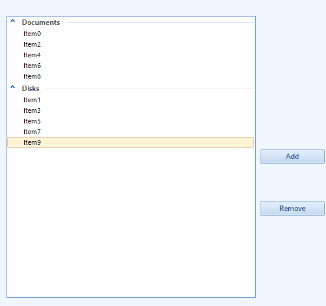

## Environment
 
|Product Version|Product|Author|
|----|----|----|
|2023.2.718|RadListView for WinForms|[Dinko Krastev](https://www.telerik.com/blogs/author/dinko-krastev)|
 

## Description

In this particular case, we will demonstrate how we can hide an empty group without deleting it or adding a new one.
 


## Solution 

Subscribe to the **VisualItemFormatting** event. In the event handler, we can get the __ListViewDataItemGroup__ and hide it if it does not contain any items. This way when you run the application, you can observe that the "Empty Group" is not visible. The group will appear when an item is added to it.


````C#
public Form1()
{
    InitializeComponent();
    this.radListView1.VisualItemFormatting += RadListView1_VisualItemFormatting;
    for (int i = 0; i < 10; i++)
    {
        this.radListView1.Items.Add("Item" + i);
    }
    radListView1.EnableCustomGrouping = true;
    radListView1.ShowGroups = true;
    ListViewDataItemGroup docGroup = new ListViewDataItemGroup("Documents");
    ListViewDataItemGroup diskGroup = new ListViewDataItemGroup("Disks");
    radListView1.Groups.Add(docGroup);
    radListView1.Groups.Add(new ListViewDataItemGroup("Empty Group") { });
    radListView1.Groups.Add(diskGroup);
    foreach (ListViewDataItem item in radListView1.Items)
    {
        if (this.radListView1.Items.IndexOf(item) % 2 == 0)
        {
            item.Group = docGroup;
        }
        else
        {
            item.Group = diskGroup;
        }
    }

    this.radListView1.AllowArbitraryItemHeight = true;
}

private void RadListView1_VisualItemFormatting(object sender, ListViewVisualItemEventArgs e)
{
    SimpleListViewGroupVisualItem groupItem = e.VisualItem as SimpleListViewGroupVisualItem;
    if (groupItem != null)
    {
        ListViewDataItemGroup group = groupItem.Data as ListViewDataItemGroup;
        if (group.Items.Count == 0)
        {
            //hide the group arrow
            groupItem.ShowHorizontalLine = false;
            groupItem.ToggleElement.Visibility = ElementVisibility.Collapsed;
            groupItem.DrawText = false;
        }
        else
        {
            groupItem.ShowHorizontalLine = true;
            groupItem.ToggleElement.Visibility = ElementVisibility.Visible;
            groupItem.DrawText = true;
        }
    }
    else
    {
        e.VisualItem.DrawText = true;
    }
}
             
       
````
````VB.NET


Public Sub New()
	InitializeComponent()
	AddHandler Me.radListView1.VisualItemFormatting, AddressOf RadListView1_VisualItemFormatting

	For i As Integer = 0 To 10 - 1
		Me.radListView1.Items.Add("Item" & i)
	Next

	radListView1.EnableCustomGrouping = True
	radListView1.ShowGroups = True
	Dim docGroup As ListViewDataItemGroup = New ListViewDataItemGroup("Documents")
	Dim diskGroup As ListViewDataItemGroup = New ListViewDataItemGroup("Disks")
	radListView1.Groups.Add(docGroup)
	radListView1.Groups.Add(New ListViewDataItemGroup("Empty Group"))
	radListView1.Groups.Add(diskGroup)

	For Each item As ListViewDataItem In radListView1.Items
		Dim index As Integer = Me.radListView1.Items.IndexOf(item)

		If index Mod 2 = 0 Then
			item.Group = docGroup
		Else
			item.Group = diskGroup
		End If
	Next

	Me.radListView1.AllowArbitraryItemHeight = True
End Sub

Private Sub RadListView1_VisualItemFormatting(ByVal sender As Object, ByVal e As ListViewVisualItemEventArgs)
	Dim groupItem As SimpleListViewGroupVisualItem = TryCast(e.VisualItem, SimpleListViewGroupVisualItem)

	If groupItem IsNot Nothing Then
		Dim group As ListViewDataItemGroup = TryCast(groupItem.Data, ListViewDataItemGroup)

		If group.Items.Count = 0 Then
			groupItem.ShowHorizontalLine = False
			groupItem.ToggleElement.Visibility = ElementVisibility.Collapsed
			groupItem.DrawText = False
		Else
			groupItem.ShowHorizontalLine = True
			groupItem.ToggleElement.Visibility = ElementVisibility.Visible
			groupItem.DrawText = True
		End If
	Else
		e.VisualItem.DrawText = True
	End If
End Sub

    
      
    
````


