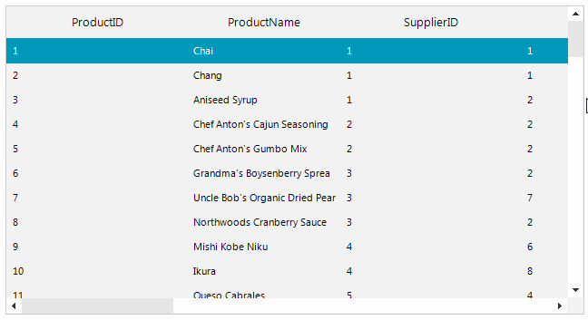
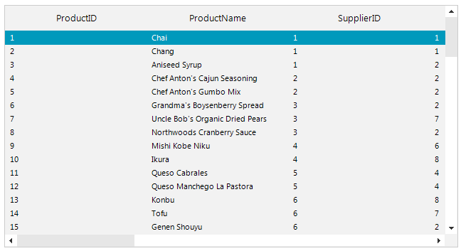
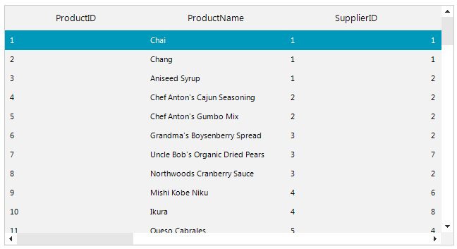

## Environment
 
|Product Version|Product|Author|
|----|----|----|
|2019.2.508|RadListView for WinForms|[Desislava Yordanova](https://www.telerik.com/blogs/author/desislava-yordanova)|
 

## Description

When **RadListView** is in *DetailsView* and the cell's content doesn't fit, the text is clipped: 
 
>caption Default behavior

This article shows how to wrap the text in order to display the whole content and ensure that the user doesn't miss any important information: 



>caption Text Wrap



## Solution 

Subscribe to the **CellFormatting** event and enable the **TextWrap** property of the cell element. Then, it is necessary to set the RadListView.**AllowArbitraryItemHeight** property to *true*:

#### Wrap ListView Cell's Text

````C#

         public RadForm1()
        {
            InitializeComponent();
            this.radListView1.AllowArbitraryItemHeight = true;
        }

        private void radListView1_CellFormatting(object sender, ListViewCellFormattingEventArgs e)
        {
            e.CellElement.TextWrap = true; 
        }      
       
````
````VB.NET
    
       Public Sub New()
        InitializeComponent()
        Me.radListView1.AllowArbitraryItemHeight = True
    End Sub

    Private Sub radListView1_CellFormatting(ByVal sender As Object, ByVal e As ListViewCellFormattingEventArgs)
        e.CellElement.TextWrap = True
    End Sub
    
````

An alternative solution to indicate that only a part of the text is displayed in the cell elements is to show **"..."**. In this case you can leave the **AllowArbitraryItemHeight** property to *false* and set the CellElement.**AutoEllipsis** property to *true*:


#### AutoEllipsis

````C#

           private void radListView1_CellFormatting(object sender, ListViewCellFormattingEventArgs e)
        {
            e.CellElement.AutoEllipsis = true; 
        }  
       
````
````VB.NET
    
	Private Sub radListView1_CellFormatting(ByVal sender As Object, ByVal e As ListViewCellFormattingEventArgs)
    	e.CellElement.AutoEllipsis = True
	End Sub
    
````

>caption AutoEllipsis




