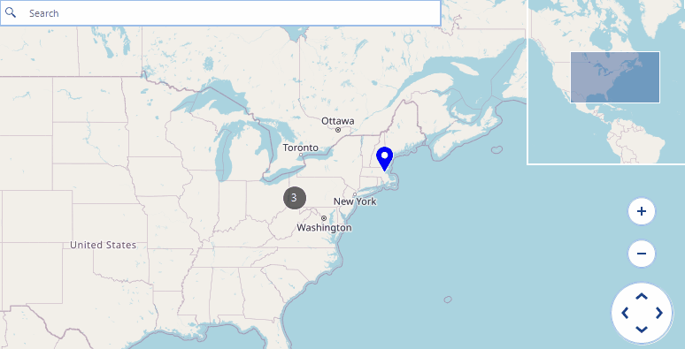

## Environment

|Product Version|Product|Author|
|----|----|----|
|2024.4.1113|RadMap for WinForms|[Dinko Krastev](https://www.telerik.com/blogs/author/dinko-krastev)|


## Description

While hit testing a particular layer, RadMap returns the cluster object assuming that this layer has an applied cluster strategy. This behavior is by design as even a single pin may form a cluster. Still, it is possible to know when you have clicked on a single pin or a cluster having multiple pins. This article demonstrates how we can show MapCallout when clicking on a single pin or a cluster.

## Solution

When the cluster functionality is enabled, a single pin will also be inside a cluster. A possible solution is to search for a **MapCluster** object in the **MouseDown** event and then inspect its **ClusteredItems** property. If the count of the cluster items is **1**, then you have clicked on a MapPin. The following code also handle the case when the cluster strategy is not enabled. You could extend the code to cover the scenario when multiple Layers are added to the RadMap control. In this case, you could iterate all Layers to check which pin or cluser object is clicked.

An important part in the code is when a cluster is clicked, you need to pass the cluster as a parameter to the MapCallout. When a pin is clicked while cluster strategy is enabled, you need to pass the first MapPin from the ClusteredItems collection to the MapCallout.


````C#            

public partial class RadForm1 : RadForm
{
    public RadForm1()
    {
        InitializeComponent();

        string cacheFolder = @"..\..\cache";
        OpenStreetMapProvider osmProvider = new OpenStreetMapProvider();
        MapTileDownloader tileDownloader = osmProvider.TileDownloader as MapTileDownloader;
        tileDownloader.WebHeaders.Add(System.Net.HttpRequestHeader.UserAgent, "your application name");
        LocalFileCacheProvider cache = new LocalFileCacheProvider(cacheFolder);
        osmProvider.CacheProvider = cache;
        this.radMap1.MapElement.Providers.Add(osmProvider);

        MapLayer easternLayer = new MapLayer("CitiesLayer");
        this.radMap1.Layers.Add(easternLayer);
        this.radMap1.Layers[0].ClusterStrategy = new ElementClusterStrategy();
        this.radMap1.Layers["CitiesLayer"].ClusterDistance = 200;

        MapLayer callOutLayer = new MapLayer("Callout");
        this.radMap1.Layers.Add(callOutLayer);

        SetupData();

        this.radMap1.MouseDown += this.RadMap1_MouseDown;
    }
    private void RadMap1_MouseDown(object sender, MouseEventArgs e)
    {
        RadMap map = (RadMap)sender;
        MapCallout callout = null;
        this.radMap1.Layers["Callout"].Clear();
        PointL pointL = new PointL(e.X - map.MapElement.PanOffset.Width, e.Y - map.MapElement.PanOffset.Height);
        PointG location = MapTileSystemHelper.PixelXYToLatLong(pointL.X, pointL.Y, map.MapElement.ZoomLevel);
        while (location.Longitude > 180)
        {
            location.Longitude -= 360;
        }

        MapPin pin = map.MapElement.Layers["CitiesLayer"].HitTest(pointL) as MapPin;

        if (pin != null) // Handles when there is no ClusterStrategy set on the layer.
        {
            callout = new MapCallout(pin);
            callout.Text = "Pin Clicked";
            radMap1.Layers["Callout"].Add(callout);
        }
        else // Handles the layer's ClusterStrategy and distinguishes clusters with single pins.
        {
            MapCluster hoveredCluster = this.radMap1.MapElement.Layers["CitiesLayer"].HitTest(location) as MapCluster;
            if (hoveredCluster != null)
            {
                if (hoveredCluster.ClusteredItems.Count == 1)
                {
                    callout = new MapCallout(hoveredCluster.ClusteredItems[0] as MapPin);
                    callout.Text = "Pin Clicked";
                }
                else
                {
                    callout = new MapCallout(hoveredCluster);
                    callout.Text = "Cluster Clicked";
                }
                radMap1.Layers["Callout"].Add(callout);
            }
        }
    }

    private void SetupData()
    {
        MapPin element = new MapPin(new PointG(40.4467648, -80.01576030));
        element.Text = "Pittsburgh";
        element.BackColor = Color.Red;
        this.radMap1.Layers["CitiesLayer"].Add(element);
        element = new MapPin(new PointG(40.8130697, -74.07439790));
        element.Text = "New York";
        element.BackColor = Color.Green;
        this.radMap1.Layers["CitiesLayer"].Add(element);
        element = new MapPin(new PointG(42.3665137, -71.06160420));
        element.Text = "Boston";
        element.BackColor = Color.Blue;
        this.radMap1.Layers["CitiesLayer"].Add(element);
        element = new MapPin(new PointG(43.6434661, -79.37909890));
        element.Text = "Toronto";
        element.BackColor = Color.Yellow;
        this.radMap1.Layers["CitiesLayer"].Add(element);
    }
}


````


The achieved result is illustrated below:



## See Also

* [OpenStreetMapProvider]()
