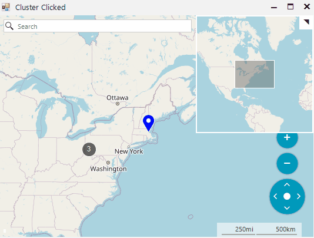

## Environment
 
|Product Version|Product|Author|
|----|----|----|
|2022.1.222|RadMap for WinForms|[Desislava Yordanova](https://www.telerik.com/blogs/author/desislava-yordanova)|


## Description

While hit testing a particular layer, RadMap returns the cluster object assuming that this layer has an applied cluster strategy. This behavior is by design as even a single pin may form a cluster. Still it is possible to know when you have clicked on a single pin or a cluster having multiple pins. This article demonstrates a sample approach how to do it.

## Solution

A possible solution is to search for a **MapCluster** object in the **MouseDown** event and then inspect its **ClusteredItems** property. If the count of the cluster items is **1**, then you have clicked on a MapPin. Please check the sample below: 


````C#            

public RadForm1()
{
    InitializeComponent();
    string cacheFolder = @"..\..\cache";
    OpenStreetMapProvider osmProvider = new OpenStreetMapProvider();
    MapTileDownloader tileDownloader = osmProvider.TileDownloader as MapTileDownloader;
    tileDownloader.WebHeaders.Add(System.Net.HttpRequestHeader.UserAgent, "your application name");
    LocalFileCacheProvider cache = new LocalFileCacheProvider(cacheFolder);
    osmProvider.CacheProvider = cache;
    this.radMap1.MapElement.Providers.Add(osmProvider);

    MapLayer easternLayer = new MapLayer("CitiesLayer");
    this.radMap1.Layers.Add(easternLayer);
    this.radMap1.Layers[0].ClusterStrategy = new ElementClusterStrategy();
    this.radMap1.Layers["CitiesLayer"].ClusterDistance = 200;

    SetupData();

    this.radMap1.MouseDown += this.RadMap1_MouseDown;
}

private void RadMap1_MouseDown(object sender, MouseEventArgs e)
{
    RadMap map = (RadMap)sender;
    Telerik.WinControls.UI.Map.PointL pointL = new PointL(e.X - map.MapElement.PanOffset.Width, e.Y - map.MapElement.PanOffset.Height);

    MapPin pin = map.MapElement.Layers["CitiesLayer"].HitTest(pointL) as MapPin;
    if (pin != null) // Handles when there is no ClusterStrategy set on the layer.
    {
        this.Text = "Pin Clicked";
    }
    else // Handles the layer's ClusterStrategy and distinguishes clusters with single pins.
    {
        MapCluster hoveredCluster = this.radMap1.MapElement.Layers["CitiesLayer"].HitTest(pointL) as MapCluster;
        if (hoveredCluster != null)
        {
            if (hoveredCluster.ClusteredItems.Count == 1)
            {
                this.Text = "Pin Clicked";
            }
            else
            {
                this.Text = "Cluster Clicked";
            }
        }
    }
}

private void SetupData()
{
    MapPin element = new MapPin(new PointG(40.4467648, -80.01576030));
    element.Text = "Pittsburgh";
    element.BackColor = Color.Red;
    this.radMap1.Layers["CitiesLayer"].Add(element);
    element = new MapPin(new PointG(40.8130697, -74.07439790));
    element.Text = "New York";
    element.BackColor = Color.Green;
    this.radMap1.Layers["CitiesLayer"].Add(element);
    element = new MapPin(new PointG(42.3665137, -71.06160420));
    element.Text = "Boston";
    element.BackColor = Color.Blue;
    this.radMap1.Layers["CitiesLayer"].Add(element);
    element = new MapPin(new PointG(43.6434661, -79.37909890));
    element.Text = "Toronto";
    element.BackColor = Color.Yellow;
    this.radMap1.Layers["CitiesLayer"].Add(element);
}


````
````VB.NET

Public Sub New()
    InitializeComponent()
    Dim cacheFolder As String = "..\..\cache"
    Dim osmProvider As OpenStreetMapProvider = New OpenStreetMapProvider()
    Dim tileDownloader As MapTileDownloader = TryCast(osmProvider.TileDownloader, MapTileDownloader)
    tileDownloader.WebHeaders.Add(System.Net.HttpRequestHeader.UserAgent, "your application name")
    Dim cache As LocalFileCacheProvider = New LocalFileCacheProvider(cacheFolder)
    osmProvider.CacheProvider = cache
    Me.RadMap1.MapElement.Providers.Add(osmProvider)
    Dim easternLayer As MapLayer = New MapLayer("CitiesLayer")
    Me.RadMap1.Layers.Add(easternLayer)
    Me.RadMap1.Layers(0).ClusterStrategy = New ElementClusterStrategy()
    Me.RadMap1.Layers("CitiesLayer").ClusterDistance = 200
    SetupData()
    AddHandler Me.RadMap1.MouseDown, AddressOf Me.RadMap1_MouseDown
End Sub

Private Sub RadMap1_MouseDown(ByVal sender As Object, ByVal e As MouseEventArgs)
    Dim map As RadMap = CType(sender, RadMap)
    Dim pointL As Telerik.WinControls.UI.Map.PointL = New PointL(e.X - map.MapElement.PanOffset.Width, e.Y - map.MapElement.PanOffset.Height)
    Dim pin As MapPin = TryCast(map.MapElement.Layers("CitiesLayer").HitTest(pointL), MapPin)

    If pin IsNot Nothing Then
        Me.Text = "Pin Clicked"
    Else
        Dim hoveredCluster As MapCluster = TryCast(Me.RadMap1.MapElement.Layers("CitiesLayer").HitTest(pointL), MapCluster)

        If hoveredCluster IsNot Nothing Then

            If hoveredCluster.ClusteredItems.Count = 1 Then
                Me.Text = "Pin Clicked"
            Else
                Me.Text = "Cluster Clicked"
            End If
        End If
    End If
End Sub

Private Sub SetupData()
    Dim element As MapPin = New MapPin(New PointG(40.4467648, -80.0157603))
    element.Text = "Pittsburgh"
    element.BackColor = Color.Red
    Me.RadMap1.Layers("CitiesLayer").Add(element)
    element = New MapPin(New PointG(40.8130697, -74.0743979))
    element.Text = "New York"
    element.BackColor = Color.Green
    Me.RadMap1.Layers("CitiesLayer").Add(element)
    element = New MapPin(New PointG(42.3665137, -71.0616042))
    element.Text = "Boston"
    element.BackColor = Color.Blue
    Me.RadMap1.Layers("CitiesLayer").Add(element)
    element = New MapPin(New PointG(43.6434661, -79.3790989))
    element.Text = "Toronto"
    element.BackColor = Color.Yellow
    Me.RadMap1.Layers("CitiesLayer").Add(element)
End Sub

````

The achieved result is illustrated below:



# See Also

* [OpenStreetMapProvider]()