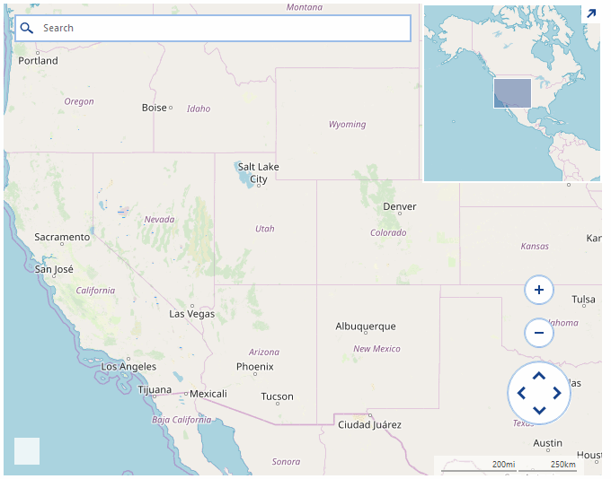

## Environment
|Product Version|Product|Author|
|----|----|----|
|2019.1.219|RadMap for WinForms|[Hristo Merdjanov](https://www.telerik.com/blogs/author/hristo-merdjanov)|


## Description

An example demonstrating how the objects shown on the map can be selected with lasso rectangle.  

## Solution

The mouse input in **RadMap** is handled by a special behavior class exposed by the **InputBehavior** property of the control. This example will demonstrate how a lasso rectangle can be painted on the map upon moving the mouse. The rectangle will be painted as a **MapPolygon** object added to a special layer in the map. The layer will be updated every time when the mouse is moved so that it will always contain a single object. After releasing the mouse, the elements which are located in the lasso rectangle will be selected using the **SelectElement** method of the input behavior class. 

**MapPin** objects will also be added to the map in a separate layer upon double-click. These pins can be later selected with the lasso rectangle and are useful while testing. 

>note In this example, the custom logic for creating the lasso rectangle and adding the pins will only work if the Ctrl key is pressed.

>caption Figure 1: Lasso Selection


#### Custom Behavior Class

````C#
public class CustomMapInputBehavior : MapInputBehavior
{
    PointG mouseDownCoordinates = PointG.Empty;

    public override void OnMouseDown(MouseEventArgs e)
    {
        this.mouseDownCoordinates = this.GetLocation(e.Location);

        base.OnMouseDown(e);

        foreach (var item in this.MapElement.SelectedElements.ToList())
        {
            PointL pixelLocation = MapTileSystemHelper.LatLongToPixelXY(item.Location, this.MapElement.ZoomLevel);
            RectangleL drawRect = new RectangleL(pixelLocation.X - item.Size.Width / 2, pixelLocation.Y - item.Size.Height, item.Size.Width, item.Size.Height);
            PointL point = new PointL(e.X - this.MapElement.PanOffset.Width, e.Y - this.MapElement.PanOffset.Height);
            if (drawRect.Contains(point))
            {
                this.MapElement.SelectedElements.Remove(item);
                item.BackColor = Color.FromArgb(255, 17, 17, 17);
            }
        }
    }

    public override void OnMouseMove(MouseEventArgs e)
    {
        this.MapElement.Layers["Polygons"].Clear();
        if (e.Button == MouseButtons.Left && Control.ModifierKeys == Keys.Control)
        {
            PointG location = this.GetLocation(e.Location);

            if (this.mouseDownCoordinates != PointG.Empty)
            {
                List<PointG> points = new List<PointG>();
                points.Add(this.mouseDownCoordinates);
                points.Add(new PointG(location.Latitude, mouseDownCoordinates.Longitude));
                points.Add(location);
                points.Add(new PointG(mouseDownCoordinates.Latitude, location.Longitude));

                MapPolygon polygon = new MapPolygon(points);
                polygon.BackColor = Color.FromArgb(125, Color.LightGreen);
                this.MapElement.Layers["Polygons"].Add(polygon);
            }
        }
        else
        {
            base.OnMouseMove(e);
        }
    }

    public override void OnMouseUp(MouseEventArgs e)
    {
        base.OnMouseUp(e);

        MapPolygon polygon = this.MapElement.Layers["Polygons"].FirstOrDefault() as MapPolygon;
        if (polygon != null)
        {
            foreach (MapPin item in this.MapElement.Layers["Pins"])
            {
                if (polygon.GeographicBounds.Contains(item.Location))
                {
                    this.SelectElement(item, true);
                    item.BackColor = Color.LightCoral;
                }
            }
        }

        this.mouseDownCoordinates = PointG.Empty;
        this.MapElement.Layers["Polygons"].Clear();
    }

    public override void OnDoubleClick(EventArgs e)
    {
        MouseEventArgs args = e as MouseEventArgs;

        if (args.Button == MouseButtons.Left && Control.ModifierKeys == Keys.Control)
        {
            PointG location = this.GetLocation(args.Location);
            MapPin pin = new MapPin(location);
            this.MapElement.Layers["Pins"].Add(pin);
        }
        else
        {
            base.OnDoubleClick(e);
        }
    }

    private PointG GetLocation(Point mouseLocation)
    {
        PointL point = new PointL(mouseLocation.X - this.MapElement.PanOffset.Width, mouseLocation.Y - this.MapElement.PanOffset.Height);
        PointG location = MapTileSystemHelper.PixelXYToLatLong(point.X, point.Y, this.MapElement.ZoomLevel);

        while (location.Longitude > 180)
        {
            location.Longitude -= 360;
        }

        return location;
    }
}


````
````VB.NET
Public Class CustomMapInputBehavior
    Inherits MapInputBehavior

    Private mouseDownCoordinates As PointG = PointG.Empty

    Public Overrides Sub OnMouseDown(ByVal e As MouseEventArgs)
        Me.mouseDownCoordinates = Me.GetLocation(e.Location)
        MyBase.OnMouseDown(e)

        For Each item In Me.MapElement.SelectedElements.ToList()
            Dim pixelLocation As PointL = MapTileSystemHelper.LatLongToPixelXY(item.Location, Me.MapElement.ZoomLevel)
            Dim drawRect As RectangleL = New RectangleL(pixelLocation.X - item.Size.Width / 2, pixelLocation.Y - item.Size.Height, item.Size.Width, item.Size.Height)
            Dim point As PointL = New PointL(e.X - Me.MapElement.PanOffset.Width, e.Y - Me.MapElement.PanOffset.Height)

            If drawRect.Contains(point) Then
                Me.MapElement.SelectedElements.Remove(item)
                item.BackColor = Color.FromArgb(255, 17, 17, 17)
            End If
        Next
    End Sub

    Public Overrides Sub OnMouseMove(ByVal e As MouseEventArgs)
        Me.MapElement.Layers("Polygons").Clear()

        If e.Button = MouseButtons.Left AndAlso Control.ModifierKeys = Keys.Control Then
            Dim location As PointG = Me.GetLocation(e.Location)

            If Me.mouseDownCoordinates <> PointG.Empty Then
                Dim points As List(Of PointG) = New List(Of PointG)()
                points.Add(Me.mouseDownCoordinates)
                points.Add(New PointG(location.Latitude, mouseDownCoordinates.Longitude))
                points.Add(location)
                points.Add(New PointG(mouseDownCoordinates.Latitude, location.Longitude))
                Dim polygon As MapPolygon = New MapPolygon(points)
                polygon.BackColor = Color.FromArgb(125, Color.LightGreen)
                Me.MapElement.Layers("Polygons").Add(polygon)
            End If
        Else
            MyBase.OnMouseMove(e)
        End If
    End Sub

    Public Overrides Sub OnMouseUp(ByVal e As MouseEventArgs)
        MyBase.OnMouseUp(e)
        Dim polygon As MapPolygon = TryCast(Me.MapElement.Layers("Polygons").FirstOrDefault(), MapPolygon)

        If polygon IsNot Nothing Then

            For Each item As MapPin In Me.MapElement.Layers("Pins")

                If polygon.GeographicBounds.Contains(item.Location) Then
                    Me.SelectElement(item, True)
                    item.BackColor = Color.LightCoral
                End If
            Next
        End If

        Me.mouseDownCoordinates = PointG.Empty
        Me.MapElement.Layers("Polygons").Clear()
    End Sub

    Public Overrides Sub OnDoubleClick(ByVal e As EventArgs)
        Dim args As MouseEventArgs = TryCast(e, MouseEventArgs)

        If args.Button = MouseButtons.Left AndAlso Control.ModifierKeys = Keys.Control Then
            Dim location As PointG = Me.GetLocation(args.Location)
            Dim pin As MapPin = New MapPin(location)
            Me.MapElement.Layers("Pins").Add(pin)
        Else
            MyBase.OnDoubleClick(e)
        End If
    End Sub

    Private Function GetLocation(ByVal mouseLocation As Point) As PointG
        Dim point As PointL = New PointL(mouseLocation.X - Me.MapElement.PanOffset.Width, mouseLocation.Y - Me.MapElement.PanOffset.Height)
        Dim location As PointG = MapTileSystemHelper.PixelXYToLatLong(point.X, point.Y, Me.MapElement.ZoomLevel)

        While location.Longitude > 180
            location.Longitude -= 360
        End While

        Return location
    End Function
End Class

````

#### Initial Setup

````C#
public partial class Form1 : Form
{
    public Form1()
    {
        InitializeComponent();

        this.BackColor = Color.White;

        OpenStreetMapProvider osmProvider = new OpenStreetMapProvider();
        osmProvider.InitializationComplete += delegate(object sender, EventArgs e)
        {
            this.radMap1.BringIntoView(new PointG(40d, -99d), 4);
        };

        this.radMap1.MapElement.Providers.Add(osmProvider);
        MapLayer pinsLayer = new MapLayer("Polygons");
        this.radMap1.Layers.Add(pinsLayer);

        this.radMap1.MapElement.Providers.Add(osmProvider);
        pinsLayer = new MapLayer("Pins");
        this.radMap1.Layers.Add(pinsLayer);

        this.radMap1.InputBehavior = new CustomMapInputBehavior();
    }
}


````
````VB.NET
Public Class RadForm1
    Public Sub New()
        InitializeComponent()
        Me.BackColor = Color.White
        Dim osmProvider As OpenStreetMapProvider = New OpenStreetMapProvider()
        AddHandler osmProvider.InitializationComplete, Sub(ByVal sender As Object, ByVal e As EventArgs)
                                                           Me.RadMap1.BringIntoView(New PointG(40.0R, -99.0R), 4)
                                                       End Sub

        Me.RadMap1.MapElement.Providers.Add(osmProvider)
        Dim pinsLayer As MapLayer = New MapLayer("Polygons")
        Me.RadMap1.Layers.Add(pinsLayer)
        Me.RadMap1.MapElement.Providers.Add(osmProvider)

        pinsLayer = New MapLayer("Pins")
        Me.RadMap1.Layers.Add(pinsLayer)
        Me.RadMap1.InputBehavior = New CustomMapInputBehavior()
    End Sub
End Class
````

# See Also
* [Adding an Image to a Map Pin]()
* [Specifying a Radius for a MapPoint]()
* [Exporting RadMap to an Image]()