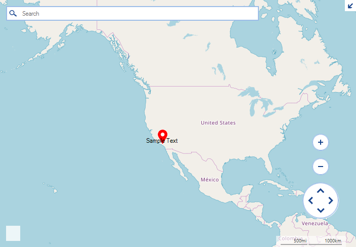

## Environment
|Product Version|Product|Author|
|----|----|----|
|2019.1.219|RadMap for WinForms|[Hristo Merdjanov](https://www.telerik.com/blogs/author/hristo-merdjanov)|


## Description

An example demonstrating the **MapPin** class can be customized to support text.  

## Solution

We will create a custom **MapPin** implementation overriding its **ViewPortChanged** and **Paint** methods. In the **ViewPortChanged** method we will save the draw rectangle of the element and its location in pixels. The **Paint** method will be customized so that the text can be actually painted.

>caption Figure 1: Pin with Text


#### Custom Pin Implementation

````C#
public class MyMapPin : MapPin
{
    private PointL pixelLocation;

    private RectangleL drawRect;

    public MyMapPin(PointG location) : base(location)
    {
    }

    public override void Paint(IGraphics graphics, IMapViewport viewport)
    {
        base.Paint(graphics, viewport);

        object state = graphics.SaveState();
        graphics.TranslateTransform(drawRect.X, drawRect.Y);
        long mapSize = MapTileSystemHelper.MapSize(viewport.ZoomLevel);

        for (int i = 0; i <= viewport.NumberOfWraparounds - 1; i++)
        {
            StringFormat stringFormat = new StringFormat();
            stringFormat.Alignment = TelerikAlignHelper.TranslateAlignment(ContentAlignment.MiddleLeft);
            stringFormat.LineAlignment = TelerikAlignHelper.TranslateLineAlignment(ContentAlignment.MiddleLeft);
            graphics.DrawString(this.Text, new Rectangle(i * System.Convert.ToInt32(mapSize), 0, System.Convert.ToInt32(this.drawRect.Width), System.Convert.ToInt32(this.drawRect.Height)), this.Font, this.ForeColor, stringFormat, Orientation.Horizontal, false);
        }

        graphics.RestoreSmoothingMode();
        graphics.RestoreState(state);
    }

    public override void ViewportChanged(IMapViewport viewport, ViewportChangeAction action)
    {
        base.ViewportChanged(viewport, action);

        long mapSize = MapTileSystemHelper.MapSize(viewport.ZoomLevel);
        if ((action & ViewportChangeAction.Zoom) != 0)
            this.pixelLocation = MapTileSystemHelper.LatLongToPixelXY(this.Location, viewport.ZoomLevel);

        SizeF size = RadGdiGraphics.MeasurementGraphics.MeasureString(this.Text, this.Font);

        if ((action & ViewportChangeAction.Pan) != 0)
            this.drawRect = new RectangleL((long)(pixelLocation.X - size.Width / (double)2), (long)(pixelLocation.Y - size.Height), (long)(size.Width + 100), (long)size.Height);
    }
}


````
````VB.NET
Public Class MyMapPin
    Inherits MapPin

    Private pixelLocation As PointL

    Private drawRect As RectangleL

    Public Sub New(ByVal location As PointG)
        MyBase.New(location)
    End Sub

    Public Overrides Sub Paint(ByVal graphics As IGraphics, ByVal viewport As IMapViewport)

        MyBase.Paint(graphics, viewport)

        Dim state As Object = graphics.SaveState()
        graphics.TranslateTransform(drawRect.X, drawRect.Y)
        Dim mapSize As Long = MapTileSystemHelper.MapSize(viewport.ZoomLevel)

        For i As Integer = 0 To viewport.NumberOfWraparounds - 1

            Dim stringFormat As StringFormat = New StringFormat()
            stringFormat.Alignment = TelerikAlignHelper.TranslateAlignment(ContentAlignment.MiddleLeft)
            stringFormat.LineAlignment = TelerikAlignHelper.TranslateLineAlignment(ContentAlignment.MiddleLeft)
            graphics.DrawString(Me.Text, New Rectangle(i * CInt(mapSize), 0, CInt(Me.drawRect.Width), CInt(Me.drawRect.Height)), Me.Font, Me.ForeColor, stringFormat, Orientation.Horizontal, False)
        Next

        graphics.RestoreSmoothingMode()
        graphics.RestoreState(state)
    End Sub

    Public Overrides Sub ViewportChanged(ByVal viewport As IMapViewport, ByVal action As ViewportChangeAction)

        MyBase.ViewportChanged(viewport, action)

        Dim mapSize As Long = MapTileSystemHelper.MapSize(viewport.ZoomLevel)
        If (action And ViewportChangeAction.Zoom) <> 0 Then
            Me.pixelLocation = MapTileSystemHelper.LatLongToPixelXY(Me.Location, viewport.ZoomLevel)
        End If

        Dim size As SizeF = RadGdiGraphics.MeasurementGraphics.MeasureString(Me.Text, Me.Font)

        If (action And ViewportChangeAction.Pan) <> 0 Then
            Me.drawRect = New RectangleL(pixelLocation.X - size.Width / 2, pixelLocation.Y - size.Height, size.Width + 100, size.Height)
        End If
    End Sub
End Class

````

#### Initial Setup

````C#
public RadForm1()
{
    InitializeComponent();

    MapLayer pointLayer = new MapLayer("PointG");
    this.radMap1.Layers.Add(pointLayer);

    CustomMapPoint element = new CustomMapPoint(new PointG(34.04302, -118.26725));
    element.RadiusInMeters = 100;
    element.BackColor = Color.FromArgb(125, Color.LightBlue);
    element.BorderColor = Color.Red;
    this.radMap1.Layers["PointG"].Add(element);
}

````
````VB.NET
Public Class RadMapPinWithTextForm
    Public Sub New()
        InitializeComponent()

        Me.SetupProviders()
        Dim pointLayer As MapLayer = New MapLayer("PointG")
        Me.radMap1.Layers.Add(pointLayer)
        Dim element As MapPin = New MyMapPin(New PointG(34.04302, -118.26725))
        element.Text = "Sample Text"
        element.BackColor = Color.Red
        Me.radMap1.Layers("PointG").Add(element)
    End Sub

    Private Sub SetupProviders()
        Dim osmProvider As OpenStreetMapProvider = New OpenStreetMapProvider()
        Me.radMap1.MapElement.Providers.Add(osmProvider)
    End Sub
End Class
````

# See Also
* [Adding an Image to a Map Pin]()
* [Specifying a Radius for a MapPoint]()
* [Exporting RadMap to an Image]()