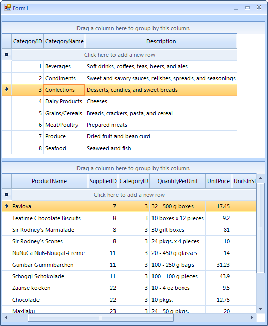

|Article relates to|Product|Author|
|----|----|----|
|Q2 2012 SP2|RadGridView for WinForms|Julian Benkov|
   
## Problem

This article will demonstrate how to display master/detail relation in two grids. The first grid will show the master data the second one the detail of the selected in the first grid row.  
   

   
   
## Solution 

The solution is very simple - just subscribe to the CurrentRowChanged event of the master grid view and there get the rows associated with the current row's DataBoundItem and assign them as data source for the second grid.   
 
 
````C#
void radGridView1_CurrentRowChanged(object sender, Telerik.WinControls.UI.CurrentRowChangedEventArgs e)
{
    if (e.CurrentRow != null && e.CurrentRow is GridViewDataRowInfo)
    {
        this.radGridView2.DataSource = ((NwindDataSet.CategoriesRow)((DataRowView)e.CurrentRow.DataBoundItem).Row).GetProductsRows();
    }
}

````
````VB.NET
Private Sub radGridView1_CurrentRowChanged(ByVal sender As Object, ByVal e As Telerik.WinControls.UI.CurrentRowChangedEventArgs)
   If Not e.CurrentRow Is Nothing AndAlso TypeOf e.CurrentRow Is GridViewDataRowInfo Then
       Me.radGridView2.DataSource = (CType((CType(e.CurrentRow.DataBoundItem, DataRowView)).Row, NwindDataSet.CategoriesRow)).GetProductsRows()
   End If
End Sub

````   

The example uses the **Categories** and the **Products** tables of the NorthWind database.   

>note A complete solution in C# and VB.NET can be found [here](https://github.com/telerik/winforms-sdk/tree/master/GridView/Master-detail%20with%20two%20grids).