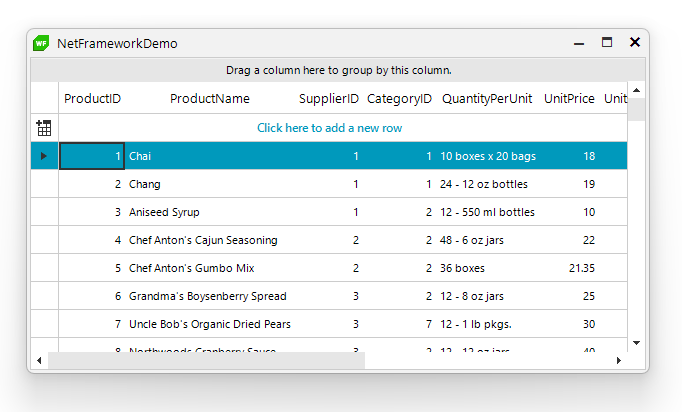
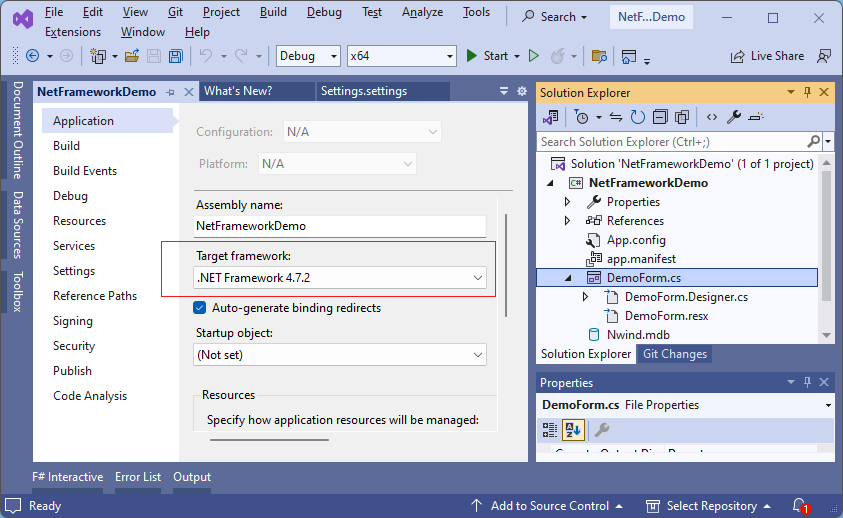
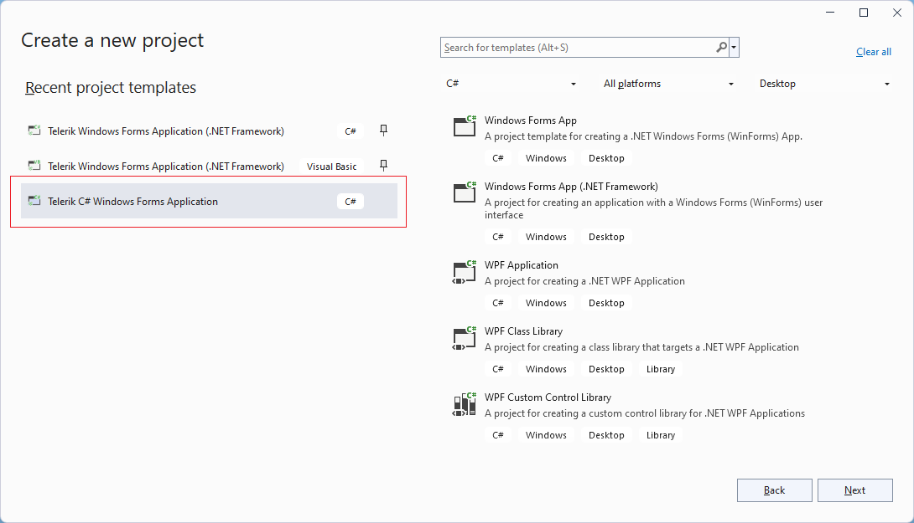
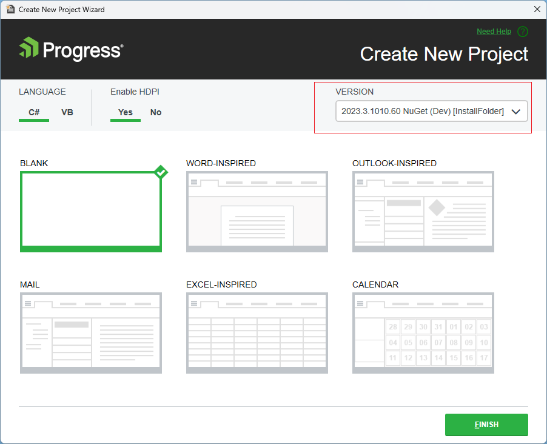
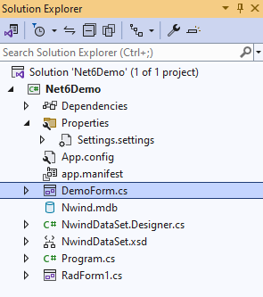
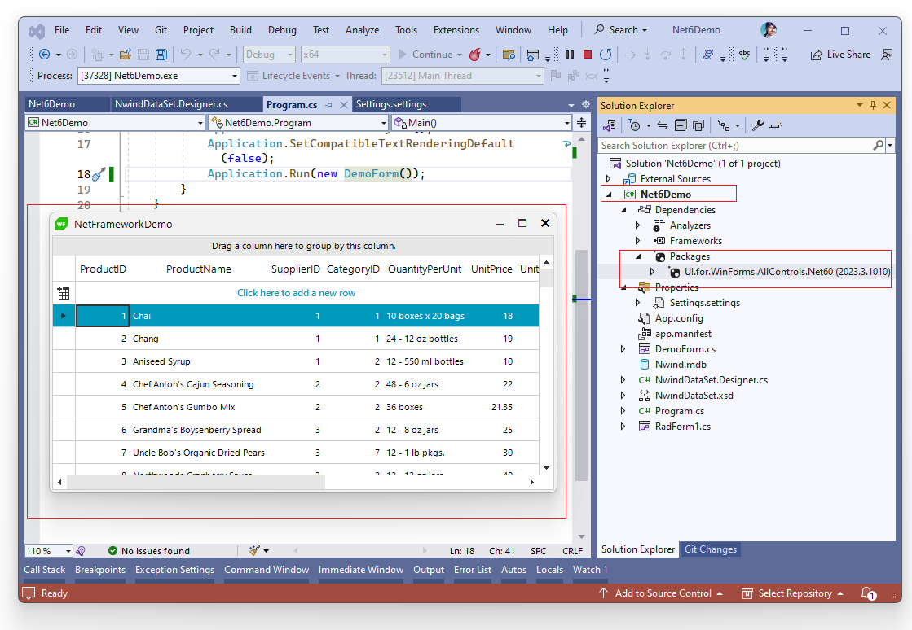

## Environment
 
|Product Version|Product|Author|
|----|----|----|
|2023.3.1010|UI for WinForms|[Desislava Yordanova](https://www.telerik.com/blogs/author/desislava-yordanova)|

## Description

If you currently have a WinForms project that uses .NET Framework 4.8 (or older version) and you need to migrate it to .NET Core (or newer), this tutorial demonstrates a few steps how to do this in an easy way. 

Let's have the following project ("NetFrameworkDemo") that uses .NET Framework 4.7.2. and has a single RadForm with a RadGridView control:

>caption DemoForm.cs

 

  
 
## Solution 

In general, you are not expected to experience any difficulties when it comes to upgrading from .NET Framework 4.8 (or older) to .NET Core (or newer). We will migrate to .NET 6 as a Target Framework for the converted project.

1\. Create a brand new .NET 6 project:

 

 

2\. Copy all the files you have in the .NET Framework project to the new project's folder. 

3\. Then, include these files in the new project and make sure that the Program.cs file starts the desired form:

  

4\. Install the [NuGet package]() for the desired version (if it is necessary). Note that by default, when creating a new project with using the Telerik template, the UI.for.WinForms.AllControls NuGet is installed.

5\. Build and run the project:

   

# See Also

* [Download Product Files]() 
* [Available NuGet Packages]()
* [Toolbox Version]()

