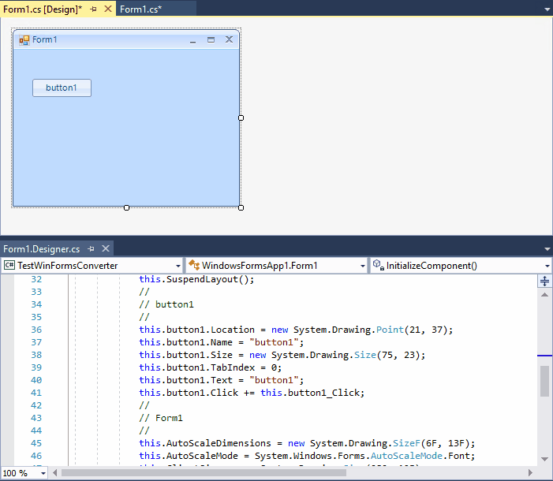
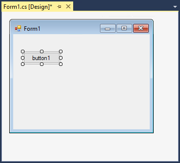
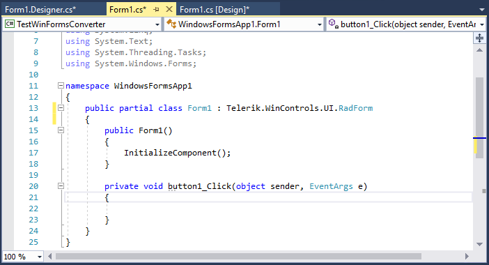
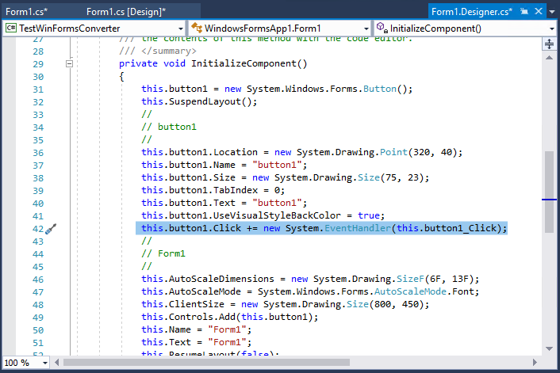

## Environment
|Product Version|Product|Author|
|----|----|----|
|2021.1.223|WinForms Converter|[Desislava Yordanova](https://www.telerik.com/blogs/author/desislava-yordanova)|

## Description

Telerik UI for WinForms suite offers a [WinForms Converter]() which is a tool that allows you to convert the standard .NET Windows Forms controls for all projects in a particular solution to their equivalent in Telerik UI for WinForms. It aims to speed up the conversion process and save time when such projects are modernized. 
 
After a project, built with the standard MS controls, is successfully converted to a Telerik WinForms project, the subscriptions to certain events available in the Designer.cs file may disappear if you open the design view and make some changes.

>caption Disappearing Click event handler



## Solution

First, we will pay attention to how the event handlers are generated at design time. Consider that we have a **Button** on the Form:



Double-click it to generate its **Click** event handler:





After using the [WinForms Converter](), Roslyn (used in the converter) converts the event handlers as follows:
 
````C#

this.button1.Click += this.button1_Click;

````
````VB.NET

Public Class Form1
    Private Sub Button1_Click(sender As Object, e As EventArgs) Handles Button1.Click
        ' TODO
    End Sub
End Class

````

This is still a valid code. However, Visual Studio designer automatically removes the event handler after some design time changes of the form if it is generated this way. There are several threads in general programming forums on this topic:

[Event handler deleted automatically](https://stackoverflow.com/questions/21525982/event-handler-deleted-automatically)

[Form designer keeps removing the ItemChecked event handler for ListView controls](https://social.msdn.microsoft.com/Forums/en-US/c0f9d417-1554-42e0-9b00-90a87029669f/form-designer-keeps-removing-the-itemchecked-event-handler-for-listview-controls?forum=csharplanguage)

Usually, adding **new System.EventHandler** deals with the problem:

````C#
this.button1.Click += new System.EventHandler(this.button1_Click);

````
````VB.NET
 
Public Class Form1
    Private Sub Button1_Click(sender As Object, e As EventArgs) Handles Button1.Click
        ' TODO
    End Sub
End Class


````

# See Also

* [WinForms Converter]()

* [Step-by-step tutorial]()  


