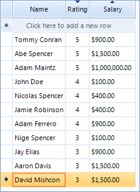

|Product Version|Product|Author|Last modified|
|----|----|----|----|
|Q3 2012 SP1|RadControls for WinForms|Stefan Stefanov|25 Dec 2012|

## Problem
 
This example shows how to use both the default and custom sorting to sort your grid. In the below grid all columns prior **Column2** are sorted with the default sort mechanism, while for **Column2** itself, we will use custom sorting.

  

## Solution 

To achieve this, all you need to do is to set the EnableCustomSorting property of RadGridView to true and implement the desired sorting logic in the CustomSorting event handler, while keeping the default sorting for the rest of the cases:  

````C#
void radGridView1_CustomSorting(object sender, Telerik.WinControls.UI.GridViewCustomSortingEventArgs e)
{
    //sort all descriptors before 'column2' are using the default comparer
    SortDescriptorCollection descriptors = e.Template.SortDescriptors;
    int index = descriptors.IndexOf("Column2");
    if (index > 0)
    {
        SortDescriptorCollection context = new SortDescriptorCollection();
        for (int i = 0; i < index; i++)
        {
            context.Add(descriptors[i]);
        }
 
        e.SortResult = GridViewRowInfoComparer.CompareRows(e.Row1, e.Row2, context);
    }
 
    if (e.SortResult == 0 && index >= 0)
    {
        decimal value1 = (decimal)e.Row1.Cells["Column2"].Value;
        decimal value2 = (decimal)e.Row2.Cells["Column2"].Value;
        e.SortResult = decimal.Compare(value1, value2);
        if (e.SortResult != 0)
        {
            if (descriptors[index].Direction == System.ComponentModel.ListSortDirection.Descending)
            {
                e.SortResult *= -1;
            }
 
            return;
        }
    }
 
    //default sorting
    e.Handled = false;
}

````
````VB.NET
Private Sub radGridView1_CustomSorting(sender As Object, e As Telerik.WinControls.UI.GridViewCustomSortingEventArgs)
    'sort all descriptors before 'column2' are using the default comparer
    Dim descriptors As SortDescriptorCollection = e.Template.SortDescriptors
    Dim index As Integer = descriptors.IndexOf("Column2")
    If index > 0 Then
        Dim context As New SortDescriptorCollection()
        For i As Integer = 0 To index - 1
            context.Add(descriptors(i))
        Next
 
        e.SortResult = GridViewRowInfoComparer.CompareRows(e.Row1, e.Row2, context)
    End If
 
    If e.SortResult = 0 AndAlso index >= 0 Then
        Dim value1 As Decimal = CDec(e.Row1.Cells("Column2").Value)
        Dim value2 As Decimal = CDec(e.Row2.Cells("Column2").Value)
        e.SortResult = Decimal.Compare(value1, value2)
        If e.SortResult <> 0 Then
            If descriptors(index).Direction = System.ComponentModel.ListSortDirection.Descending Then
                e.SortResult *= -1
            End If
 
            Return
        End If
    End If
 
    'default sorting
    e.Handled = False
End Sub

````
 
