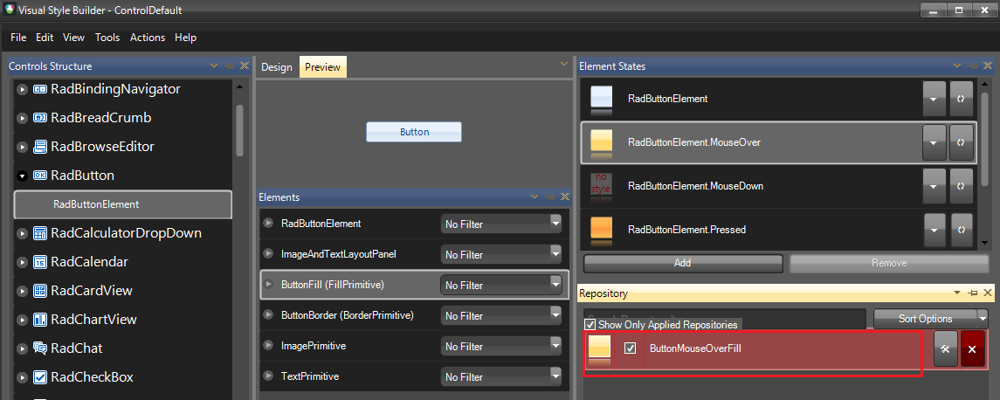

## Environment
|Product Version|Product|Author|
|----|----|----|
|2021.2.511|Visual Style Builder for WinForms|[Desislava Yordanova](https://www.telerik.com/blogs/author/desislava-yordanova)|

## Description

Telerik UI for WinForms suite offers a variety of [built-in themes]() that a developer can use while building an application. This can bring a diverse look and feel to every project. Very often, developers need some custom design according to their requirements. Here comes the benefit of using [custom themes]().

Creating a theme from scratch is a very time-consuming process since you will need to define different style settings for all inner control's elements and element states respectively. That is why, we usually recommend our customers to save a considerable amount of time by updating one of the predefined themes that come out-of-the-box with the installation of the Telerik UI for WinForms suite. The theme can be either modified in [Visual Style Builder]() or programatically. This article shows a sample approach how to customize the theme via code.

## Solution

Customizing a theme at run time may be a clumsy process since it would be necessary to inspect in advance by using [Visual Style Builder]() what are the applied repository items for the respective elements and their element states in the particular theme. In addition, each theme defines its own design and the repositories are different in the different themes.

>caption ButtonMouseOverFill Repository in ControlDefault theme



#### Clone a Theme and modify the ButtonMouseOverFill StyleRepository

````C#

Theme controlDefaultTheme = ThemeRepository.FindTheme("ControlDefault");
Theme clonedTheme = (Theme)controlDefaultTheme.Clone();
clonedTheme.Name = "CustomTheme";
StyleRepository repository = clonedTheme.FindRepository("ButtonMouseOverFill");
repository.FindSetting("BackColor").Value = Color.Red;
repository.FindSetting("BackColor2").Value = Color.Red;
repository.FindSetting("BackColor3").Value = Color.Red;
repository.FindSetting("BackColor4").Value = Color.Red;
ThemeRepository.Add(clonedTheme);


````
````VB.NET

Dim controlDefaultTheme As Theme = ThemeRepository.FindTheme("ControlDefault")
Dim clonedTheme As Theme = CType(controlDefaultTheme.Clone(), Theme)
clonedTheme.Name = "CustomTheme"
Dim repository As StyleRepository = clonedTheme.FindRepository("ButtonMouseOverFill")
repository.FindSetting("BackColor").Value = Color.Red
repository.FindSetting("BackColor2").Value = Color.Red
repository.FindSetting("BackColor3").Value = Color.Red
repository.FindSetting("BackColor4").Value = Color.Red
ThemeRepository.Add(clonedTheme)

````  

A repository is a predefined set of properties that can be applied to some primitive or element. **StyleRepositories** can be applied on particular elements. These repositories are reused for more than one control. You can either access a particular setting by its name or you can iterate all of the settings and based on their type, execute your custom logic: 

#### Iterate all Repositories

````C#

this.radRibbonBar1.ThemeName = "Office2013Light";
Theme theme = ThemeRepository.FindTheme(this.radRibbonBar1.ThemeName);
foreach (StyleRepository repo in theme.Repositories)
{
    foreach (PropertySetting setting in repo.Settings)
    {
        //...
    }
} 


````
````VB.NET

Me.radRibbonBar1.ThemeName = "Office2013Light"
Dim theme As Theme = ThemeRepository.FindTheme(Me.radRibbonBar1.ThemeName)

For Each repo As StyleRepository In theme.Repositories

    For Each setting As PropertySetting In repo.Settings
    Next
Next


```` 

It is possible to access some specific style group, e.g. for RadGridView:


````C#
 
Theme controlDefaultTheme = ThemeRepository.FindTheme("ControlDefault");
StyleGroup group = controlDefaultTheme.FindStyleGroup("Telerik.WinControls.UI.RadGridView");
 
foreach (PropertySettingGroup settingGroup in group.PropertySettingGroups)
{
    if (settingGroup.Selector.Value == "GridHeaderCellElement")
    {
        foreach (PropertySetting property in settingGroup.PropertySettings)
        {
            if (property.Name == "BackColor2")
            {
                 
            }
        }
    }
}

````
````VB.NET

Dim controlDefaultTheme As Theme = ThemeRepository.FindTheme("ControlDefault")
Dim group As StyleGroup = controlDefaultTheme.FindStyleGroup("Telerik.WinControls.UI.RadGridView")

For Each settingGroup As PropertySettingGroup In group.PropertySettingGroups

    If settingGroup.Selector.Value = "GridHeaderCellElement" Then

        For Each [property] As PropertySetting In settingGroup.PropertySettings

            If [property].Name = "BackColor2" Then
            End If
        Next
    End If
Next

```` 

>note Note that the different themes in the Telerik UI for WinForms suite have their own implementation. You can't reply on the fact that the names of the repository settings will be identical in all themes. Usually, manipulating a theme at run time is not a recommended approach as it would include a lot of code for even simple customizations. A better option is [customizing the theme in Visual Style Builder](https://docs.telerik.com/devtools/winforms/knowledge-base/customize-a-theme).
 

# See Also

* [How to Customize a Theme]()
* [Using Custom Themes]() 


