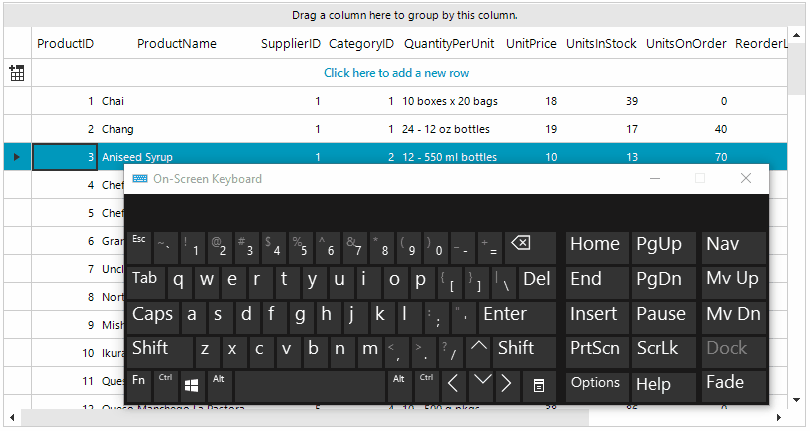

### Environment
 
|Product Version|Product|Author|
|----|----|----|
|2023.2.718|RadGridView for WinForms|[Desislava Yordanova](https://www.telerik.com/blogs/author/desislava-yordanova)|
 
## Description

When the editor in RadGridView is active, it is expected to handle the user's input. For example, when a spin editor is activated in a decimal column, pressing the up/down arrow keys increases/decreases the editor's value. If you want to skip handling the up/down arrows by the editor and move the current row in the respective direction, you can have a look at the following code snippet which result is illustrated below: 




## Solution

When the editor is initialized, we can handle the keyboard processing and execute custom logic when the up/down arrow keys are pressed. In addition, the default logic for increasing/decreasing the value in the spin editor should be restricted:
 
 
````C#

        public RadForm1()
        {
            InitializeComponent();
            this.radGridView1.CellEditorInitialized += RadGridView_CellEditorInitialized;
        }

        private void RadGridView_CellEditorInitialized(object sender, Telerik.WinControls.UI.GridViewCellEventArgs e)
        {
            var spinEditor = e.ActiveEditor as GridSpinEditor;
            if (spinEditor != null)
            {
                var element = spinEditor.EditorElement as RadSpinEditorElement;
                element.InterceptArrowKeys = false;
                element.KeyDown -= element_KeyDown;
                element.KeyDown += element_KeyDown;
            }
        }

        private void element_KeyDown(object sender, KeyEventArgs e)
        {
            if (e.KeyData == Keys.Down)
                this.radGridView1.GridNavigator.SelectNextRow(1);
            else if (e.KeyData == Keys.Up)
                this.radGridView1.GridNavigator.SelectPreviousRow(1);
        }
        
````
````VB.NET

    Sub New() 
        InitializeComponent()

        AddHandler Me.RadGridView1.CellEditorInitialized, AddressOf RadGridView_CellEditorInitialized

    End Sub

    Private Sub RadGridView_CellEditorInitialized(sender As Object, e As Telerik.WinControls.UI.GridViewCellEventArgs)
        Dim spinEditor = TryCast(e.ActiveEditor, GridSpinEditor)
        If spinEditor IsNot Nothing Then
            Dim element = TryCast(spinEditor.EditorElement, RadSpinEditorElement)
            element.InterceptArrowKeys = False 
            RemoveHandler element.KeyDown, AddressOf element_KeyDown
            AddHandler element.KeyDown, AddressOf element_KeyDown
        End If
    End Sub

    Private Sub element_KeyDown(sender As Object, e As KeyEventArgs)
        If e.KeyData = Keys.Down Then
            Me.RadGridView1.GridNavigator.SelectNextRow(1)
        ElseIf e.KeyData = Keys.Up Then
            Me.RadGridView1.GridNavigator.SelectPreviousRow(1)
        End If
    End Sub  
    
````

# See Also

 * [Handling Editors' events]()
 * [Editing Lifecycle]() 

