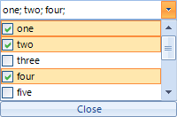

|Date Posted|Product|Author|
|----|----|----|
|Q1 2013|Telerik UI for WinForms|Tsvetan Raikov| 
   
## How To
   
By default, [RadDropDownList]() does not support selecting multiple items out of the box. This article will guide to through the process of extending the functionality of RadDropDownList to support multi selection with check boxes.   
   
   

>important As of **Q3 2014 (version 2014.3.1021)** Telerik UI for WinForms suite offers [RadCheckedDropDownList](https://docs.telerik.com/devtools/winforms/controls/dropdown-listcontrol-and-checkeddropdownlist/checkeddropdownlist/checkeddropdownlist) control which combines RadDropDownList and RadAutoCompleteBox in order to provide functionality to check items in the drop down area and tokenize them in the text area. All previous functionality is preserved, such as visual formatting and data binding, which is now extended.
   
## Solution 
   
First, we will start by creating **CustomDropDownList**, which inherits from **RadDropDownList**. We should override the **ThemeClassName** in order to allow the control to use the **RadDropDownList** theme and the **CreateDropDownListElement**, where we will return an instance of a CustomEditorElement and will define the collection editor for our items at design time, so we can add our custom items:  
   
````C#
public class CustomDropDownList : RadDropDownList
{
    public override string ThemeClassName
    {
        get
        {
            return typeof(RadDropDownList).FullName;
        }
        set
        {
        }
    }
 
    protected override RadDropDownListElement CreateDropDownListElement()
    {
        return new CustomEditorElement();
    }
 
    [DesignerSerializationVisibility(DesignerSerializationVisibility.Content),
    Editor(typeof(CustomListControlCollectionEditor), typeof(UITypeEditor)),
    Category(RadDesignCategory.DataCategory)]
    [Description("Gets a collection representing the items contained in this RadDropDownList.")]
    public new RadListDataItemCollection Items
    {
        get { return base.Items; }
    }
}

````
````VB.NET
Public Class CustomDropDownList
    Inherits RadDropDownList
    Public Overrides Property ThemeClassName() As String
        Get
            Return GetType(RadDropDownList).FullName
        End Get
        Set(value As String)
        End Set
    End Property
 
    Protected Overrides Function CreateDropDownListElement() As RadDropDownListElement
        Return New CustomEditorElement()
    End Function
 
    <DesignerSerializationVisibility(DesignerSerializationVisibility.Content), Editor(GetType(CustomListcontrolCollectionEditor), GetType(UITypeEditor)), Category(RadDesignCategory.DataCategory)> _
        <Description("Gets a collection representing the items contained in this RadDropDownList.")> _
    Public Shadows ReadOnly Property Items() As RadListDataItemCollection
        Get
            Return MyBase.Items
        End Get
    End Property
 
End Class

````
   
Now, we have to create the CustomEditorElement. In the element's constructor we will first initialize the close button and add it accordingly to the sizing grip of the popup. We will also subscribe to its click, where we will close the popup. Next, we will set the SelectionMode to MultiSimple, which means that the users will be able to select item with mouse click or space button. We will also subscribe to the following events:  

 - PopupClosing - here we will cancel the popup closure when it contains mouse so we can use it to select items  

 - CreatingVisualItem - here replace the default visual item with a custom one   

 - ItemDataBinding - replace the default data item with a custom one  
   
In the **CreateChildElements** override, we will initialize and add the LightVisualElement which will hold the text.   
   
Another useful override we have to add is the the one of the ShowPopup method, where prior calling the base functionality we will save the selected items and restore them after.   
   
Finally, we will create a method that fires the OnTextChanged event, used to set the element's text accordingly:  
   
````C#
public class CustomEditorElement : RadDropDownListEditorElement
{
    private LightVisualElement customText;
    private RadButtonElement closeButton;
    private bool textChanged;
 
    public CustomEditorElement()
    {
        closeButton = new RadButtonElement("Close");
        closeButton.SetValue(DockLayoutPanel.DockProperty, Dock.Bottom);
        closeButton.Click += new EventHandler(closeButton_Click);
        this.Popup.SizingGripDockLayout.Children.Insert(1, closeButton);
        this.SelectionMode = System.Windows.Forms.SelectionMode.MultiSimple;
 
        this.PopupClosing += new RadPopupClosingEventHandler(CustomEditorElement_PopupClosing);
        this.CreatingVisualItem += new CreatingVisualListItemEventHandler(CustomEditorElement_CreatingVisualItem);
        this.ListElement.ItemDataBinding += this.CustomEditorElement_ItemDataBinding;
    }
 
    private void deselectAll_Click(object sender, EventArgs e)
    {
        this.SetItemsCheckSelect(false);
    }
 
    private void selectAll_Click(object sender, EventArgs e)
    {
        this.SetItemsCheckSelect(true);
    }
 
    private void SetItemsCheckSelect(bool value)
    {
        foreach (CustomListDataItem item in this.Items)
        {
            item.Selected = value;
            item.Checked = value;
        }
 
        this.SynchronizeText();
    }
 
    protected override void SyncVisualProperties(RadListDataItem listItem)
    {
    }
 
    void closeButton_Click(object sender, EventArgs e)
    {
        ClosePopup();
        GridDataCellElement cell = this.Parent as GridDataCellElement;
        if (cell != null)
        {
            cell.GridViewElement.EndEdit();
        }
    }
 
    private void CustomEditorElement_ItemDataBinding(object sender, ListItemDataBindingEventArgs args)
    {
        args.NewItem = new CustomListDataItem();
    }
 
    void CustomEditorElement_CreatingVisualItem(object sender, CreatingVisualListItemEventArgs args)
    {
        args.VisualItem = new CustomListVisualItem();
    }
 
    void CustomEditorElement_PopupClosing(object sender, RadPopupClosingEventArgs args)
    {
        CustomEditorElement editor = (CustomEditorElement)sender;
        if (args.CloseReason == RadPopupCloseReason.Mouse)
        {
            if (editor.PopupForm.Bounds.Contains(Control.MousePosition))
            {
                args.Cancel = true;
            }
        }
    }
 
    protected override void CreateChildElements()
    {
        base.CreateChildElements();
 
        customText = new LightVisualElement();
        customText.DrawBorder = false;
        customText.DrawFill = true;
        customText.GradientStyle = GradientStyles.Solid;
        customText.BackColor = Color.White;
        customText.TextAlignment = ContentAlignment.MiddleLeft;
        this.EditableElement.Children.Add(customText);
        this.TextBox.Visibility = ElementVisibility.Collapsed;
        this.MinSize = new Size(0, 21);
    }
 
    public override void ShowPopup()
    {
        bool[] selected = new bool[this.Items.Count];
        for (int i = 0; i < selected.Length; i++)
        {
            selected[i] = this.Items[i].Selected;
        }
 
        base.ShowPopup();
        for (int i = 0; i < selected.Length; i++)
        {
            this.Items[i].Selected = selected[i];
        }
    }
 
    protected override void OnTextChanged(EventArgs e)
    {
        SynchronizeText();
    }
 
    internal void SynchronizeText()
    {
        if (textChanged)
        {
            return;
        }
 
        textChanged = true;
        StringBuilder text = new StringBuilder();
        foreach (CustomListDataItem item in this.ListElement.Items)
        {
            if (item.Checked)
            {
                text.AppendFormat("{0}; ", item.Text);
            }
        }
 
        customText.Text = text.ToString();
        textChanged = false;       
    }
}

````
````VB.NET
Public Class CustomEditorElement
    Inherits RadDropDownListEditorElement
    Private customText As LightVisualElement
    Private closeButton As RadButtonElement
    Private textChanged As Boolean
 
    Public Sub New()
        closeButton = New RadButtonElement("Close")
        closeButton.SetValue(DockLayoutPanel.DockProperty, Dock.Bottom)
        AddHandler closeButton.Click, AddressOf closeButton_Click
        Me.Popup.SizingGripDockLayout.Children.Insert(1, closeButton)
        Me.SelectionMode = System.Windows.Forms.SelectionMode.MultiSimple
 
        AddHandler Me.PopupClosing, AddressOf CustomEditorElement_PopupClosing
        AddHandler Me.CreatingVisualItem, AddressOf CustomEditorElement_CreatingVisualItem
        AddHandler Me.ListElement.ItemDataBinding, AddressOf Me.CustomEditorElement_ItemDataBinding
    End Sub
 
    Private Sub deselectAll_Click(sender As Object, e As EventArgs)
        Me.SetItemsCheckSelect(False)
    End Sub
 
    Private Sub selectAll_Click(sender As Object, e As EventArgs)
        Me.SetItemsCheckSelect(True)
    End Sub
 
    Private Sub SetItemsCheckSelect(value As Boolean)
        For Each item As CustomListDataItem In Me.Items
            item.Selected = value
            item.Checked = value
        Next
 
        Me.SynchronizeText()
    End Sub
 
    Protected Overrides Sub SyncVisualProperties(listItem As RadListDataItem)
    End Sub
 
    Private Sub closeButton_Click(sender As Object, e As EventArgs)
        ClosePopup()
        Dim cell As GridDataCellElement = TryCast(Me.Parent, GridDataCellElement)
        If cell IsNot Nothing Then
            cell.GridViewElement.EndEdit()
        End If
    End Sub
 
    Private Sub CustomEditorElement_ItemDataBinding(sender As Object, args As ListItemDataBindingEventArgs)
        args.NewItem = New CustomListDataItem()
    End Sub
 
    Private Sub CustomEditorElement_CreatingVisualItem(sender As Object, args As CreatingVisualListItemEventArgs)
        args.VisualItem = New CustomListVisualItem()
    End Sub
 
    Private Sub CustomEditorElement_PopupClosing(sender As Object, args As RadPopupClosingEventArgs)
        Dim editor As CustomEditorElement = DirectCast(sender, CustomEditorElement)
        If args.CloseReason = RadPopupCloseReason.Mouse Then
            If editor.PopupForm.Bounds.Contains(Control.MousePosition) Then
                args.Cancel = True
            End If
        End If
    End Sub
 
    Protected Overrides Sub CreateChildElements()
        MyBase.CreateChildElements()
 
        customText = New LightVisualElement()
        customText.DrawBorder = False
        customText.DrawFill = True
        customText.GradientStyle = GradientStyles.Solid
        customText.BackColor = Color.White
        customText.TextAlignment = ContentAlignment.MiddleLeft
        Me.EditableElement.Children.Add(customText)
        Me.TextBox.Visibility = ElementVisibility.Collapsed
        Me.MinSize = New Size(0, 21)
    End Sub
 
    Public Overrides Sub ShowPopup()
        Dim selected As Boolean() = New Boolean(Me.Items.Count - 1) {}
        For i As Integer = 0 To selected.Length - 1
            selected(i) = Me.Items(i).Selected
        Next
 
        MyBase.ShowPopup()
        For i As Integer = 0 To selected.Length - 1
            Me.Items(i).Selected = selected(i)
        Next
    End Sub
 
    Protected Overrides Sub OnTextChanged(e As EventArgs)
        SynchronizeText()
    End Sub
 
    Friend Sub SynchronizeText()
        If textChanged Then
            Return
        End If
 
        textChanged = True
        Dim text As New StringBuilder()
        For Each item As CustomListDataItem In Me.ListElement.Items
            If item.Checked Then
                text.AppendFormat("{0}; ", item.Text)
            End If
        Next
 
        customText.Text = text.ToString()
        textChanged = False
    End Sub
End Class

````

Next, we will create a custom data item where we will  just add a property to store that information about the check operation:

````C#
public class CustomListDataItem : RadListDataItem
{
    #region RadProperties
 
        public static readonly RadProperty CheckedProperty = RadProperty.Register("Checked", typeof(bool), typeof(CustomListDataItem), new RadElementPropertyMetadata(false));
         
        #endregion
 
    #region Properties
 
        public bool Checked
        {
            get
            {
                return (bool)this.GetValue(CustomListDataItem.CheckedProperty);
            }
            set
            {
                this.SetValue(CustomListDataItem.CheckedProperty, value);
            }
        }
 
        protected override void OnPropertyChanged(RadPropertyChangedEventArgs e)
        {
            base.OnPropertyChanged(e);
        }
 
        #endregion
 
    #region Overrides
 
        protected override void SetDataBoundItem(bool dataBinding, object value)
        {
            base.SetDataBoundItem(dataBinding, value);
            if (value is INotifyPropertyChanged)
            {
                INotifyPropertyChanged item = value as INotifyPropertyChanged;
                item.PropertyChanged += item_PropertyChanged;
            }
        }
 
        #endregion
 
    #region Private Methods
 
        private void item_PropertyChanged(object sender, PropertyChangedEventArgs e)
        {
            if (e.PropertyName == "Checked")
            {
                this.Checked = (this.DataBoundItem  as RadListDataItem).Selected;
            }           
        }
        #endregion
}

````
````VB.NET
Public Class CustomListDataItem
        Inherits RadListDataItem
        #Region "RadProperties"
 
        Public Shared ReadOnly CheckedProperty As RadProperty = RadProperty.Register("Checked", GetType(Boolean), GetType(CustomListDataItem), New RadElementPropertyMetadata(False))
 
        #End Region
 
        #Region "Properties"
 
        Public Property Checked() As Boolean
            Get
                Return CBool(Me.GetValue(CustomListDataItem.CheckedProperty))
            End Get
            Set
                Me.SetValue(CustomListDataItem.CheckedProperty, Value)
            End Set
        End Property
 
 
 
        #End Region
 
        #Region "Overrides"
 
        Protected Overrides Sub SetDataBoundItem(ByVal dataBinding As Boolean, ByVal value As Object)
            MyBase.SetDataBoundItem(dataBinding, value)
            If TypeOf value Is INotifyPropertyChanged Then
                Dim item As INotifyPropertyChanged = TryCast(value, INotifyPropertyChanged)
                AddHandler item.PropertyChanged, AddressOf item_PropertyChanged
            End If
        End Sub
 
        #End Region
 
        #Region "Private Methods"
 
        Private Sub item_PropertyChanged(ByVal sender As Object, ByVal e As PropertyChangedEventArgs)
            If e.PropertyName = "Checked" Then
                Me.Checked = (TryCast(Me.DataBoundItem, RadListDataItem)).Selected
            End If
        End Sub
 
        #End Region
    End Class

````

Finally, we will need to create a custom visual item. To do that, we will inherit from RadListVisualItem. Then, in the CreateChildElements override, we will initialize a StackLayoutElement, which will hold both the check box (RadCheckBoxElement) and the content element (a LightVisualElement). In the ToggleStateChanged event of the check box we will set the data item's Check property (which we have added in the CustomListDataItem class) and in the SynchronizeProperties override we will sync the check box and the text with its data item:

````C#
public class CustomListVisualItem : RadListVisualItem
{
    private RadCheckBoxElement checkbox;
    private LightVisualElement content;
 
    protected override void CreateChildElements()
    {
        base.CreateChildElements();
 
        StackLayoutElement stack = new StackLayoutElement();
        stack.Orientation = Orientation.Horizontal;
        this.Children.Add(stack);
 
        checkbox = new RadCheckBoxElement();
        checkbox.ToggleStateChanged += new StateChangedEventHandler(checkbox_ToggleStateChanged);
        stack.Children.Add(checkbox);
 
        content = new LightVisualElement();
        content.StretchHorizontally = false;
        content.StretchVertically = true;
        content.TextAlignment = ContentAlignment.MiddleLeft;
        content.NotifyParentOnMouseInput = true;
        stack.Children.Add(content);
    }
 
    void checkbox_ToggleStateChanged(object sender, StateChangedEventArgs e)
    {
        ((CustomListDataItem)this.Data).Checked = this.checkbox.Checked;
 
        DropDownPopupForm form = this.ElementTree.Control as DropDownPopupForm;
        ((CustomEditorElement)form.OwnerDropDownListElement).SynchronizeText();
    }
 
    protected override Type ThemeEffectiveType
    {
        get
        {
            return typeof(RadListVisualItem);
        }
    }
 
    protected override void SynchronizeProperties()
    {
        base.SynchronizeProperties();
        checkbox.IsChecked = this.Data.Selected;
        this.content.Text = this.Data.Text;
        this.Text = "";
    }
}

````
````VB.NET
Public Class CustomListVisualItem
    Inherits RadListVisualItem
    Private checkbox As RadCheckBoxElement
    Private content As LightVisualElement
 
    Protected Overrides Sub CreateChildElements()
        MyBase.CreateChildElements()
 
        Dim stack As New StackLayoutElement()
        stack.Orientation = Orientation.Horizontal
        Me.Children.Add(stack)
 
        checkbox = New RadCheckBoxElement()
        AddHandler checkbox.ToggleStateChanged, AddressOf checkbox_ToggleStateChanged
        stack.Children.Add(checkbox)
 
        content = New LightVisualElement()
        content.StretchHorizontally = False
        content.StretchVertically = True
        content.TextAlignment = ContentAlignment.MiddleLeft
        content.NotifyParentOnMouseInput = True
        stack.Children.Add(content)
    End Sub
 
    Private Sub checkbox_ToggleStateChanged(sender As Object, e As StateChangedEventArgs)
        DirectCast(Me.Data, CustomListDataItem).Checked = Me.checkbox.Checked
 
        Dim form As DropDownPopupForm = TryCast(Me.ElementTree.Control, DropDownPopupForm)
        DirectCast(form.OwnerDropDownListElement, CustomEditorElement).SynchronizeText()
    End Sub
 
    Protected Overrides ReadOnly Property ThemeEffectiveType() As Type
        Get
            Return GetType(RadListVisualItem)
        End Get
    End Property
 
    Protected Overrides Sub SynchronizeProperties()
        MyBase.SynchronizeProperties()
        checkbox.IsChecked = Me.Data.Selected
        Me.content.Text = Me.Data.Text
        Me.Text = ""
    End Sub
End Class

````

And finally we need to create our CollectionEditor, for design time support:

````C#
public class CustomListControlCollectionEditor : RadListControlCollectionEditor
{
    public CustomListControlCollectionEditor(Type itemType)
        : base(itemType)
    {
    }
 
    protected override Type[] CreateNewItemTypes()
    {
        Type[] baseTypes =  base.CreateNewItemTypes();
        Type[] newTypes = new Type[baseTypes.Length + 1];
        baseTypes.CopyTo(newTypes, 0);
        newTypes[baseTypes.Length] = typeof(CustomListDataItem);
        return newTypes;
    }
}

````
````VB.NET

Public Class CustomListControlCollectionEditor
    Inherits RadListControlCollectionEditor
    Public Sub New(itemType As Type)
        MyBase.New(itemType)
    End Sub
 
    Protected Overrides Function CreateNewItemTypes() As Type()
        Dim baseTypes As Type() = MyBase.CreateNewItemTypes()
        Dim newTypes As Type() = New Type(baseTypes.Length) {}
        baseTypes.CopyTo(newTypes, 0)
        newTypes(baseTypes.Length) = GetType(CustomListDataItem)
        Return newTypes
    End Function
End Class

````

Here is how to put this control in action:

````C#
public partial class Form1 : Form
  {
      public Form1()
      {
          InitializeComponent();
 
          DataTable t = new DataTable();
          t.Columns.Add("ID", typeof(int));
          t.Columns.Add("Name", typeof(string));
          t.Rows.Add(1, "one");
          t.Rows.Add(2, "two");
          t.Rows.Add(3, "three");
          t.Rows.Add(4, "four");
          t.Rows.Add(5, "five");
          t.Rows.Add(6, "six");
          t.Rows.Add(7, "seven");
          t.Rows.Add(8, "eight");
          t.Rows.Add(9, "nine");
          t.Rows.Add(10, "ten");
 
          CustomDropDownList list = new CustomDropDownList();
          list.Location = new Point(50, 50);
          list.Size = new System.Drawing.Size(200, 20);
          list.DataSource = t;
          list.DisplayMember = "Name";
          list.ValueMember = "ID";
          Controls.Add(list);
      }
  }

````
````VB.NET
Public Partial Class Form1
        Inherits Form
        Public Sub New()
            InitializeComponent()
 
            Dim t As DataTable = New DataTable()
            t.Columns.Add("ID", GetType(Integer))
            t.Columns.Add("Name", GetType(String))
            t.Rows.Add(1, "one")
            t.Rows.Add(2, "two")
            t.Rows.Add(3, "three")
            t.Rows.Add(4, "four")
            t.Rows.Add(5, "five")
            t.Rows.Add(6, "six")
            t.Rows.Add(7, "seven")
            t.Rows.Add(8, "eight")
            t.Rows.Add(9, "nine")
            t.Rows.Add(10, "ten")
 
            Dim list As CustomDropDownList = New CustomDropDownList()
            list.Location = New Point(50, 50)
            list.Size = New System.Drawing.Size(200, 20)
            list.DataSource = t
            list.DisplayMember = "Name"
            list.ValueMember = "ID"
            Controls.Add(list)
        End Sub
    End Class

````

>note A complete solution in C# and VB.NET can be found [here](https://github.com/telerik/winforms-sdk/tree/master/DropDownList/MultiSelectDropDown).