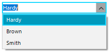
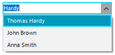
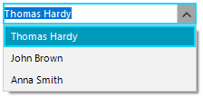

## Environment
 
|Product Version|Product|Author|
|----|----|----|
|2022.2.622|RadDropDownList for WinForms|[Desislava Yordanova](https://www.telerik.com/blogs/author/desislava-yordanova)|

## Description

When using [data binding]() for populating **RadDropDownList** with data, note that the **DisplayMember** property allows you to specify the particular field in the data source which will be used by the items in RadDropDownList for their Text. However, it is possible to specify only a single field.

````C#  

DataTable dt = new DataTable();
dt.Columns.Add("Id", typeof(int));
dt.Columns.Add("FirstName", typeof(string));
dt.Columns.Add("LastName", typeof(string));

dt.Rows.Add(1, "Thomas", "Hardy");
dt.Rows.Add(2, "John", "Brown");
dt.Rows.Add(3, "Anna", "Smith");

this.radDropDownList1.DisplayMember = "LastName";
this.radDropDownList1.ValueMember = "Id";
this.radDropDownList1.DataSource = dt;
         
````
````VB.NET

Dim dt As DataTable = New DataTable()
dt.Columns.Add("Id", GetType(Integer))
dt.Columns.Add("FirstName", GetType(String))
dt.Columns.Add("LastName", GetType(String))
dt.Rows.Add(1, "Thomas", "Hardy")
dt.Rows.Add(2, "John", "Brown")
dt.Rows.Add(3, "Anna", "Smith")
Me.RadDropDownList1.DisplayMember = "LastName"
Me.RadDropDownList1.ValueMember = "Id"
Me.RadDropDownList1.DataSource = dt

````

>caption Default DisplayMember



A common requirement is to include more than one property in the **DisplayMember**, e.g. "FirstName" + "LastName". This article shows a sample approach how to do it.

## Solution

1\. Subscribe to the RadDropDownList.**VisualListItemFormatting** event and set the VisualItem.**Text** to the desired combined text extracted from the **DataBoundItem**.
 
 
````C#  

private void radDropDownList1_VisualListItemFormatting(object sender, VisualItemFormattingEventArgs args)
{
    DataRowView row = args.VisualItem.Data.DataBoundItem as DataRowView;
    args.VisualItem.Text = row["FirstName"] + " " + row["LastName"];      
}      
   
````
````VB.NET

Private Sub radDropDownList1_VisualListItemFormatting(ByVal sender As Object, ByVal args As VisualItemFormattingEventArgs)
    Dim row As DataRowView = TryCast(args.VisualItem.Data.DataBoundItem, DataRowView)
    args.VisualItem.Text = row("FirstName") & " " & row("LastName")
End Sub

````

Thus, the popup items will show the complete name. But the editable part still will show only the field specified as DisplayMember:

>caption Combined Text in the DropDown Items




2\. Create a field in the data source collection that combines multiple fields (e.g. "FirstName" + "LastName"). Then, set that combined field as DisplayMember. 

````C#  

DataTable dt = new DataTable();
dt.Columns.Add("Id", typeof(int));
dt.Columns.Add("FirstName", typeof(string));
dt.Columns.Add("LastName", typeof(string));
dt.Columns.Add("FullName", typeof(string));

dt.Rows.Add(1, "Thomas", "Hardy");
dt.Rows.Add(2, "John", "Brown");
dt.Rows.Add(3, "Anna", "Smith");

foreach (DataRow row in dt.Rows)
{
    row["FullName"]= row["FirstName"]+" "+row["LastName"];
}

this.radDropDownList1.DisplayMember = "FullName";
this.radDropDownList1.ValueMember = "Id";
this.radDropDownList1.DataSource = dt;
         
````
````VB.NET

Dim dt As DataTable = New DataTable()
dt.Columns.Add("Id", GetType(Integer))
dt.Columns.Add("FirstName", GetType(String))
dt.Columns.Add("LastName", GetType(String))
dt.Columns.Add("FullName", GetType(String))
dt.Rows.Add(1, "Thomas", "Hardy")
dt.Rows.Add(2, "John", "Brown")
dt.Rows.Add(3, "Anna", "Smith")

For Each row As DataRow In dt.Rows
    row("FullName") = row("FirstName") & " " & row("LastName")
Next

Me.RadDropDownList1.DisplayMember = "FullName"
Me.RadDropDownList1.ValueMember = "Id"
Me.RadDropDownList1.DataSource = dt

````

Thus, the editable part will also show the full name:




# See Also

* [Data Binding]()
