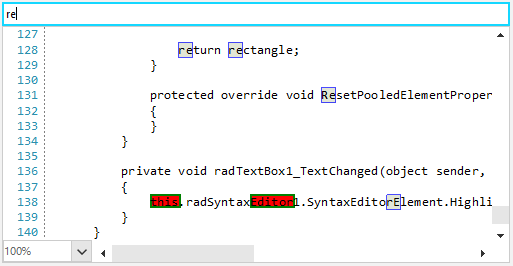

## Environment
 
|Product Version|Product|Author|
|----|----|----|
|2022.1.222|RadSyntaxEditor for WinForms|[Desislava Yordanova](https://www.telerik.com/blogs/author/desislava-yordanova)|

## Description

By default, **RadSyntaxEditor** offers default highlight style for the [Find and Replace]() functionality. This article demonstrates how to highlight in a different way another portion of text matches.

>caption Default Highlight Style
 


## Solution

RadSyntaxEditor is purposed to offer one common highlight style for the found search results. Hence, multiple *HighlightAllMatches* rules are not supported. If you need to highlight specific portion of text in a different color (different than the standard search format style), it would be necessary to create a custom tagger to classify the desired words and mark these words as specific. Then, add a custom UI layer to paint the desired format style. As a result, you will have different styles for the different words to be classified.

In the below code snippet, there are two words "this" and "editor" that are classified as different:

>caption Multiple Highlight Styles
 



````C#     
public RadForm1()
{
    InitializeComponent();

    this.radSyntaxEditor1.SyntaxEditorElement.UILayersBuilder = new CustomUILayersBuilder();
    this.radSyntaxEditor1.TextFormatDefinitions.AddLast(MyTextSearchHighlightTagger.TelerikClassificationType,
    new TextFormatDefinition(new SolidBrush(System.Drawing.Color.Black), new SolidBrush(System.Drawing.Color.Red),
                         null,
                         new Telerik.WinForms.Controls.SyntaxEditor.UI.Pen(new SolidBrush(System.Drawing.Color.Green), 2)));

    MyTextSearchHighlightTagger highlightTagger = new MyTextSearchHighlightTagger(this.radSyntaxEditor1.SyntaxEditorElement);
    this.radSyntaxEditor1.TaggersRegistry.RegisterTagger(highlightTagger);
}
public class MyTextSearchHighlightTagger : WordTaggerBase
{
    public static readonly ClassificationType TelerikClassificationType = new ClassificationType("Telerik");
    public static readonly Dictionary<string, ClassificationType> WordsToClassificationType = new Dictionary<string, ClassificationType>();
    private StringComparison comparison = StringComparison.OrdinalIgnoreCase; 
    public MyTextSearchHighlightTagger(RadSyntaxEditorElement editor)
       : base(editor)
    { 
        WordsToClassificationType.Add("this", TelerikClassificationType);
        WordsToClassificationType.Add("editor", TelerikClassificationType);
    }

    protected override Dictionary<string, ClassificationType> GetWordsToClassificationTypes()
    {
        return MyTextSearchHighlightTagger.WordsToClassificationType;
    }

    public override IEnumerable<TagSpan<ClassificationTag>> GetTags(NormalizedSnapshotSpanCollection spans)
    {

        if (WordsToClassificationType.Count == 0)
        {
            yield break;
        }

        TextSnapshot snapshot = this.Document.CurrentSnapshot;
        foreach (TextSnapshotSpan snapshotSpan in spans)
        {
            string lineString = snapshotSpan.GetText();
            foreach (KeyValuePair<string, ClassificationType> searchWord in WordsToClassificationType)
            {

                int index = lineString.IndexOf(searchWord.Key, comparison);
                while (index != -1)
                {
                    TextSnapshotSpan tempSnapshotSpan = new TextSnapshotSpan(snapshot,
                        new Telerik.WinForms.SyntaxEditor.Core.Text.Span(snapshotSpan.Start + index, searchWord.Key.Length));

                    yield return new TagSpan<ClassificationTag>(tempSnapshotSpan, new ClassificationTag(TelerikClassificationType));

                    index = lineString.IndexOf(searchWord.Key, index + searchWord.Key.Length);
                }
            }
        }
    }
}

public class CustomUILayersBuilder : Telerik.WinForms.Controls.SyntaxEditor.UI.Layers.UILayersBuilder
{
    public override void BuildUILayers(UILayerStack uiLayers)
    { 
        uiLayers.AddLast(new MyTextUnderlineUILayer());
        base.BuildUILayers(uiLayers);
       
    }
}
public class MyTextUnderlineUILayer : LineBasedUILayer<ClassificationTag>
{
    public override string Name => "MyTextUnderlineUILayer";

    protected override FrameworkElement GetLinePartUIElement(ClassificationTag tag,
                                                             Telerik.WinForms.SyntaxEditor.Core.Text.Span span,
                                                             UIUpdateContext updateContext)
    {
        if (tag.ClassificationType != MyTextSearchHighlightTagger.TelerikClassificationType)
        {
            return null;
        }

        TextFormatDefinition textFormatting = updateContext.Editor.TextFormatDefinitions.
            GetTextFormatDefinition(MyTextSearchHighlightTagger.TelerikClassificationType);
        Telerik.WinControls.SyntaxEditor.UI.Rect rect = updateContext.Editor.GetLinePartBoundingRectangle(span, true);


        Telerik.WinControls.SyntaxEditor.UI.Rectangle rectangle = this.GetElementFromPool<Telerik.WinControls.SyntaxEditor.UI.Rectangle>();
        rectangle.Width = rect.Width;
        rectangle.Height = rect.Height;
        rectangle.Fill = textFormatting.Background;

        rectangle.Stroke = textFormatting.Border.Brush;
        rectangle.StrokeThickness = textFormatting.Border.Thickness.Left;

        return rectangle;
    }

    protected override void ResetPooledElementProperties(object element)
    {
    }
}

private void radTextBox1_TextChanged(object sender, EventArgs e)
{
    this.radSyntaxEditor1.SyntaxEditorElement.HighlightAllMatches(this.radTextBox1.Text);
}
       

````
````VB.NET

Public Sub New()
    InitializeComponent()
    Me.RadSyntaxEditor1.SyntaxEditorElement.UILayersBuilder = New CustomUILayersBuilder()
    Me.RadSyntaxEditor1.TextFormatDefinitions.AddLast(MyTextSearchHighlightTagger.TelerikClassificationType,
                                                New TextFormatDefinition(New SolidBrush(System.Drawing.Color.Black),
                                                New SolidBrush(System.Drawing.Color.Red), Nothing,
                                                New Telerik.WinForms.Controls.SyntaxEditor.UI.Pen(New SolidBrush(System.Drawing.Color.Green), 2)))
    Dim highlightTagger As MyTextSearchHighlightTagger = New MyTextSearchHighlightTagger(Me.RadSyntaxEditor1.SyntaxEditorElement)
    Me.RadSyntaxEditor1.TaggersRegistry.RegisterTagger(highlightTagger)
End Sub

Public Class MyTextSearchHighlightTagger
    Inherits WordTaggerBase

    Public Shared ReadOnly TelerikClassificationType As ClassificationType = New ClassificationType("Telerik")
    Public Shared ReadOnly WordsToClassificationType As Dictionary(Of String, ClassificationType) = New Dictionary(Of String, ClassificationType)()
    Private comparison As StringComparison = StringComparison.OrdinalIgnoreCase

    Public Sub New(ByVal editor As RadSyntaxEditorElement)
        MyBase.New(editor)
        WordsToClassificationType.Add("this", TelerikClassificationType)
        WordsToClassificationType.Add("editor", TelerikClassificationType)
    End Sub

    Protected Overrides Function GetWordsToClassificationTypes() As Dictionary(Of String, ClassificationType)
        Return MyTextSearchHighlightTagger.WordsToClassificationType
    End Function

    Public Overrides Iterator Function GetTags(ByVal spans As NormalizedSnapshotSpanCollection) As IEnumerable(Of TagSpan(Of ClassificationTag))
        If WordsToClassificationType.Count = 0 Then
            Return
        End If

        Dim snapshot As TextSnapshot = Me.Document.CurrentSnapshot

        For Each snapshotSpan As TextSnapshotSpan In spans
            Dim lineString As String = snapshotSpan.GetText()

            For Each searchWord As KeyValuePair(Of String, ClassificationType) In WordsToClassificationType
                Dim index As Integer = lineString.IndexOf(searchWord.Key, comparison)

                While index <> -1
                    Dim tempSnapshotSpan As TextSnapshotSpan = New TextSnapshotSpan(snapshot, New Telerik.WinForms.SyntaxEditor.Core.Text.Span(snapshotSpan.Start _
                                                                                         + index, searchWord.Key.Length))
                    Yield New TagSpan(Of ClassificationTag)(tempSnapshotSpan, New ClassificationTag(TelerikClassificationType))
                    index = lineString.IndexOf(searchWord.Key, index + searchWord.Key.Length)
                End While
            Next
        Next
    End Function
End Class

Public Class CustomUILayersBuilder
    Inherits Telerik.WinForms.Controls.SyntaxEditor.UI.Layers.UILayersBuilder

    Public Overrides Sub BuildUILayers(ByVal uiLayers As UILayerStack)
        uiLayers.AddLast(New MyTextUnderlineUILayer())
        MyBase.BuildUILayers(uiLayers)
    End Sub
End Class

Public Class MyTextUnderlineUILayer
    Inherits LineBasedUILayer(Of ClassificationTag)

    Public Overrides ReadOnly Property Name As String
        Get
            Return "MyTextUnderlineUILayer"
        End Get
    End Property

    Protected Overrides Function GetLinePartUIElement(tag As ClassificationTag, span As Telerik.WinForms.SyntaxEditor.Core.Text.Span,
                                                      updateContext As UIUpdateContext) As FrameworkElement
        If Not tag.ClassificationType.Equals(MyTextSearchHighlightTagger.TelerikClassificationType) Then
            Return Nothing
        End If

        Dim textFormatting As TextFormatDefinition = updateContext.Editor.TextFormatDefinitions.GetTextFormatDefinition(MyTextSearchHighlightTagger.TelerikClassificationType)
        Dim rect As Telerik.WinControls.SyntaxEditor.UI.Rect = updateContext.Editor.GetLinePartBoundingRectangle(span, True)
        Dim rectangle As Telerik.WinControls.SyntaxEditor.UI.Rectangle = Me.GetElementFromPool(Of Telerik.WinControls.SyntaxEditor.UI.Rectangle)()
        rectangle.Width = rect.Width
        rectangle.Height = rect.Height
        rectangle.Fill = textFormatting.Background
        rectangle.Stroke = textFormatting.Border.Brush
        rectangle.StrokeThickness = textFormatting.Border.Thickness.Left
        Return rectangle
    End Function

    Protected Overrides Sub ResetPooledElementProperties(ByVal element As Object)
    End Sub
End Class
Private Sub RadTextBox1_TextChanged(sender As Object, e As EventArgs) Handles RadTextBox1.TextChanged
    Me.RadSyntaxEditor1.SyntaxEditorElement.HighlightAllMatches(Me.RadTextBox1.Text)
End Sub

````

# See Also

* [Find and Replace]()
* [How to Achieve Underline Text in RadSyntaxEditor]()
* []()