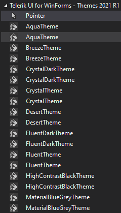
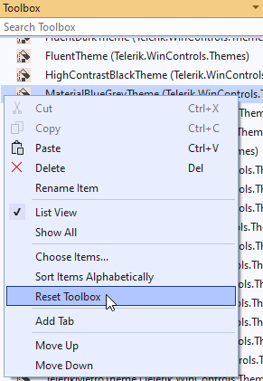

## Environment
 
|Product Version|Product|Author|
|----|----|----|
|2022.2.622|UI for WinForms|[Desislava Yordanova](https://www.telerik.com/blogs/author/desislava-yordanova)|

## Description

A common case is to observe the Telerik controls displayed twice in the Visual Studio Toolbox:

 
 
## Solution

The first thing to try is to **reset** the Visual Studio **Toolbox** by right-clicking on it and select *Reset Toolbox* option. Alternatively, you can uninstall the Telerik UI for WinForms suite and [install]() it again.

Another approach is to:

1. Close all Visual Studio instances.
2. Open Windows Explorer and navigate to **%localappdata%\Microsoft\VisualStudio\15.0_<instanceID>** (e.g. VS 2017). Note that you might have several such folders according to the Visual Studio versions that are installed.
3. Make sure that the option '*Show hidden files, folders and drives*' is selected in the Windows Explorer options.
4. Delete all *.tbd files.
5. Start Visual Studio 2017 and check if the issue still persists.

If there is no Telerik controls in toolbox please use [Toolbox Configuration Wizard](%slug %) to set them.

# See Also

* [Adding RadControls to Visual Studio Toolbox in .NET Framework Projects]() 
* [Adding RadControls to Visual Studio Toolbox in .NET Core Projects]() 
* [Set Toolbox Version]()
