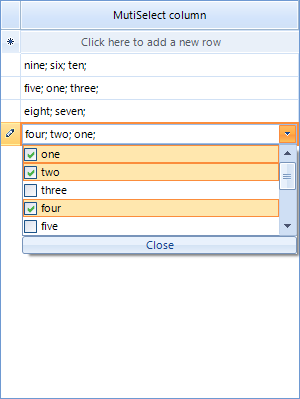

|Date Posted|Product|Author|
|----|----|----|
|Q3 2012 SP1|Telerik UI for WinForms|Tsvetan Raikov| 
 
## How To 

This article will demonstrate how to create a custom column in **RadGridView** with a multi-select drop down editor with check boxes. It allows keyboard selection with **Ctrl** and **Shift** keys and/or by using the mouse and the items' check boxes. The selection is stored in an integer array in the cell value.   
   
  
   
>important As of **Q3 2014 (version 2014.3.1021)** Telerik UI for WinForms suite offers [RadCheckedDropDownList](https://docs.telerik.com/devtools/winforms/controls/dropdown-listcontrol-and-checkeddropdownlist/checkeddropdownlist/checkeddropdownlist) control which combines RadDropDownList and RadAutoCompleteBox in order to provide functionality to check items in the drop down area and tokenize them in the text area. All previous functionality is preserved, such as visual formatting and data binding, which is now extended. RadCheckedDropDownList can also be used [as an editor in RadGridView](https://docs.telerik.com/devtools/winforms/controls/dropdown-listcontrol-and-checkeddropdownlist/checkeddropdownlist/how-to/use-as-radgridview-editor).

## Solution 

The solution to this case is to create a custom column which uses a specific cell and editor. The editor allows you to have multiple selection, while the cell holds the values. The column is used to easily incorporate the cell and the editor in **RadGridView**.  

In the column we will define the desired **DataType**. In this case it will be an array of integers. Additionally, we will specify the desired editor and cell types:  

````C#
public class CustomColumn : GridViewComboBoxColumn
{
    public CustomColumn(string name)
        : base(name)
    {
 
    }
 
    public override Type DataType
    {
        get
        {
            if (UseGetLookupValue)
            {
                return typeof(int);
            }
            return typeof(int[]);
        }
        set { }
    }
 
    public bool UseGetLookupValue = false;
 
    public override Type GetDefaultEditorType()
    {
        return typeof(CustomDropDownListEditor);
    }
 
    public override Type GetCellType(GridViewRowInfo row)
    {
        if (row is GridViewDataRowInfo || row is GridViewNewRowInfo)
        {
            return typeof(CustomCellElement);
        }
        return base.GetCellType(row);
    }
}

````
````VB.NET
Public Class CustomColumn
    Inherits GridViewComboBoxColumn
    Public Sub New(name As String)
 
        MyBase.New(name)
    End Sub
 
    Public Overrides Property DataType() As Type
        Get
            If UseGetLookupValue Then
                Return GetType(Integer)
            End If
            Return GetType(Integer())
        End Get
        Set
        End Set
    End Property
 
    Public UseGetLookupValue As Boolean = False
 
    Public Overrides Function GetDefaultEditorType() As Type
        Return GetType(CustomDropDownListEditor)
    End Function
 
    Public Overrides Function GetCellType(row As GridViewRowInfo) As Type
        If TypeOf row Is GridViewDataRowInfo OrElse TypeOf row Is GridViewNewRowInfo Then
            Return GetType(CustomCellElement)
        End If
        Return MyBase.GetCellType(row)
    End Function
End Class

```` 

Now, let's create the cells that we are going to use in our column. Here we will just override the SetContent method, where we will set the content of the cell - the selected item's text separated by semi column or empty string when the value is null:  

````C#
public class CustomCellElement: GridDataCellElement
{
    public CustomCellElement(GridViewColumn column, GridRowElement row)
        : base(column, row)
    { }
 
    protected override Type ThemeEffectiveType
    {
        get
        {
            return typeof(GridDataCellElement);
        }
    }
 
    public override void SetContent()
    {
        int[] values = this.Value as int[];
        if (values == null)
        {
            this.Text = "";
        }
        else
        {
            string text = "";
 
            CustomColumn col = this.ColumnInfo as CustomColumn;
            if (col != null)
            {
                foreach (int i in values)
                {
                    col.UseGetLookupValue = true;
                    object val = col.GetLookupValue(i);
                    col.UseGetLookupValue = false;
                    if (val != null)
                    {
                        text += val.ToString() + "; ";
                    }
                }
            }
            this.Text = text;
        }
    }
}

````
````VB.NET
Public Class CustomCellElement
    Inherits GridDataCellElement
    Public Sub New(column As GridViewColumn, row As GridRowElement)
        MyBase.New(column, row)
    End Sub
 
    Protected Overrides ReadOnly Property ThemeEffectiveType() As Type
        Get
            Return GetType(GridDataCellElement)
        End Get
    End Property
 
    Public Overrides Sub SetContent()
        Dim values As Integer() = TryCast(Me.Value, Integer())
        If values Is Nothing Then
            Me.Text = ""
        Else
            Dim text As String = ""
 
            Dim col As CustomColumn = TryCast(Me.ColumnInfo, CustomColumn)
            If col IsNot Nothing Then
                For Each i As Integer In values
                    col.UseGetLookupValue = True
                    Dim val As Object = col.GetLookupValue(i)
                    col.UseGetLookupValue = False
                    If val IsNot Nothing Then
                        text += val.ToString() + "; "
                    End If
                Next
            End If
            Me.Text = text
        End If
    End Sub
End Class

```` 

Let's continue with the editor. First we have to override the CreateEditorElement method where we will return the CustomEditorElement which we will use. Also, we will have to override the Value property in the getter of which we will return the selected items as an array of integers and in the setter we will set the selected items according to the value:

````C#
public class CustomDropDownListEditor : RadDropDownListEditor
{
     public override object Value
    {
        get
        {
            CustomEditorElement editorElement = this.EditorElement as CustomEditorElement;
            if (editorElement != null)
            {
                List<int> selected = new List<int>();
                foreach (RadListDataItem item in editorElement.ListElement.SelectedItems)
                {
                    selected.Add((int)item.Value);
                }
                return selected.ToArray();
            }
            return base.Value;
        }
        set
        {
            CustomEditorElement editorElement = this.EditorElement as CustomEditorElement;
            if (editorElement != null)
            {
                int[] names = value as int[];
                if (names != null)
                {
                    foreach (int val in names)
                    {
                        RadListDataItem item = FindByValue(val);
                        if (item != null)
                        {
                            item.Selected = true;
                        }
                    }
                }
                editorElement.CallTextChanged();
            }
        }
    }
 
    private RadListDataItem FindByValue(object value)
    {
        CustomEditorElement editorElement = this.EditorElement as CustomEditorElement;
        foreach (RadListDataItem item in editorElement.Items)
        {
            if (value.Equals(item.Value))
            {
                return item;
            }
        }
        return null;
    }
 
    protected override RadElement CreateEditorElement()
    {
        return new CustomEditorElement();
    }
}

````
````VB.NET
Public Class CustomDropDownListEditor
    Inherits RadDropDownListEditor
 
    Public Overrides Property Value() As Object
        Get
            Dim editorElement As CustomEditorElement = TryCast(Me.EditorElement, CustomEditorElement)
            If editorElement IsNot Nothing Then
                Dim selected As New List(Of Integer)()
                For Each item As RadListDataItem In editorElement.ListElement.SelectedItems
                    selected.Add(CInt(item.Value))
                Next
                Return selected.ToArray()
            End If
            Return MyBase.Value
        End Get
        Set
            Dim editorElement As CustomEditorElement = TryCast(Me.EditorElement, CustomEditorElement)
            If editorElement IsNot Nothing Then
                Dim names As Integer() = TryCast(value, Integer())
                If names IsNot Nothing Then
                    For Each val As Integer In names
                        Dim item As RadListDataItem = FindByValue(val)
                        If item IsNot Nothing Then
                            item.Selected = True
                        End If
                    Next
                End If
                editorElement.CallTextChanged()
            End If
        End Set
    End Property
 
    Private Function FindByValue(value As Object) As RadListDataItem
        Dim editorElement As CustomEditorElement = TryCast(Me.EditorElement, CustomEditorElement)
        For Each item As RadListDataItem In editorElement.Items
            If value.Equals(item.Value) Then
                Return item
            End If
        Next
        Return Nothing
    End Function
 
    Protected Overrides Function CreateEditorElement() As RadElement
        Return New CustomEditorElement()
    End Function
End Class

````

Now, the editor element. It will consist of a LightVisualElement, which displays the values and is placed in the EditableArea of the control and a button for closing the drop down.

In the element's constructor we will first initialize the close button and add it accordingly to the sizing grip of the popup. We will also subscribe to its click, where we will close the popup. Next, we will set the [SelectionMode to MultiSimple](https://docs.telerik.com/devtools/winforms/introduction), which means that the users will be able to select item with mouse click or space button. We will also subscribe to the following events:
- PopupClosing - here we will cancel the popup closure when it contains mouse so we can use it to select items
- CreatingVisualItem - here replace the default visual item with a custom one 
- ItemDataBinding - replace the default data item with a custom one

In the CreateChildElements override, we will initialize and add the LightVisualElement which will hold the text. 

Another useful override is the one of the ShowPopup method, where prior calling the base functionality we will save the selected items and restore them after. 

Finally, we will create a method that fires the OnTextChanged event, used to set the element's text accordingly:

````C#
public class CustomEditorElement : RadDropDownListEditorElement
{
    LightVisualElement customText;
    RadButtonElement closeButton;
    bool textChanged;
 
    public CustomEditorElement()
    {
        closeButton = new RadButtonElement("Close");
        closeButton.SetValue(DockLayoutPanel.DockProperty, Dock.Bottom);
        closeButton.Click += new EventHandler(closeButton_Click);
        this.Popup.SizingGripDockLayout.Children.Insert(1, closeButton);
 
        this.SelectionMode = System.Windows.Forms.SelectionMode.MultiSimple;
 
        this.PopupClosing += new RadPopupClosingEventHandler(CustomEditorElement_PopupClosing);
        this.CreatingVisualItem += new CreatingVisualListItemEventHandler(CustomEditorElement_CreatingVisualItem);
        this.ListElement.ItemDataBinding += this.CustomEditorElement_ItemDataBinding;
    }
 
    void closeButton_Click(object sender, EventArgs e)
    {
        ClosePopup();
        GridDataCellElement cell = this.Parent as GridDataCellElement;
        if (cell != null)
        {
            cell.GridViewElement.EndEdit();
        }
    }
 
    private void CustomEditorElement_ItemDataBinding(object sender, ListItemDataBindingEventArgs args)
    {
        args.NewItem = new CustomListDataItem();
    }
 
    void CustomEditorElement_CreatingVisualItem(object sender, CreatingVisualListItemEventArgs args)
    {
        args.VisualItem = new CustomListVisualItem();
    }
 
    void CustomEditorElement_PopupClosing(object sender, RadPopupClosingEventArgs args)
    {
        CustomEditorElement editor = (CustomEditorElement)sender;
        if (args.CloseReason == RadPopupCloseReason.Mouse)
        {
            if (editor.PopupForm.Bounds.Contains(Control.MousePosition))
            {
                args.Cancel = true;
            }
        }
    }
 
    protected override void CreateChildElements()
    {
        base.CreateChildElements();
 
        customText = new LightVisualElement();
        customText.DrawBorder = false;
        customText.DrawFill = true;
        customText.GradientStyle = GradientStyles.Solid;
        customText.BackColor = Color.White;
        customText.TextAlignment = ContentAlignment.MiddleLeft;
        this.EditableElement.Children.Add(customText);
    }
 
    public override void ShowPopup()
    {
        bool[] selected = new bool[this.Items.Count];
        for (int i = 0; i < selected.Length; i++)
        {
            selected[i] = this.Items[i].Selected;
        }
        base.ShowPopup();
        for (int i = 0; i < selected.Length; i++)
        {
            this.Items[i].Selected = selected[i];
        }
    }
 
 
    public void CallTextChanged()
    {
        OnTextChanged(EventArgs.Empty);
    }
 
    protected override void OnTextChanged(EventArgs e)
    {
        if (textChanged)
        {
            return;
        }
        textChanged = true;
        string text = "";
        foreach (RadListDataItem item in this.ListElement.SelectedItems)
        {
            text += item.Text + "; ";
        }
        customText.Text = text;
        textChanged = false;
    }
}

````
````VB.NET
Public Class CustomEditorElement
    Inherits RadDropDownListEditorElement
    Private customText As LightVisualElement
    Private closeButton As RadButtonElement
    Private textChanged As Boolean
 
    Public Sub New()
        closeButton = New RadButtonElement("Close")
        closeButton.SetValue(DockLayoutPanel.DockProperty, Dock.Bottom)
        closeButton.Click += New EventHandler(closeButton_Click)
        Me.Popup.SizingGripDockLayout.Children.Insert(1, closeButton)
 
        Me.SelectionMode = System.Windows.Forms.SelectionMode.MultiSimple
 
        Me.PopupClosing += New RadPopupClosingEventHandler(CustomEditorElement_PopupClosing)
        Me.CreatingVisualItem += New CreatingVisualListItemEventHandler(CustomEditorElement_CreatingVisualItem)
        Me.ListElement.ItemDataBinding += Me.CustomEditorElement_ItemDataBinding
    End Sub
 
    Private Sub closeButton_Click(sender As Object, e As EventArgs)
        ClosePopup()
        Dim cell As GridDataCellElement = TryCast(Me.Parent, GridDataCellElement)
        If cell IsNot Nothing Then
            cell.GridViewElement.EndEdit()
        End If
    End Sub
 
    Private Sub CustomEditorElement_ItemDataBinding(sender As Object, args As ListItemDataBindingEventArgs)
        args.NewItem = New CustomListDataItem()
    End Sub
 
    Private Sub CustomEditorElement_CreatingVisualItem(sender As Object, args As CreatingVisualListItemEventArgs)
        args.VisualItem = New CustomListVisualItem()
    End Sub
 
    Private Sub CustomEditorElement_PopupClosing(sender As Object, args As RadPopupClosingEventArgs)
        Dim editor As CustomEditorElement = DirectCast(sender, CustomEditorElement)
        If args.CloseReason = RadPopupCloseReason.Mouse Then
            If editor.PopupForm.Bounds.Contains(Control.MousePosition) Then
                args.Cancel = True
            End If
        End If
    End Sub
 
    Protected Overrides Sub CreateChildElements()
        MyBase.CreateChildElements()
 
        customText = New LightVisualElement()
        customText.DrawBorder = False
        customText.DrawFill = True
        customText.GradientStyle = GradientStyles.Solid
        customText.BackColor = Color.White
        customText.TextAlignment = ContentAlignment.MiddleLeft
        Me.EditableElement.Children.Add(customText)
    End Sub
 
    Public Overrides Sub ShowPopup()
        Dim selected As Boolean() = New Boolean(Me.Items.Count - 1) {}
        For i As Integer = 0 To selected.Length - 1
            selected(i) = Me.Items(i).Selected
        Next
        MyBase.ShowPopup()
        For i As Integer = 0 To selected.Length - 1
            Me.Items(i).Selected = selected(i)
        Next
    End Sub
 
 
    Public Sub CallTextChanged()
        OnTextChanged(EventArgs.Empty)
    End Sub
 
    Protected Overrides Sub OnTextChanged(e As EventArgs)
        If textChanged Then
            Return
        End If
        textChanged = True
        Dim text As String = ""
        For Each item As RadListDataItem In Me.ListElement.SelectedItems
            text += item.Text + "; "
        Next
        customText.Text = text
        textChanged = False
    End Sub
End Class

````

In the custom data item will just add a property to store that information about a check operation:

````C#
public class CustomListDataItem : RadListDataItem
{
    public static readonly RadProperty CheckedProperty = RadProperty.Register("Checked", typeof(bool), typeof(CustomListDataItem), new RadElementPropertyMetadata(false));
     
    public bool Checked
    {
        get
        {
            return (bool)this.GetValue(CustomListDataItem.CheckedProperty);
        }
        set
        {
            this.SetValue(CustomListDataItem.CheckedProperty, value);
        }
    }
  
    protected override void SetDataBoundItem(bool dataBinding, object value)
    {
        base.SetDataBoundItem(dataBinding, value);
        if (value is INotifyPropertyChanged)
        {
            INotifyPropertyChanged item = value as INotifyPropertyChanged;
            item.PropertyChanged += item_PropertyChanged;
        }
    }
 
    private void item_PropertyChanged(object sender, PropertyChangedEventArgs e)
    {
        if (e.PropertyName == "Checked")
        {
            this.Checked = (this.DataBoundItem  as RadListDataItem).Selected;
        }           
    }
 }

````
````VB.NET
Public Class CustomListDataItem
    Inherits RadListDataItem
    
    Public Shared ReadOnly CheckedProperty As RadProperty = RadProperty.Register("Checked", GetType(Boolean), GetType(CustomListDataItem), New RadElementPropertyMetadata(False))
 
    Public Property Checked() As Boolean
        Get
            Return CBool(Me.GetValue(CustomListDataItem.CheckedProperty))
        End Get
        Set
            Me.SetValue(CustomListDataItem.CheckedProperty, value)
        End Set
    End Property
 
    Protected Overrides Sub SetDataBoundItem(dataBinding As Boolean, value As Object)
        MyBase.SetDataBoundItem(dataBinding, value)
        If TypeOf value Is INotifyPropertyChanged Then
            Dim item As INotifyPropertyChanged = TryCast(value, INotifyPropertyChanged)
            item.PropertyChanged += item_PropertyChanged
        End If
    End Sub
 
    Private Sub item_PropertyChanged(sender As Object, e As PropertyChangedEventArgs)
        If e.PropertyName = "Checked" Then
            Me.Checked = TryCast(Me.DataBoundItem, RadListDataItem).Selected
        End If
    End Sub
 End Class

````

And finally, the visual item. In the CreateChildElements override, we will initialize a StackLayoutElement, which will hold both the check box (RadCheckBoxElement) and the content element (a LightVisualElement). In the ToggleStateChanged event of the check box we will set the data item's Check property (which we have added in the CustomListDataItem class) and in the SynchronizeProperties override we will sync the check box and the text with its data item:

````C#
public class CustomListVisualItem : RadListVisualItem
{
    RadCheckBoxElement checkbox;
    LightVisualElement content;
 
    protected override void CreateChildElements()
    {
        base.CreateChildElements();
 
        StackLayoutElement stack = new StackLayoutElement();
        stack.Orientation = Orientation.Horizontal;
        this.Children.Add(stack);
 
        checkbox = new RadCheckBoxElement();
        checkbox.ToggleStateChanged += new StateChangedEventHandler(checkbox_ToggleStateChanged);
        stack.Children.Add(checkbox);
 
        content = new LightVisualElement();
        content.StretchHorizontally = false;
        content.StretchVertically = true;
        content.TextAlignment = ContentAlignment.MiddleLeft;
        content.NotifyParentOnMouseInput = true;
        stack.Children.Add(content);
    }
 
    void checkbox_ToggleStateChanged(object sender, StateChangedEventArgs e)
    {
        ((CustomListDataItem)this.Data).Checked = this.checkbox.Checked;
    }
 
    protected override Type ThemeEffectiveType
    {
        get
        {
            return typeof(RadListVisualItem);
        }
    }
 
    protected override void SynchronizeProperties()
    {
        base.SynchronizeProperties();
        checkbox.IsChecked = this.Data.Selected;
        this.content.Text = this.Data.Text;
        this.Text = "";
    }
}

````
````VB.NET
Public Class CustomListVisualItem
    Inherits RadListVisualItem
    Private checkbox As RadCheckBoxElement
    Private content As LightVisualElement
 
    Protected Overrides Sub CreateChildElements()
        MyBase.CreateChildElements()
 
        Dim stack As New StackLayoutElement()
        stack.Orientation = Orientation.Horizontal
        Me.Children.Add(stack)
 
        checkbox = New RadCheckBoxElement()
        checkbox.ToggleStateChanged += New StateChangedEventHandler(checkbox_ToggleStateChanged)
        stack.Children.Add(checkbox)
 
        content = New LightVisualElement()
        content.StretchHorizontally = False
        content.StretchVertically = True
        content.TextAlignment = ContentAlignment.MiddleLeft
        content.NotifyParentOnMouseInput = True
        stack.Children.Add(content)
    End Sub
 
    Private Sub checkbox_ToggleStateChanged(sender As Object, e As StateChangedEventArgs)
        DirectCast(Me.Data, CustomListDataItem).Checked = Me.checkbox.Checked
    End Sub
 
    Protected Overrides ReadOnly Property ThemeEffectiveType() As Type
        Get
            Return GetType(RadListVisualItem)
        End Get
    End Property
 
    Protected Overrides Sub SynchronizeProperties()
        MyBase.SynchronizeProperties()
        checkbox.IsChecked = Me.Data.Selected
        Me.content.Text = Me.Data.Text
        Me.Text = ""
    End Sub
End Class

````

Here is how to put this column in action:

````C#
public Form1()
{
    InitializeComponent();
      
    DataTable t = new DataTable();
    t.Columns.Add("ID", typeof(int));
    t.Columns.Add("Name", typeof(string));
    t.Rows.Add(1, "one");
    t.Rows.Add(2, "two");
    t.Rows.Add(3, "three");
    t.Rows.Add(4, "four");
    t.Rows.Add(5, "five");
    t.Rows.Add(6, "six");
    t.Rows.Add(7, "seven");
    t.Rows.Add(8, "eight");
    t.Rows.Add(9, "nine");
    t.Rows.Add(10, "ten");
 
    CustomColumn col = new CustomColumn("MutiSelect column");
    col.DataSource = t;
    col.DisplayMember = "Name";
    col.ValueMember = "ID";
    radGridView1.Columns.Add(col);
 
    radGridView1.Rows.Add( new int[] { 9, 6, 10 });
    radGridView1.Rows.Add( new int[] { 5, 1, 3 });
    radGridView1.Rows.Add( new int[] { 8,7 });
    radGridView1.Rows.Add( new int[] { 4, 2, 1 });
 
}

````
````VB.NET
Public Sub New()
    InitializeComponent()
 
    Dim t As New DataTable()
    t.Columns.Add("ID", GetType(Integer))
    t.Columns.Add("Name", GetType(String))
    t.Rows.Add(1, "one")
    t.Rows.Add(2, "two")
    t.Rows.Add(3, "three")
    t.Rows.Add(4, "four")
    t.Rows.Add(5, "five")
    t.Rows.Add(6, "six")
    t.Rows.Add(7, "seven")
    t.Rows.Add(8, "eight")
    t.Rows.Add(9, "nine")
    t.Rows.Add(10, "ten")
 
    Dim col As New CustomColumn("MutiSelect column")
    col.DataSource = t
    col.DisplayMember = "Name"
    col.ValueMember = "ID"
    radGridView1.Columns.Add(col)
 
    radGridView1.Rows.Add(New Integer() {9, 6, 10})
    radGridView1.Rows.Add(New Integer() {5, 1, 3})
    radGridView1.Rows.Add(New Integer() {8, 7})
    radGridView1.Rows.Add(New Integer() {4, 2, 1})
End Sub

````

>note A complete solution in C# can be found [here](https://github.com/telerik/winforms-sdk/tree/master/GridView/Multiselect-Column-cs).