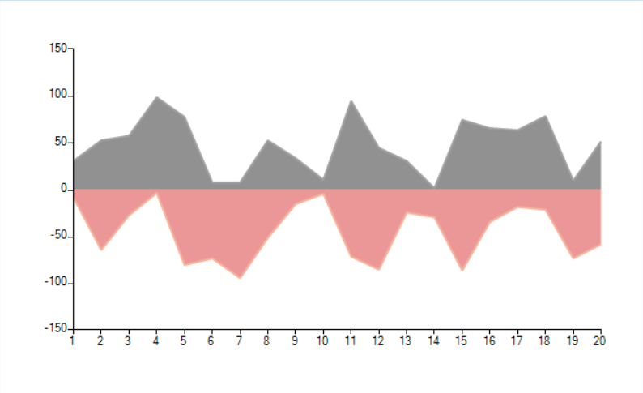

## Environment
<table>
    <tr>
        <td>Product Version</td>
        <td>2018.1 220</td>
    </tr>
    <tr>
        <td>Product</td>
        <td>RadChartView for WinForms</td>
    </tr>
</table>

## Description

By default the area series are pained from bottom to top (above the horizontal axis). This article shows how you can paint a chart where the area is started from zero. This means that the positive values will go up and the negative down.

>caption Figure 1: Sample Chart


## Solution

The solution is to create a [custom renderer](), and custom draw part which allows you to override the entire painting code. You will use most of the default logic. What you need to change is the Y position of the are rectangle to be on the zero value. 

#### The CustomAreaSeriesDrawPart 

{{source=..\SamplesCS\KnowledgeBase\NegativeAreaChart.cs region=CustomDrawPart}} 
{{source=..\SamplesVB\KnowledgeBase\NegativeAreaChart.vb region=CustomDrawPart}}
````C#
class CustomAreaSeriesDrawPart : AreaSeriesDrawPart
{
    public CustomAreaSeriesDrawPart(AreaSeries series, ChartRenderer renderer) : base(series, renderer)
    { }
    public double GetLocationOfValue(object value, NumericalAxis axis)
    {
        NumericalAxisModel model = axis.Model as NumericalAxisModel;
        double val = Convert.ToDouble(value);
        val = (double)model.TransformValue(val);
        double delta = axis.ActualRange.Maximum - axis.ActualRange.Minimum;
        double normalizedValue = (val - axis.ActualRange.Minimum) / delta;
        IChartView view = (IChartView)axis.View;
        CartesianArea area = axis.View.GetArea<CartesianArea>();
        double result;
        if (area != null &&
            ((area.Orientation == Orientation.Vertical && axis.AxisType == Telerik.Charting.AxisType.First) ||
            (area.Orientation == Orientation.Horizontal && axis.AxisType == Telerik.Charting.AxisType.Second)))
        {
            result = view.PlotOriginX + axis.Model.LayoutSlot.X + normalizedValue * (axis.Model.LayoutSlot.Width * view.ZoomWidth);
        }
        else
        {
            result = view.PlotOriginY + ((Telerik.WinControls.UI.ChartView)view).Margin.Top + axis.Model.LayoutSlot.Y + (1.0d - normalizedValue) * (axis.Model.LayoutSlot.Height * view.ZoomHeight);
        }
        return result;
    }
    protected override void DrawArea()
    {
        CartesianRenderer renderer = (CartesianRenderer)this.Renderer;
        AreaSeries area = this.Element as AreaSeries;
        Graphics graphics = renderer.Graphics;
        RadGdiGraphics radGraphics = new RadGdiGraphics(graphics);
        RectangleF rect = ChartRenderer.ToRectangleF(this.Element.Model.LayoutSlot);
        RectangleF clipRect = (RectangleF)renderer.Area
            .GetType()
            .GetMethod("GetCartesianClipRect", BindingFlags.Instance | BindingFlags.NonPublic)
            .Invoke(renderer.Area, new object[] { });
        PointF topLeft = new PointF(clipRect.X, clipRect.Y);
        PointF topRight = new PointF(clipRect.Right - 1, clipRect.Y);
        PointF lowerRight = new PointF(clipRect.Right - 1, clipRect.Bottom - 1);
        PointF lowerLeft = new PointF(clipRect.X, clipRect.Bottom - 1);
        List<PointF[]> allPoints = GetPointsPositionsArrays();
        float zeroOnTheYAxis = (float)this.GetLocationOfValue(0, (NumericalAxis)area.VerticalAxis);
        lowerLeft.Y = zeroOnTheYAxis;
        lowerRight.Y = zeroOnTheYAxis;
        foreach (PointF[] points in allPoints)
        {
            if (points.Length < 2)
            {
                continue;
            }
            GraphicsPath fillPath = this.GetLinePaths(points);
            if (fillPath == null)
            {
                continue;
            }
            if (this.Element.View.GetArea<CartesianArea>().Orientation == System.Windows.Forms.Orientation.Vertical)
            {
                if (area.VerticalAxis.IsInverse)
                {
                    fillPath.AddLine(points[points.Length - 1], new PointF(points[points.Length - 1].X, topRight.Y));
                    fillPath.AddLine(topRight, topLeft);
                    fillPath.AddLine(new PointF(points[0].X, topLeft.Y), points[0]);
                }
                else
                {
                    fillPath.AddLine(points[points.Length - 1], new PointF(points[points.Length - 1].X, lowerRight.Y));
                    fillPath.AddLine(lowerRight, lowerLeft);
                    fillPath.AddLine(new PointF(points[0].X, lowerLeft.Y), points[0]);
                }
            }
            else
            {
                if (area.HorizontalAxis.IsInverse)
                {
                    fillPath.AddLine(points[points.Length - 1], topRight);
                    fillPath.AddLine(topRight, lowerRight);
                    fillPath.AddLine(lowerRight, points[0]);
                }
                else
                {
                    fillPath.AddLine(points[points.Length - 1], topLeft);
                    fillPath.AddLine(topLeft, lowerLeft);
                    fillPath.AddLine(lowerLeft, points[0]);
                }
            }
            FillPrimitiveImpl fill = new FillPrimitiveImpl(this.Element, null);
            fill.PaintFill(radGraphics, fillPath, clipRect);
            GraphicsPath borderPath = new GraphicsPath();
            AreaSeries series = (AreaSeries)this.Element;
            borderPath = new GraphicsPath();
            if (series.StrokeMode == AreaSeriesStrokeMode.All ||
                series.StrokeMode == AreaSeriesStrokeMode.AllButPlotLine ||
                series.StrokeMode == AreaSeriesStrokeMode.LeftAndPoints ||
                series.StrokeMode == AreaSeriesStrokeMode.LeftLine)
            {
                if (this.Element.View.GetArea<CartesianArea>().Orientation == System.Windows.Forms.Orientation.Vertical)
                {
                    if (area.VerticalAxis.IsInverse)
                    {
                        borderPath.AddLine(topLeft, points[0]);
                    }
                    else
                    {
                        borderPath.AddLine(lowerLeft, points[0]);
                    }
                }
                else
                {
                    if (area.HorizontalAxis.IsInverse)
                    {
                        borderPath.AddLine(lowerRight, points[0]);
                    }
                    else
                    {
                        borderPath.AddLine(lowerLeft, points[0]);
                    }
                }
            }
            if (series.StrokeMode == AreaSeriesStrokeMode.All ||
                series.StrokeMode == AreaSeriesStrokeMode.AllButPlotLine ||
                series.StrokeMode == AreaSeriesStrokeMode.LeftAndPoints ||
                series.StrokeMode == AreaSeriesStrokeMode.Points ||
                series.StrokeMode == AreaSeriesStrokeMode.RightAndPoints)
            {
                GraphicsPath path = GetLinePaths(points);
                if (path != null)
                {
                    borderPath.AddPath(path, true);
                }
            }
            if (series.StrokeMode == AreaSeriesStrokeMode.All ||
                series.StrokeMode == AreaSeriesStrokeMode.AllButPlotLine ||
                series.StrokeMode == AreaSeriesStrokeMode.RightAndPoints ||
                series.StrokeMode == AreaSeriesStrokeMode.RightLine)
            {
                if (this.Element.View.GetArea<CartesianArea>().Orientation == System.Windows.Forms.Orientation.Vertical)
                {
                    if (area.VerticalAxis.IsInverse)
                    {
                        borderPath.AddLine(points[points.Length - 1], topRight);
                    }
                    else
                    {
                        borderPath.AddLine(points[points.Length - 1], lowerRight);
                    }
                }
                else
                {
                    if (area.HorizontalAxis.IsInverse)
                    {
                        borderPath.AddLine(points[points.Length - 1], topRight);
                    }
                    else
                    {
                        borderPath.AddLine(points[points.Length - 1], topLeft);
                    }
                }
            }
            if (series.StrokeMode == AreaSeriesStrokeMode.All ||
                series.StrokeMode == AreaSeriesStrokeMode.PlotLine)
            {
                if (this.Element.View.GetArea<CartesianArea>().Orientation == System.Windows.Forms.Orientation.Vertical)
                {
                    if (area.VerticalAxis.IsInverse)
                    {
                        borderPath.AddLine(topRight, topLeft);
                    }
                    else
                    {
                        borderPath.AddLine(lowerRight, lowerLeft);
                    }
                }
                else
                {
                    if (area.HorizontalAxis.IsInverse)
                    {
                        borderPath.AddLine(topRight, lowerRight);
                    }
                    else
                    {
                        borderPath.AddLine(lowerLeft, topLeft);
                    }
                }
            }
            BorderPrimitiveImpl border = new BorderPrimitiveImpl(this.Element, null);
            border.PaintBorder(radGraphics, null, borderPath, rect);
            if (series.Image != null)
            {
                graphics.SetClip(fillPath);
                ImagePrimitiveImpl image = new ImagePrimitiveImpl(series);
                image.PaintImage(radGraphics, series.Image, clipRect, series.ImageLayout, series.ImageAlignment, series.ImageOpacity, false);
                graphics.ResetClip();
            }
        }
    }
}

````
````VB.NET
Friend Class CustomAreaSeriesDrawPart
    Inherits AreaSeriesDrawPart
    Public Sub New(ByVal series As AreaSeries, ByVal renderer As ChartRenderer)
        MyBase.New(series, renderer)
    End Sub
    Public Function GetLocationOfValue(ByVal value As Object, ByVal axis As NumericalAxis) As Double
        Dim model As NumericalAxisModel = TryCast(axis.Model, NumericalAxisModel)
        Dim val As Double = Convert.ToDouble(value)
        val = DirectCast(model.TransformValue(val), Double)
        Dim delta As Double = axis.ActualRange.Maximum - axis.ActualRange.Minimum
        Dim normalizedValue As Double = (val - axis.ActualRange.Minimum) / delta
        Dim view As IChartView = DirectCast(axis.View, IChartView)
        Dim area As CartesianArea = axis.View.GetArea(Of CartesianArea)()
        Dim result As Double
        If area IsNot Nothing AndAlso ((area.Orientation = Orientation.Vertical AndAlso axis.AxisType = Telerik.Charting.AxisType.First) OrElse (area.Orientation = Orientation.Horizontal AndAlso axis.AxisType = Telerik.Charting.AxisType.Second)) Then
            result = view.PlotOriginX + axis.Model.LayoutSlot.X + normalizedValue * (axis.Model.LayoutSlot.Width * view.ZoomWidth)
        Else
            result = view.PlotOriginY + DirectCast(view, ChartView).Margin.Top + axis.Model.LayoutSlot.Y + (1.0R - normalizedValue) * (axis.Model.LayoutSlot.Height * view.ZoomHeight)
        End If
        Return result
    End Function
    Protected Overrides Sub DrawArea()
        Dim renderer_Renamed As CartesianRenderer = DirectCast(Me.Renderer, CartesianRenderer)
        Dim area As AreaSeries = TryCast(Me.Element, AreaSeries)
        Dim graphics As Graphics = renderer_Renamed.Graphics
        Dim radGraphics As New RadGdiGraphics(graphics)
        Dim rect As RectangleF = ChartRenderer.ToRectangleF(Me.Element.Model.LayoutSlot)
        Dim clipRect As RectangleF = CType(renderer_Renamed.Area.GetType().GetMethod("GetCartesianClipRect", BindingFlags.Instance Or BindingFlags.NonPublic).Invoke(renderer_Renamed.Area, New Object() {}), RectangleF)
        Dim topLeft As New PointF(clipRect.X, clipRect.Y)
        Dim topRight As New PointF(clipRect.Right - 1, clipRect.Y)
        Dim lowerRight As New PointF(clipRect.Right - 1, clipRect.Bottom - 1)
        Dim lowerLeft As New PointF(clipRect.X, clipRect.Bottom - 1)
        Dim allPoints As List(Of PointF()) = GetPointsPositionsArrays()
        Dim zeroOnTheYAxis As Single = CSng(Me.GetLocationOfValue(0, CType(area.VerticalAxis, NumericalAxis)))
        lowerLeft.Y = zeroOnTheYAxis
        lowerRight.Y = zeroOnTheYAxis
        For Each points As PointF() In allPoints
            If points.Length < 2 Then
                Continue For
            End If
            Dim fillPath As GraphicsPath = Me.GetLinePaths(points)
            If fillPath Is Nothing Then
                Continue For
            End If
            If Me.Element.View.GetArea(Of CartesianArea)().Orientation = System.Windows.Forms.Orientation.Vertical Then
                If area.VerticalAxis.IsInverse Then
                    fillPath.AddLine(points(points.Length - 1), New PointF(points(points.Length - 1).X, topRight.Y))
                    fillPath.AddLine(topRight, topLeft)
                    fillPath.AddLine(New PointF(points(0).X, topLeft.Y), points(0))
                Else
                    fillPath.AddLine(points(points.Length - 1), New PointF(points(points.Length - 1).X, lowerRight.Y))
                    fillPath.AddLine(lowerRight, lowerLeft)
                    fillPath.AddLine(New PointF(points(0).X, lowerLeft.Y), points(0))
                End If
            Else
                If area.HorizontalAxis.IsInverse Then
                    fillPath.AddLine(points(points.Length - 1), topRight)
                    fillPath.AddLine(topRight, lowerRight)
                    fillPath.AddLine(lowerRight, points(0))
                Else
                    fillPath.AddLine(points(points.Length - 1), topLeft)
                    fillPath.AddLine(topLeft, lowerLeft)
                    fillPath.AddLine(lowerLeft, points(0))
                End If
            End If
            Dim fill As New FillPrimitiveImpl(Me.Element, Nothing)
            fill.PaintFill(radGraphics, fillPath, clipRect)
            Dim borderPath As New GraphicsPath()
            Dim series As AreaSeries = CType(Me.Element, AreaSeries)
            borderPath = New GraphicsPath()
            If series.StrokeMode = AreaSeriesStrokeMode.All OrElse series.StrokeMode = AreaSeriesStrokeMode.AllButPlotLine OrElse series.StrokeMode = AreaSeriesStrokeMode.LeftAndPoints OrElse series.StrokeMode = AreaSeriesStrokeMode.LeftLine Then
                If Me.Element.View.GetArea(Of CartesianArea)().Orientation = System.Windows.Forms.Orientation.Vertical Then
                    If area.VerticalAxis.IsInverse Then
                        borderPath.AddLine(topLeft, points(0))
                    Else
                        borderPath.AddLine(lowerLeft, points(0))
                    End If
                Else
                    If area.HorizontalAxis.IsInverse Then
                        borderPath.AddLine(lowerRight, points(0))
                    Else
                        borderPath.AddLine(lowerLeft, points(0))
                    End If
                End If
            End If
            If series.StrokeMode = AreaSeriesStrokeMode.All OrElse series.StrokeMode = AreaSeriesStrokeMode.AllButPlotLine OrElse series.StrokeMode = AreaSeriesStrokeMode.LeftAndPoints OrElse series.StrokeMode = AreaSeriesStrokeMode.Points OrElse series.StrokeMode = AreaSeriesStrokeMode.RightAndPoints Then
                Dim path As GraphicsPath = GetLinePaths(points)
                If path IsNot Nothing Then
                    borderPath.AddPath(path, True)
                End If
            End If
            If series.StrokeMode = AreaSeriesStrokeMode.All OrElse series.StrokeMode = AreaSeriesStrokeMode.AllButPlotLine OrElse series.StrokeMode = AreaSeriesStrokeMode.RightAndPoints OrElse series.StrokeMode = AreaSeriesStrokeMode.RightLine Then
                If Me.Element.View.GetArea(Of CartesianArea)().Orientation = System.Windows.Forms.Orientation.Vertical Then
                    If area.VerticalAxis.IsInverse Then
                        borderPath.AddLine(points(points.Length - 1), topRight)
                    Else
                        borderPath.AddLine(points(points.Length - 1), lowerRight)
                    End If
                Else
                    If area.HorizontalAxis.IsInverse Then
                        borderPath.AddLine(points(points.Length - 1), topRight)
                    Else
                        borderPath.AddLine(points(points.Length - 1), topLeft)
                    End If
                End If
            End If
            If series.StrokeMode = AreaSeriesStrokeMode.All OrElse series.StrokeMode = AreaSeriesStrokeMode.PlotLine Then
                If Me.Element.View.GetArea(Of CartesianArea)().Orientation = System.Windows.Forms.Orientation.Vertical Then
                    If area.VerticalAxis.IsInverse Then
                        borderPath.AddLine(topRight, topLeft)
                    Else
                        borderPath.AddLine(lowerRight, lowerLeft)
                    End If
                Else
                    If area.HorizontalAxis.IsInverse Then
                        borderPath.AddLine(topRight, lowerRight)
                    Else
                        borderPath.AddLine(lowerLeft, topLeft)
                    End If
                End If
            End If
            Dim border As New BorderPrimitiveImpl(Me.Element, Nothing)
            border.PaintBorder(radGraphics, Nothing, borderPath, rect)
            If series.Image IsNot Nothing Then
                graphics.SetClip(fillPath)
                Dim image As New ImagePrimitiveImpl(series)
                image.PaintImage(radGraphics, series.Image, clipRect, series.ImageLayout, series.ImageAlignment, series.ImageOpacity, False)
                graphics.ResetClip()
            End If
        Next points
    End Sub
End Class

````


{{endregion}} 


Now you are need to change the default draw part within the custom renderer class.

#### The Custom Renderer

{{source=..\SamplesCS\KnowledgeBase\NegativeAreaChart.cs region=CustomRenderer}} 
{{source=..\SamplesVB\KnowledgeBase\NegativeAreaChart.vb region=CustomRenderer}}
````C#
public class CustomCartesianRenderer : CartesianRenderer
{
    public CustomCartesianRenderer(CartesianArea area)
        : base(area)
    { }
    protected override void Initialize()
    {
        base.Initialize();
        for (int i = 0; i < this.DrawParts.Count; i++)
        {
            AreaSeriesDrawPart linePart = this.DrawParts[i] as AreaSeriesDrawPart;
            if (linePart != null)
            {
                this.DrawParts[i] = new CustomAreaSeriesDrawPart((AreaSeries)linePart.Element, this);
            }
        }
    }
}

````
````VB.NET
Public Class CustomCartesianRenderer1
    Inherits CartesianRenderer
    Public Sub New(ByVal area As CartesianArea)
        MyBase.New(area)
    End Sub
    Protected Overrides Sub Initialize()
        MyBase.Initialize()
        For i As Integer = 0 To Me.DrawParts.Count - 1
            Dim linePart As AreaSeriesDrawPart = TryCast(Me.DrawParts(i), AreaSeriesDrawPart)
            If linePart IsNot Nothing Then
                Me.DrawParts(i) = New CustomAreaSeriesDrawPart(CType(linePart.Element, AreaSeries), Me)
            End If
        Next i
    End Sub
End Class

````


{{endregion}} 

The final step is to setup the chart and change the defualt renderer.

#### Setup the ChartView

{{source=..\SamplesCS\KnowledgeBase\NegativeAreaChart.cs region=SetChart}} 
{{source=..\SamplesVB\KnowledgeBase\NegativeAreaChart.vb region=SetChart}}
````C#
public NegativeAreaChart()
{
    InitializeComponent();
    radChartView1.CreateRenderer += RadChartView1_CreateRenderer;
    AreaSeries areaSeries = new AreaSeries();
    // areaSeries.Spline = true;
    AreaSeries areaSeries2 = new AreaSeries();
    for (int x = 0; x < 60; x++)
    {
        areaSeries.DataPoints.Add(rnd.Next(1, 100), x);
        areaSeries2.DataPoints.Add(rnd.Next(1, 100) * -1, x);
    }
    this.radChartView1.Series.Add(areaSeries);
    this.radChartView1.Series.Add(areaSeries2);
}
private void RadChartView1_CreateRenderer(object sender, ChartViewCreateRendererEventArgs e)
{
    e.Renderer = new CustomCartesianRenderer(e.Area as CartesianArea);
}

````
````VB.NET
Public Sub New()
    InitializeComponent()
    AddHandler radChartView1.CreateRenderer, AddressOf RadChartView1_CreateRenderer
    Dim areaSeries As New AreaSeries()
    ' areaSeries.Spline = true;
    Dim areaSeries2 As New AreaSeries()
    For x As Integer = 0 To 59
        areaSeries.DataPoints.Add(rnd.Next(1, 100), x)
        areaSeries2.DataPoints.Add(rnd.Next(1, 100) * -1, x)
    Next x
    Me.radChartView1.Series.Add(areaSeries)
    Me.radChartView1.Series.Add(areaSeries2)
End Sub
Private Sub RadChartView1_CreateRenderer(ByVal sender As Object, ByVal e As ChartViewCreateRendererEventArgs)
    e.Renderer = New CustomCartesianRenderer1(TryCast(e.Area, CartesianArea))
End Sub

````


{{endregion}} 


A complete solution is available in our [SDK repository](https://github.com/telerik/winforms-sdk/tree/master/ChartView/NegativeAreaChart).

