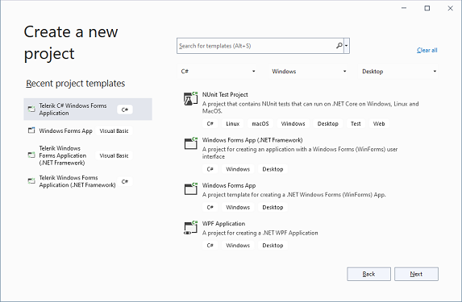
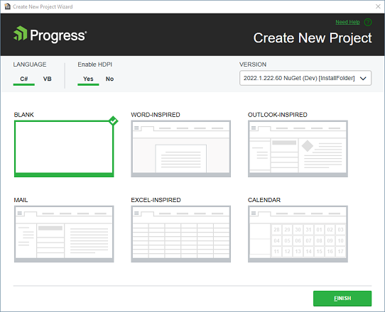
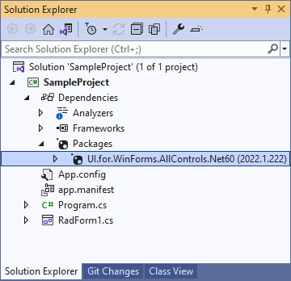
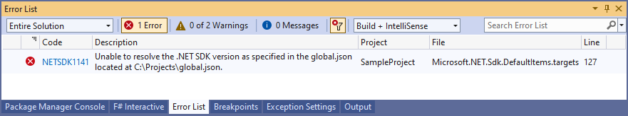
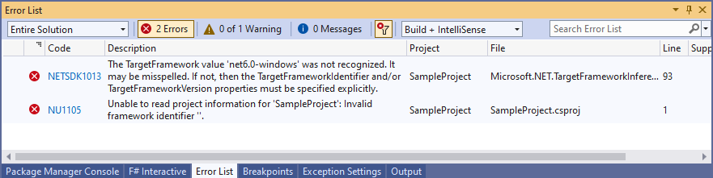
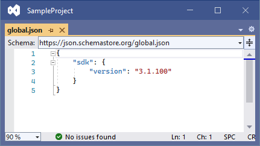
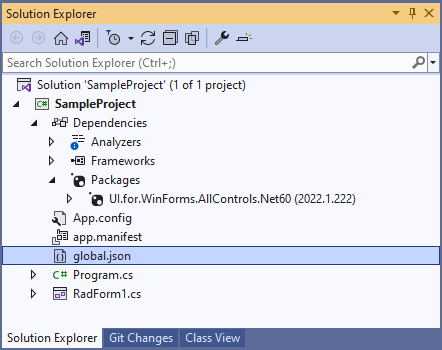
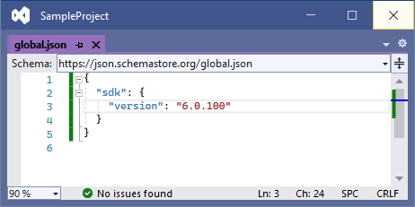
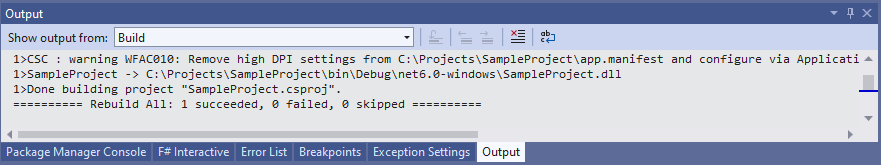

## Environment
 
|Product Version|Product|Author|
|----|----|----|
|2022.1.222|UI for WinForms for WinForms|[Desislava Yordanova](https://www.telerik.com/blogs/author/desislava-yordanova)|

## Description

Create a Telerik WinForms application from the template:

The respective NuGet package (Net60) is installed:

There are cases in which it may not be possible to build the project due to the following errors:

More information about it is available here:

* [NETSDK1141: Unable to resolve the .NET SDK version as specified in the global.json](https://docs.microsoft.com/en-us/dotnet/core/tools/sdk-errors/netsdk1141?f1url=%3FappId%3DDev16IDEF1%26l%3DEN-US%26k%3Dk(NETSDK1141)%26rd%3Dtrue)

* [NETSDK1013: The TargetFramework value was not recognized](https://docs.microsoft.com/en-us/dotnet/core/tools/sdk-errors/netsdk1013?f1url=%3FappId%3DDev16IDEF1%26l%3DEN-US%26k%3Dk(NETSDK1013)%26rd%3Dtrue)

* [NuGet Error NU1105](https://docs.microsoft.com/en-us/nuget/reference/errors-and-warnings/nu1105?f1url=%3FappId%3DDev16IDEF1%26l%3DEN-US%26k%3Dk(NU1105)%26rd%3Dtrue)

>note Have in mind that these are some of the possible errors that may occur due to the same reason, the global.json. file.

All of these errors are due to a mismatch between the target framework and the specified SDK version. They may occur if there is a **global.json** file inside of some parent folder which refers a different sdk version, for example:

## Solution

There are two approaches that can handle this situation:

1\. Create a local **global.json** file and specify the correct sdk version to be used:

Thus, the project rebuild will be successful:

2\. Move the **global.json** file from the parent folder to another destination together with the projects that depend on this file.

# See Also

* [NET Core Design Time]()
