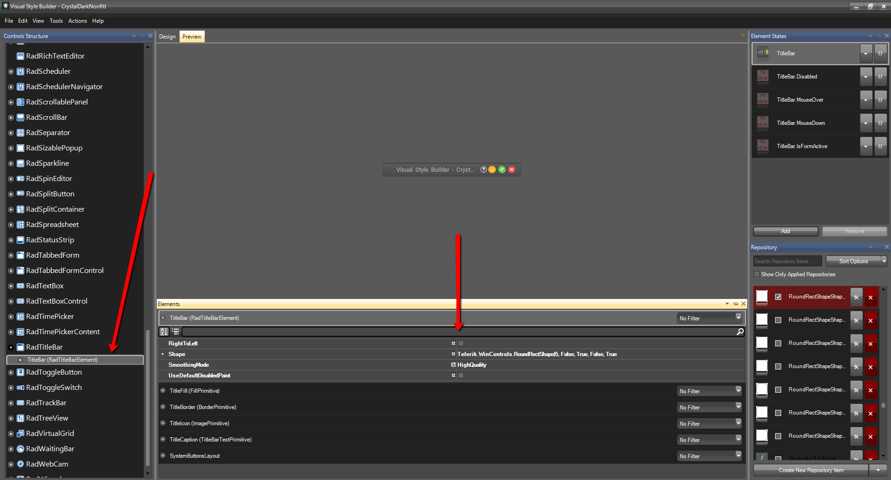

## Environment
 
|Product Version|Product|Author|
|----|----|----|
|2019.3.917|Telerik UI for WinForms|Dimitar Karamfilov|

# Problem

You like the new __Crystal__ and __CrystalDark__ themes but you do not want the title bar buttons to be on the left. 

# Solution

Edit the theme and change a single property which will affect all forms. Here are the detailed steps:

1\. Extract the predefined themes, which will allow you to edit the crystal theme: [Loading Predefined Themes]()

2\.	Change the RightToLeft property in the theme.

3\.	Save and use the new theme in your application: [Using custom themes]()

That is all that needs to be done and you can use the same approach for both Crystal and CrystalDark themes.

