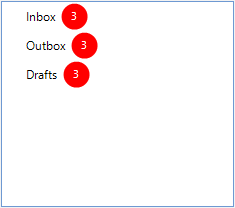
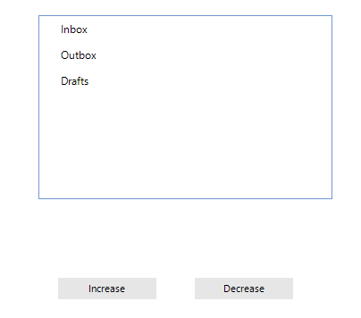

## Environment
 
|Product Version|Product|Author|
|----|----|----|
|2021.1.223|RadTreeView for WinForms|[Nadya Karaivanova](https://www.telerik.com/blogs/author/nadya-karaivanova)|
 
## Description

Usually badges are used to indicate that a new message, email, push notification, or any other  info message is waiting. Each app with new unread information has a white number with a red background in the upper right hand corner of the app icon. This is a badge. This article will demonstrate how to create such a notification badge/button for the nodes in **RadTreeView** control.


 
## Solution 

This can be done by creating a custom **TreeNodeElement**, which will replace the default one in the **CreateNodeElement** event handler. We should override the **CreateChildElements** method in order to add a red circled **LightVisualElement** that would illustrate the notification badge. You can customize the **LightVisualElement** in a way that is suitable for you, I used red background and white text for the numbers. 

If you want to update the displayed number in the red circle, the **Synchronize** method is the right place where you can sync the **LightVisualElement**'s text.

````C#
public class NotificationNodeElement : TreeNodeElement
{
    int result;
    LightVisualElement lve;
    int sizeConst = 26;

    protected override void CreateChildElements()
    {
        base.CreateChildElements();

        lve = new LightVisualElement();
        lve.BackColor = Color.Red;
        lve.DrawFill = true;
        lve.StretchHorizontally = false;
        lve.StretchVertically = false;
        lve.GradientStyle = Telerik.WinControls.GradientStyles.Solid;
        lve.Shape = new RoundRectShape(sizeConst / 2);
        lve.SmoothingMode = System.Drawing.Drawing2D.SmoothingMode.AntiAlias;
        lve.ForeColor = Color.White;
        lve.MinSize = new Size(sizeConst, sizeConst);
        this.Children.Add(lve);
        lve.Visibility = ElementVisibility.Hidden;
    }
    public override void Synchronize()
    {
        base.Synchronize();

        RadTreeNode node = this.Data;

        if (node.Tag != null)
        {
            result = (int)node.Tag;

            if (result == 0)
            {
                lve.Visibility = ElementVisibility.Hidden;
            }
            else
            {
                lve.Visibility = ElementVisibility.Visible;
            }

            lve.Text = result.ToString();
        }

    }
    protected override Type ThemeEffectiveType
    {
        get { return typeof(TreeNodeElement); }
    }
}

````
````VB.NET
Public Class NotificationNodeElement
    Inherits TreeNodeElement

    Private result As Integer
    Private lve As LightVisualElement
    Private sizeConst As Integer = 26

    Protected Overrides Sub CreateChildElements()
        MyBase.CreateChildElements()
        lve = New LightVisualElement()
        lve.BackColor = Color.Red
        lve.DrawFill = True
        lve.StretchHorizontally = False
        lve.StretchVertically = False
        lve.GradientStyle = Telerik.WinControls.GradientStyles.Solid
        lve.Shape = New RoundRectShape(sizeConst / 2)
        lve.SmoothingMode = System.Drawing.Drawing2D.SmoothingMode.AntiAlias
        lve.ForeColor = Color.White
        lve.MinSize = New Size(sizeConst, sizeConst)
        Me.Children.Add(lve)
        lve.Visibility = ElementVisibility.Hidden
    End Sub

    Public Overrides Sub Synchronize()
        MyBase.Synchronize()
        Dim node As RadTreeNode = Me.Data

        If node.Tag IsNot Nothing Then
            result = CInt(node.Tag)

            If result = 0 Then
                lve.Visibility = ElementVisibility.Hidden
            Else
                lve.Visibility = ElementVisibility.Visible
            End If

            lve.Text = result.ToString()
        End If
    End Sub

    Protected Overrides ReadOnly Property ThemeEffectiveType As Type
        Get
            Return GetType(TreeNodeElement)
        End Get
    End Property
End Class

````

And also we need to subscribe to the **CreateNodeElement** event in order to use the newly created custom notification node:

````C#
public NotificationTreeNode()
{
    InitializeComponent();

    this.radTreeView1.CreateNodeElement += new CreateTreeNodeElementEventHandler(radTreeView1_CreateNodeElement);
    this.radTreeView1.LineStyle = TreeLineStyle.Solid;
    this.radTreeView1.Nodes.Add(new RadTreeNode("Inbox"));
    this.radTreeView1.Nodes.Add(new RadTreeNode("Outbox"));
    this.radTreeView1.Nodes.Add(new RadTreeNode("Drafts"));
    this.radTreeView1.ItemHeight = 30;

}

private void radTreeView1_CreateNodeElement(object sender, CreateTreeNodeElementEventArgs e)
{
    e.NodeElement = new NotificationNodeElement();
}
int result = 1;
private void radButton1_Click(object sender, EventArgs e)
{
    this.radTreeView1.Nodes[0].Tag = result;
    this.radTreeView1.Nodes[1].Tag = result;
    this.radTreeView1.Nodes[2].Tag = result;
    this.radTreeView1.TreeViewElement.Update(RadTreeViewElement.UpdateActions.StateChanged);
    result++;
}

private void radButton2_Click(object sender, EventArgs e)
{
    this.radTreeView1.Nodes[0].Tag = result;
    this.radTreeView1.Nodes[1].Tag = result;
    this.radTreeView1.Nodes[2].Tag = result;
    this.radTreeView1.TreeViewElement.Update(RadTreeViewElement.UpdateActions.StateChanged);
    result--;
}

````
````VB.NET

Class SurroundingClass
    Public Sub New()
        InitializeComponent()
        AddHandler Me.radTreeView1.CreateNodeElement, AddressOf New CreateTreeNodeElementEventHandler(AddressOf radTreeView1_CreateNodeElement)
        Me.radTreeView1.LineStyle = TreeLineStyle.Solid
        Me.radTreeView1.Nodes.Add(New RadTreeNode("Inbox"))
        Me.radTreeView1.Nodes.Add(New RadTreeNode("Outbox"))
        Me.radTreeView1.Nodes.Add(New RadTreeNode("Drafts"))
        Me.radTreeView1.ItemHeight = 30
    End Sub

    Private Sub radTreeView1_CreateNodeElement(ByVal sender As Object, ByVal e As CreateTreeNodeElementEventArgs)
        e.NodeElement = New NotificationNodeElement()
    End Sub

    Private result As Integer = 1

    Private Sub radButton1_Click(ByVal sender As Object, ByVal e As EventArgs)
        Me.radTreeView1.Nodes(0).Tag = result
        Me.radTreeView1.Nodes(1).Tag = result
        Me.radTreeView1.Nodes(2).Tag = result
        Me.radTreeView1.TreeViewElement.Update(RadTreeViewElement.UpdateActions.StateChanged)
        result += 1
    End Sub

    Private Sub radButton2_Click(ByVal sender As Object, ByVal e As EventArgs)
        Me.radTreeView1.Nodes(0).Tag = result
        Me.radTreeView1.Nodes(1).Tag = result
        Me.radTreeView1.Nodes(2).Tag = result
        Me.radTreeView1.TreeViewElement.Update(RadTreeViewElement.UpdateActions.StateChanged)
        result -= 1
    End Sub
End Class

````

Below you can see the result of this example.



# See Also

* [Custom Nodes](https://docs.telerik.com/devtools/winforms/controls/treeview/working-with-nodes/custom-nodes)

