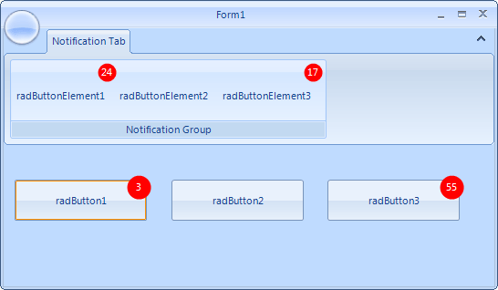
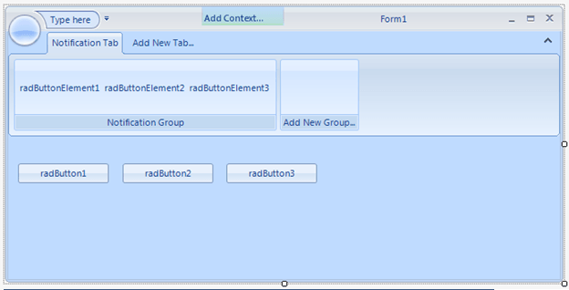

|Product Version|Product|Author|Last modified|
|----|----|----|----|
|Q2 2015|RadButton for WinForms|[Desislava Yordanova](https://www.telerik.com/blogs/author/desislava-yordanova)|November 05, 2015|

# Notification Button

## Problem

This article demonstrates how to create a notification button.



## Solution

Firstly, you should create a new project with a **RadRibbonForm**. Afterwards, drag several **RadButton** controls from the Toolbox and drop them onto the form. You need to insert a **RibbonTab** and a **RadRibbonBarGroup** with several **RadButtonElements**. The following screenshot illustrates how the design time should look like:



Next, we should create a derivative of **RadButton** where the **CreateChildItems** method should be overridden in order to add a red <g class="gr_ gr_25 gr-alert gr_spell ContextualSpelling" id="25" data-gr-id="25">circled</g> **LightVisualElement** to illustrate the notification. The **NotificationCount** property controls whether the notification badge will be visible. If its value is set to *0*, the red circle will be hidden:


````C#
public class NotificationButton : RadButton
{
    int result;
    LightVisualElement lve;
    int sizeConst = 26;

    protected override void CreateChildItems(Telerik.WinControls.RadElement parent)
    {
        base.CreateChildItems(parent);

        lve = new LightVisualElement();
        lve.BackColor = Color.Red;
        lve.DrawFill = true;
        lve.StretchHorizontally = false;
        lve.StretchVertically = false;
        lve.GradientStyle = Telerik.WinControls.GradientStyles.Solid;
        lve.Shape = new RoundRectShape(sizeConst / 2);
        lve.SmoothingMode = System.Drawing.Drawing2D.SmoothingMode.AntiAlias;
        lve.ForeColor = Color.White;
        lve.MinSize = new Size(sizeConst, sizeConst);
        lve.Visibility = ElementVisibility.Collapsed;
        this.RootElement.Children.Add(lve);

        // Pushing the ButtonElement off the top and right edges
        // so that the badge is not completely overlapped with the button
        this.ButtonElement.Margin = new System.Windows.Forms.Padding(0, 5, 5, 0);
    }

    protected override void InitLayout()
    {
        base.InitLayout();

        lve.Margin = new System.Windows.Forms.Padding(this.Size.Width - sizeConst - 1, 0, 0, 0);
    }

    protected override void OnSizeChanged(EventArgs e)
    {
        base.OnSizeChanged(e);

        lve.Margin = new System.Windows.Forms.Padding(this.Size.Width - sizeConst - 1, 0, 0, 0);
    }

    [DefaultValue(0)]
    public int NotificationCount
    {
        get
        {
            if (lve.Text != null)
            {
                bool isInt = int.TryParse(lve.Text, out result);
                if (isInt)
                {
                    return result;
                }
            }

            return 0;
        }
        set
        {
            if (value > 0)
            {
                lve.Visibility = ElementVisibility.Visible;
            }
            else
            {
                lve.Visibility = ElementVisibility.Collapsed;
            }
            lve.Text = value.ToString();
        }
    }

    protected override Size DefaultSize
    {
        get
        {
            return new Size(150, 50);
        }
    }
}

````
````VB.NET
Public Class NotificationButton
Inherits RadButton
    Private result As Integer
    Private lve As LightVisualElement
    Private sizeConst As Integer

    Protected Overrides Sub CreateChildItems(ByVal parent As Telerik.WinControls.RadElement)
        MyBase.CreateChildItems(parent)
        sizeConst = 26
        lve = New LightVisualElement()
        lve.BackColor = Color.Red
        lve.DrawFill = True
        lve.StretchHorizontally = False
        lve.StretchVertically = False
        lve.GradientStyle = Telerik.WinControls.GradientStyles.Solid
        lve.Shape = New RoundRectShape(sizeConst / 2)
        lve.SmoothingMode = System.Drawing.Drawing2D.SmoothingMode.AntiAlias
        lve.ForeColor = Color.White
        lve.MinSize = New Size(sizeConst, sizeConst)
        lve.Visibility = ElementVisibility.Collapsed
        Me.RootElement.Children.Add(lve)

        ' Pushing the ButtonElement off the top and right edges
        ' so that the badge is not completely overlapped with the button
        Me.ButtonElement.Margin = New System.Windows.Forms.Padding(0, 5, 5, 0)
    End Sub

    Protected Overrides Sub InitLayout()
        MyBase.InitLayout()

        lve.Margin = New System.Windows.Forms.Padding(Me.Size.Width - sizeConst - 1, 0, 0, 0)
    End Sub

    Protected Overrides Sub OnSizeChanged(ByVal e As EventArgs)
        MyBase.OnSizeChanged(e)

        lve.Margin = New System.Windows.Forms.Padding(Me.Size.Width - sizeConst - 1, 0, 0, 0)
    End Sub

    <DefaultValue(0)> _
    Public Property NotificationCount() As Integer
        Get
            If Not lve.Text Is Nothing Then
                Dim isInt As Boolean = Integer.TryParse(lve.Text, result)
                If isInt Then
                    Return result
                End If
            End If

            Return 0
        End Get
        Set(value As Integer)
            If value > 0 Then
                lve.Visibility = ElementVisibility.Visible
            Else
                lve.Visibility = ElementVisibility.Collapsed
            End If
            lve.Text = value.ToString()
        End Set
    End Property

    Protected Overrides ReadOnly Property DefaultSize() As Size
        Get
            Return New Size(150, 50)
        End Get
    End Property
End Class

````

>note The complete examples in C# and VB can be downloaded by clicking the following [link](https://github.com/telerik/winforms-sdk/tree/master/Button/NotificationButton).


