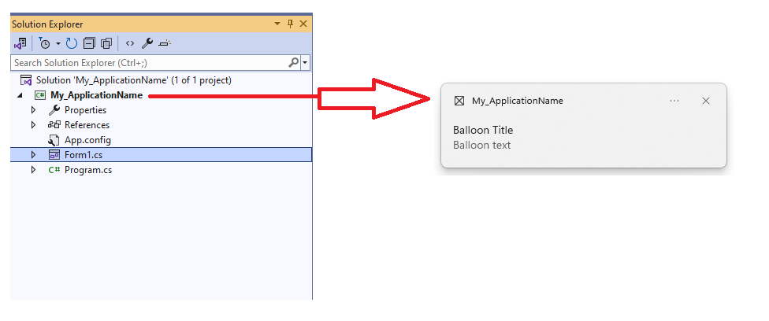
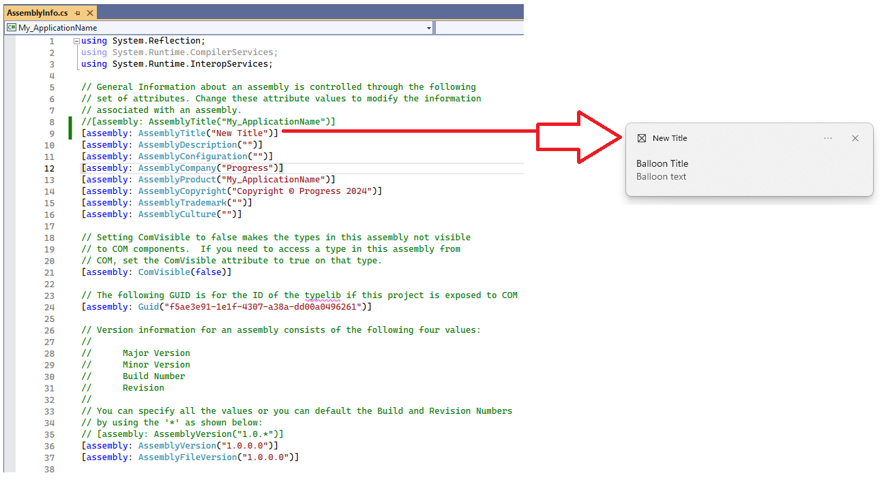

## Environment

|Product Version|Product|Author|
|----|----|----|
|2023.3.1114|RadNotifyIcon for WinForms|[Dinko Krastev](https://www.telerik.com/blogs/author/dinko-krastev)|

## Description

By default, the application title in the RadNotifyIcon balloon notifications will be the same as your project name.

## Solution

To change the application name for balloon notifications in RadNotifyIcon for WinForms, you need to modify the `AssemblyTitle` attribute in the `AssemblyInfo.cs` file of your project. Follow these steps:

1. In your project, expand the Properties item.
2. Open the `AssemblyInfo.cs` file.
3. Locate the `AssemblyTitle` attribute.
4. Modify the value of the `AssemblyTitle` attribute to your desired application name.
5. Save the file and rebuild your project.

After making this change, the balloon notification will display the specified application name instead of the interpreter name.

