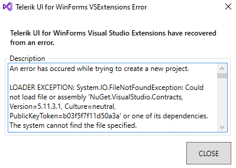
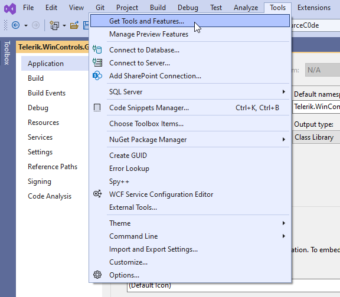
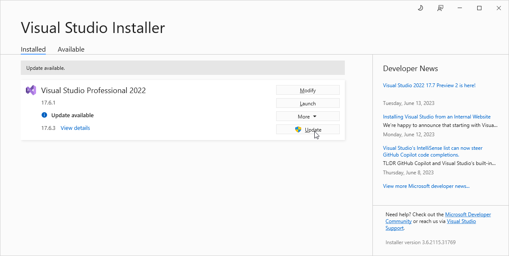
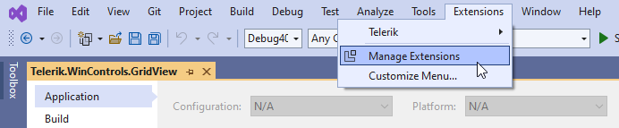
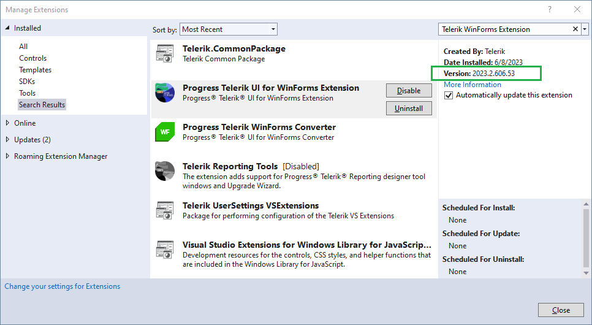

## Environment
|Product Version|Product|Author|
|----|----|----|
|2023.2.606|UI for WinForms|[Desislava Yordanova](https://www.telerik.com/blogs/author/desislava-yordanova)|

## Description

We have invested some time to improve the performance experience with the Visual Studio Extensions for the Telerik UI for WinForms suite. The fix was officially released in **R2 2023**. However, after upgrading the version, the following error message may be observed:

>caption Exception related to NuGet.VisualStudio.Contracts, Version=5.11.3.1

  

## Solution

The described behavior is a known issue in our Visual Studio extensions and it is mostly reproducible when the version of the Visual Studio is not latest. However, we are currently working on improving the user experience in such cases and we will release it in one of our future releases.

The easiest way to fix the problematic behavior by your side is to update the Visual Studio version to the latest one. First, check if there are available updates for your Visual Studio (Visual Studio -> Tools -> Get Tools and Features... menu):

    

and install them to the latest version. Then, give another try to our Create New Project wizard:

  

Please make sure that your Telerik UI for WinForms VS Extension is updated correctly, as well. You could achieve this directly in your Visual Studio, as follows:

1\. Launch Visual Studio

2\. Select Extensions and choose Manage Extensions option

 

3\. Expand **Installed** tab and select **Progress Telerik UI for WinForms Extension** - the latest version of the extension is 2023.2.606.53

 

4\. If the version is old, please expand the **Online** tab and press **Update** button on the Progress Telerik UI for WinForms Extension

5\.Restart your Visual Studio

## See Also

* [NuGet 5.11 Release Notes](https://learn.microsoft.com/en-us/nuget/release-notes/nuget-5.11)

