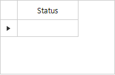

## Environment
|Product Version|Product|Author|
|----|----|----|
|2021.1.122|RadGridView for WinForms|[Desislava Yordanova](https://www.telerik.com/blogs/author/desislava-yordanova)|

## Description

When you click a cell in **RadGridView**, it gets selected. When you click the same cell again, it enters edit mode. In case a **RadDropDownListEditor** is activated, you will need to click once again the arrow button to open the pop up. This article demonstrates how to activate the editor and open the drop down with just a single click.

|Default behavior|Improved behavior|
|----|----|
|||

## Solution

The **CellEditorInitialized** event is appropriate for forcing the drop down once the editor is being activated and initialized. Please have a look at the below code snippet: 
 
````C#
private void radGridView1_CellEditorInitialized(object sender, GridViewCellEventArgs e)
{
     RadDropDownListEditor editor = e.ActiveEditor as  RadDropDownListEditor;
     if (editor!=null)
     {
         RadDropDownListEditorElement el = editor.EditorElement as RadDropDownListEditorElement;
         el.ShowPopup();
     }
}


````
````VB.NET
Private Sub radGridView1_CellEditorInitialized(ByVal sender As Object, ByVal e As GridViewCellEventArgs)
    Dim editor As RadDropDownListEditor = TryCast(e.ActiveEditor, RadDropDownListEditor)

    If editor IsNot Nothing Then
        Dim el As RadDropDownListEditorElement = TryCast(editor.EditorElement, RadDropDownListEditorElement)
        el.ShowPopup()
    End If
End Sub

 
````

# See Also

* [Default editors in GridView]()  

