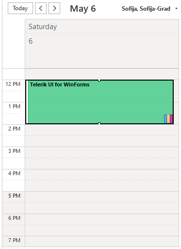
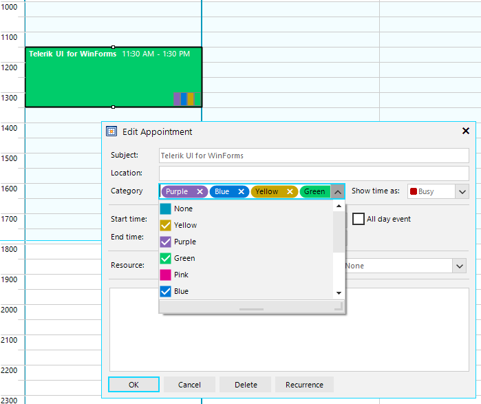

## Environment
 
|Product Version|Product|Author|
|----|----|----|
|2023.1.314|RadScheduler for WinForms|[Desislava Yordanova](https://www.telerik.com/blogs/author/desislava-yordanova)|
 

## Description

This example demonstrates a sample approach how to simulate the multiple categories that Outlook offers for marking its appointments with tags/categories:

|MS Outlook|RadScheduler|
|----|----|
|||

## Solution 
This solution requires the following steps:

1. It is necessary to extend the default visual **AppointmentElement** and add a container for visualizing the colored tags/categories at the bottom right corner of the visual elements. The **SchedulerElementProvider** will help you for replacing the default element with the custom implementation: [Custom Appointment Element]()

2. Create a derivative of the data event, the **Appointment** class and add a new property **CategoryIds** for storing the selected categories/tags: [Custom Appointment Element]()

3. Extend the **EditAppointmentDialog** and hide the Backgrounds drop down. Then, add a new checked drop down for the categories: [Adding a Custom Field to the EditAppointment Dialog]()

>note A complete solution providing a C# and VB.NET project is available [here]().

# See Also

* [Appointment Styles]()
* [Custom Appointment Element]()
* [Adding a Custom Field to the EditAppointment Dialog]()
* [Customize Appointment Backgrounds and Statuses in RadScheduler]()
* [Working with Appointments]()
 

 

 