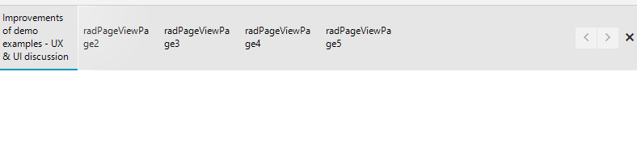

## Environment
 
|Product Version|Product|Author|
|----|----|----|
|2023.3.1010|RadPageView for WinForms|[Dinko Krastev](https://www.telerik.com/blogs/author/dinko-krastev)|


## Solution

In this particular example, we will demonstrate how to wrap the text in the RadPageView page title tab in StripView mode.




````C#  
public Form1()
{
	InitializeComponent();
	this.radPageView1.ItemSizeMode = PageViewItemSizeMode.EqualSize;
	RadPageViewStripElement element = radPageView1.ViewElement as RadPageViewStripElement;

	foreach (var item in element.Items)
	{
		item.MaxSize = new Size(100, 0);
		item.MinSize = new Size(0, 80);
		item.TextWrap = true;
	}
}

````
````VB.NET

Public Sub New()
InitializeComponent()
	Me.radPageView1.ItemSizeMode = PageViewItemSizeMode.EqualSize
	Dim element As RadPageViewStripElement = TryCast(radPageView1.ViewElement, RadPageViewStripElement)

	For Each item In element.Items
		item.MaxSize = New Size(100, 0)
		item.MinSize = New Size(0, 80)
		item.TextWrap = True
	Next
End Sub


````


