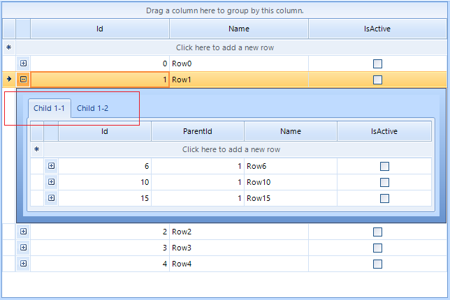
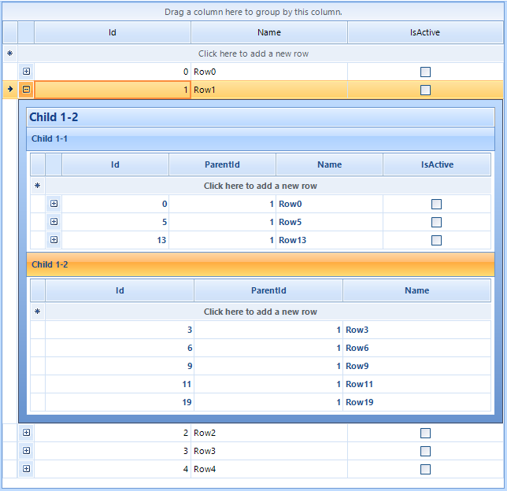
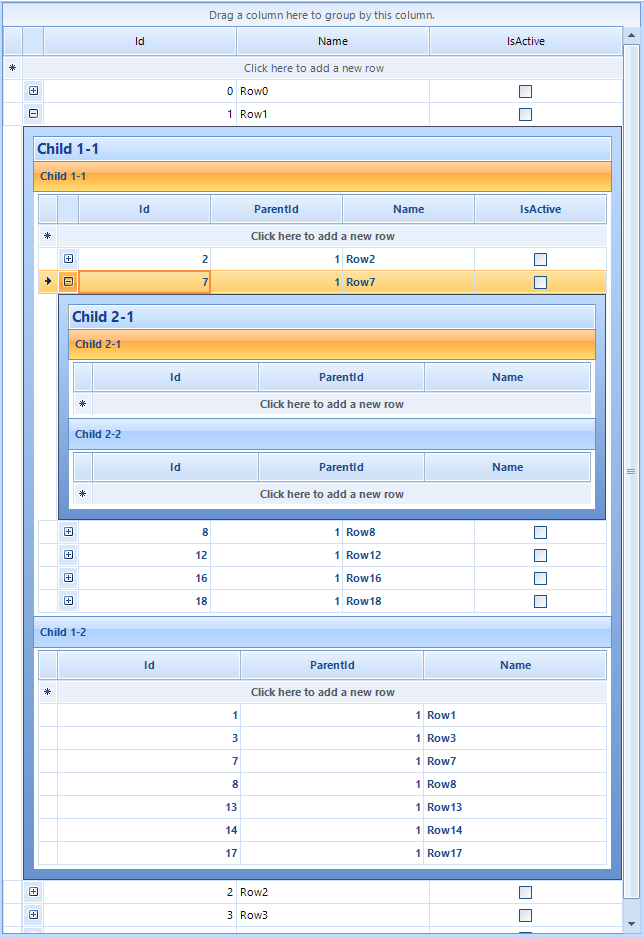

## Environment
|Product Version|Product|Author|
|----|----|----|
|2021.2.615|RadGridView|[Desislava Yordanova](https://www.telerik.com/blogs/author/desislava-yordanova)|

## Description

The hierarchy in **RadGridView** consists of a parent and a child template and a relation between them (e.g. linking parent's ID with a ParentID field in the child template). Hence, for the parent level you need to have any rows which will display the expander ("+") according to the child records the parent has.
 
When you add two or more child templates at the same level, they are displayed in tabbed view by default:



**RadGridView** internally uses a page view element for displaying the child templates. The TableElement.**PageViewMode** property gives you control over the page view mode used in child views, e.g. *Strip*, *Stack*, *Outlook*, *ExplorerBar*.



Since **RadGridView** creates its **TableElements** for the child levels on demand, you don't have access to the n-level **TableElements** until you expand a n-1 parent row. That is why the **PageViewMode** changes the mode only for the first hierarchical level. The inner hierarchical levels have the default strip mode:



This article demonstrates a sample approach how to change the **PageViewMode** for the inner levels as well.

## Solution

It is necessary to create a derivative of the **GridDetailViewCellElement** class and override its **CreatePageViewProvider** method. Then, return the desired **IRadPageViewProvider**, e.g. **RadPageViewExplorerBarProvider**.  
 

````C#

public RadForm1()
{
    InitializeComponent();
     
    this.radGridView1.CreateCell += RadGridView1_CreateCell; 

    Random rand = new Random();
    DataTable dt1 = new DataTable();
    dt1.Columns.Add("Id", typeof(int));
    dt1.Columns.Add("Name", typeof(string));
    dt1.Columns.Add("IsActive", typeof(bool));
    for (int i = 0; i < 5; i++)
    {
        dt1.Rows.Add(i, "Row" + i);
    }

    this.radGridView1.MasterTemplate.DataSource = dt1;
    this.radGridView1.MasterTemplate.AutoSizeColumnsMode = GridViewAutoSizeColumnsMode.Fill;

    //level 1-1

    DataTable dt2 = new DataTable();
    dt2.Columns.Add("Id", typeof(int));
    dt2.Columns.Add("ParentId", typeof(int));
    dt2.Columns.Add("Name", typeof(string));
    dt2.Columns.Add("IsActive", typeof(bool));
    for (int i = 0; i < 20; i++)
    {
        dt2.Rows.Add(i, rand.Next(0, 5), "Row" + i);
    }

    GridViewTemplate template = new GridViewTemplate();
    template.Caption = "Child 1-1";
    template.DataSource = dt2;
    template.AutoSizeColumnsMode = GridViewAutoSizeColumnsMode.Fill;
    radGridView1.MasterTemplate.Templates.Add(template);

    GridViewRelation relation = new GridViewRelation(radGridView1.MasterTemplate);
    relation.ChildTemplate = template;
    relation.RelationName = "Relation1";
    relation.ParentColumnNames.Add("Id");
    relation.ChildColumnNames.Add("ParentId");
    radGridView1.Relations.Add(relation);

    //level 1-2

    DataTable dt3 = new DataTable();
    dt3.Columns.Add("Id", typeof(int));
    dt3.Columns.Add("ParentId", typeof(int));
    dt3.Columns.Add("Name", typeof(string));
    for (int i = 0; i < 20; i++)
    {
        dt3.Rows.Add(i, rand.Next(0, 5), "Row" + i);
    }

    GridViewTemplate template2 = new GridViewTemplate();
    template2.Caption = "Child 1-2";
    template2.DataSource = dt3;
    template2.AutoSizeColumnsMode = GridViewAutoSizeColumnsMode.Fill;
    radGridView1.MasterTemplate.Templates.Add(template2);

    GridViewRelation relation2 = new GridViewRelation(radGridView1.MasterTemplate);
    relation2.ChildTemplate = template2;
    relation2.RelationName = "Relation2";
    relation2.ParentColumnNames.Add("Id");
    relation2.ChildColumnNames.Add("ParentId");
    radGridView1.Relations.Add(relation2);

    this.radGridView1.TableElement.PageViewMode = PageViewMode.ExplorerBar;

    //level 2-1

    DataTable dt4 = new DataTable();
    dt4.Columns.Add("Id", typeof(int));
    dt4.Columns.Add("ParentId", typeof(int));
    dt4.Columns.Add("Name", typeof(string));
    for (int i = 0; i < 20; i++)
    {
        dt4.Rows.Add(i, rand.Next(0, 20), "Row" + i);
    }

    GridViewTemplate template3 = new GridViewTemplate();
    template3.Caption = "Child 2-1";
    template3.DataSource = dt4;
    template3.AutoSizeColumnsMode = GridViewAutoSizeColumnsMode.Fill;
    template.Templates.Add(template3);

    GridViewRelation relation3 = new GridViewRelation(template);
    relation3.ChildTemplate = template3;
    relation3.RelationName = "Relation3";
    relation3.ParentColumnNames.Add("Id");
    relation3.ChildColumnNames.Add("ParentId");
    radGridView1.Relations.Add(relation3);

    //level 2-2

    DataTable dt5 = new DataTable();
    dt5.Columns.Add("Id", typeof(int));
    dt5.Columns.Add("ParentId", typeof(int));
    dt5.Columns.Add("Name", typeof(string));
    for (int i = 0; i < 20; i++)
    {
        dt5.Rows.Add(i, rand.Next(0, 20), "Row" + i);
    }

    GridViewTemplate template4 = new GridViewTemplate();
    template4.Caption = "Child 2-2";
    template4.DataSource = dt3;
    template4.AutoSizeColumnsMode = GridViewAutoSizeColumnsMode.Fill;
    template.Templates.Add(template4);

    GridViewRelation relation4 = new GridViewRelation(template);
    relation4.ChildTemplate = template4;
    relation4.RelationName = "Relation4";
    relation4.ParentColumnNames.Add("Id");
    relation4.ChildColumnNames.Add("ParentId");
    radGridView1.Relations.Add(relation4);
     
} 

private void RadGridView1_CreateCell(object sender, GridViewCreateCellEventArgs e)
{
    if (e.CellType == typeof(GridDetailViewCellElement))
    {
         e.CellElement = new CustomGridDetailViewCellElement(e.Column, e.Row);
    }
}
public class CustomGridDetailViewCellElement : GridDetailViewCellElement
{
    public CustomGridDetailViewCellElement(GridViewColumn column, GridRowElement row) : base(column, row)
    {
    }
    protected override Type ThemeEffectiveType
    {
        get
        {
            return typeof(GridDetailViewCellElement);
        }
    }

    protected override IRadPageViewProvider CreatePageViewProvider()
    {
        IRadPageViewProvider provider = base.CreatePageViewProvider();
        provider = new RadPageViewExplorerBarProvider();
        return provider;
    }
}
 

````
````VB.NET

 Public Sub New()
    InitializeComponent()
    AddHandler Me.RadGridView1.CreateCell, AddressOf RadGridView1_CreateCell
    Dim rand As Random = New Random()
    Dim dt1 As DataTable = New DataTable()
    dt1.Columns.Add("Id", GetType(Integer))
    dt1.Columns.Add("Name", GetType(String))
    dt1.Columns.Add("IsActive", GetType(Boolean))
    
    For i As Integer = 0 To 5 - 1
        dt1.Rows.Add(i, "Row" & i)
    Next

    Me.RadGridView1.MasterTemplate.DataSource = dt1
    Me.RadGridView1.MasterTemplate.AutoSizeColumnsMode = GridViewAutoSizeColumnsMode.Fill
    Dim dt2 As DataTable = New DataTable()
    dt2.Columns.Add("Id", GetType(Integer))
    dt2.Columns.Add("ParentId", GetType(Integer))
    dt2.Columns.Add("Name", GetType(String))
    dt2.Columns.Add("IsActive", GetType(Boolean))

    For i As Integer = 0 To 20 - 1
        dt2.Rows.Add(i, rand.[Next](0, 5), "Row" & i)
    Next

    Dim template As GridViewTemplate = New GridViewTemplate()
    template.Caption = "Child 1-1"
    template.DataSource = dt2
    template.AutoSizeColumnsMode = GridViewAutoSizeColumnsMode.Fill
    RadGridView1.MasterTemplate.Templates.Add(template)
    Dim relation As GridViewRelation = New GridViewRelation(RadGridView1.MasterTemplate)
    relation.ChildTemplate = template
    relation.RelationName = "Relation1"
    relation.ParentColumnNames.Add("Id")
    relation.ChildColumnNames.Add("ParentId")
    RadGridView1.Relations.Add(relation)
    Dim dt3 As DataTable = New DataTable()
    dt3.Columns.Add("Id", GetType(Integer))
    dt3.Columns.Add("ParentId", GetType(Integer))
    dt3.Columns.Add("Name", GetType(String))

    For i As Integer = 0 To 20 - 1
        dt3.Rows.Add(i, rand.[Next](0, 5), "Row" & i)
    Next

    Dim template2 As GridViewTemplate = New GridViewTemplate()
    template2.Caption = "Child 1-2"
    template2.DataSource = dt3
    template2.AutoSizeColumnsMode = GridViewAutoSizeColumnsMode.Fill
    RadGridView1.MasterTemplate.Templates.Add(template2)
    Dim relation2 As GridViewRelation = New GridViewRelation(RadGridView1.MasterTemplate)
    relation2.ChildTemplate = template2
    relation2.RelationName = "Relation2"
    relation2.ParentColumnNames.Add("Id")
    relation2.ChildColumnNames.Add("ParentId")
    RadGridView1.Relations.Add(relation2)
    Me.RadGridView1.TableElement.PageViewMode = PageViewMode.ExplorerBar
    Dim dt4 As DataTable = New DataTable()
    dt4.Columns.Add("Id", GetType(Integer))
    dt4.Columns.Add("ParentId", GetType(Integer))
    dt4.Columns.Add("Name", GetType(String))

    For i As Integer = 0 To 20 - 1
        dt4.Rows.Add(i, rand.[Next](0, 20), "Row" & i)
    Next

    Dim template3 As GridViewTemplate = New GridViewTemplate()
    template3.Caption = "Child 2-1"
    template3.DataSource = dt4
    template3.AutoSizeColumnsMode = GridViewAutoSizeColumnsMode.Fill
    template.Templates.Add(template3)
    Dim relation3 As GridViewRelation = New GridViewRelation(template)
    relation3.ChildTemplate = template3
    relation3.RelationName = "Relation3"
    relation3.ParentColumnNames.Add("Id")
    relation3.ChildColumnNames.Add("ParentId")
    RadGridView1.Relations.Add(relation3)
    Dim dt5 As DataTable = New DataTable()
    dt5.Columns.Add("Id", GetType(Integer))
    dt5.Columns.Add("ParentId", GetType(Integer))
    dt5.Columns.Add("Name", GetType(String))

    For i As Integer = 0 To 20 - 1
        dt5.Rows.Add(i, rand.[Next](0, 20), "Row" & i)
    Next

    Dim template4 As GridViewTemplate = New GridViewTemplate()
    template4.Caption = "Child 2-2"
    template4.DataSource = dt3
    template4.AutoSizeColumnsMode = GridViewAutoSizeColumnsMode.Fill
    template.Templates.Add(template4)
    Dim relation4 As GridViewRelation = New GridViewRelation(template)
    relation4.ChildTemplate = template4
    relation4.RelationName = "Relation4"
    relation4.ParentColumnNames.Add("Id")
    relation4.ChildColumnNames.Add("ParentId")
    RadGridView1.Relations.Add(relation4)
End Sub

Private Sub RadGridView1_CreateCell(ByVal sender As Object, ByVal e As GridViewCreateCellEventArgs)
    If e.CellType = GetType(GridDetailViewCellElement) Then
        e.CellElement = New CustomGridDetailViewCellElement(e.Column, e.Row)
    End If
End Sub

Public Class CustomGridDetailViewCellElement
Inherits GridDetailViewCellElement

    Public Sub New(ByVal column As GridViewColumn, ByVal row As GridRowElement)
        MyBase.New(column, row)
    End Sub

    Protected Overrides ReadOnly Property ThemeEffectiveType As Type
        Get
            Return GetType(GridDetailViewCellElement)
        End Get
    End Property

    Protected Overrides Function CreatePageViewProvider() As IRadPageViewProvider
        Dim provider As IRadPageViewProvider = MyBase.CreatePageViewProvider()
        provider = New RadPageViewExplorerBarProvider()
        Return provider
    End Function
End Class

````

# See Also

* [Binding to Hierarchical Data Programmatically]()
* [Creating Custom Cells]()

